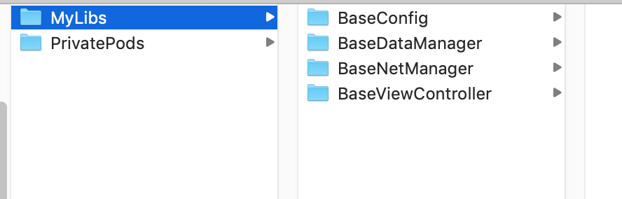
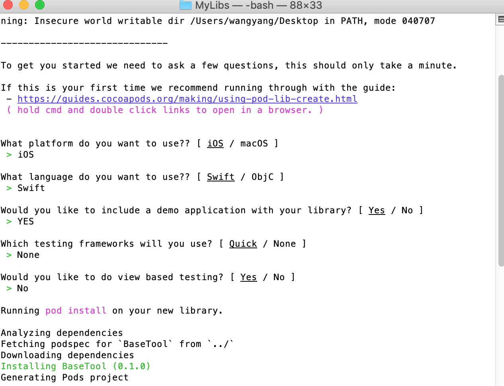

**制作pod私有库**

<!-- more -->

#### 一.Git准备两个仓库:

**1.存放libs工程代码:**

https://github.com/sophistWY/BaseTool.git


**2.存放生成的podspec文件:**

https://github.com/sophistWY/PrivatePods.git


#### 二.创建并设置一个私有的Spec Repo:

目的:本地 cocopod 路径Localpod 与 git 云端关联

```
 # pod repo add [Private Repo Name] [对应的.git url]
 $ pod repo add LocalPod https://github.com/sophistWY/PrivatePods.git
```

查看命令:

```
~/.cocoapods/repos
```

如下图:




#### 三.创建PodLib:

**1.创建存放的lib的目录:**

**2.cd到该目录下执行下面命令:**

```
 $ pod lib create BaseTool
```

**3.如下图交互:**



**4.打开Example工程编辑BaseConfig.podspec文件:**

```ruby
 s.name             = 'BaseTool ' ##名字必须与libname相同
 s.version          = '0.1.0'     #版本必须为0.0.0格式
 s.summary          = 'demo of BaseTool.' #关于库的一个简短描述
 s.description      = <<-DESC
 TODO: 备注文字(较长描述)
                             DESC
 #是否支持arc
 s.requires_arc = true
 #文件主页
 s.homepage         = 'https://github.com/sophistWY/BaseTool '
 #开源协议
 s.license          = { :type => 'MIT', :file => 'LICENSE' }
 #作者信息
 s.author           = = { 'sophistWY' => 'sophistwy@163.com' }
 #源文件所在网络路径
 s.source           = { :git => 'https://github.com/sophistWY/BaseTool.git', :tag => s.version.to_s }
 #支持版本
 s.ios.deployment_target = '7.0'
 #公开头文件名
 s.public_header_files = 'Pod/Classes/**/*.h'
 #依赖的框架
 s.frameworks = 'UIKit', 'MapKit'
 #依赖库
 s.dependency 'AFNetworking', '~> 2.3'
```

**5.验证podspec:**

```
 #测试podspec检查是否存在问题
 $ pod lib lint 
 //通过结果
  -> BaseTool (0.1.0)

 BaseTool passed validation.
       
 #如果有警告可以忽略
 $ pod lib lint --allow-warnings 
```


#### 四.本地测试与上传工程代码:

**1.cd到Example目录执行:**

```
pod install
```

**2.提交工程代码到git:**

```
 #跳转到lib目录下
 $ cd [libFolder] 
 $ git init
 
(** 推荐客户端操作 **
1.add Existing Repository 2. commit to master 3.push To public)
 
 地址:https://github.com/sophistWY/BaseTool.git
 
 **最后命令号提交tag**
 $ git tag -m "release 0.1.0" "0.1.0"
 $ git push --tags     #推送tag到远端仓库   
```


#### 五.上传podspec代码:

```
$ pod repo push LocalPod BaseTool.podspec
#如果有警告可以忽略
$ pod repo push LocalPod BaseTool.podspec --allow-warnings 
```


#### 六.使用私有库:

```
#官方仓库的地址
source 'https://github.com/CocoaPods/Specs.git' 
#我们自己的私有spec仓库的地址
source 'https://github.com/sophistWY/PrivatePods.git' 

#使用私有库下的组件
pod 'BaseTool'
```

#### 七.其他常用命令:

```
# 提交本地库
$ pod repo push LocalPod MyLibrary.podspec

# 移除本地库
# pod repo remove [Private Repo Name]
$ pod repo remove LocalPod

移除本地仓库中的lib.podspec
1.前往~/.cocoapods/repos 将其对应文件夹文件夹删除
2.提交修改到git
3.pod repo update LocalPod
```


