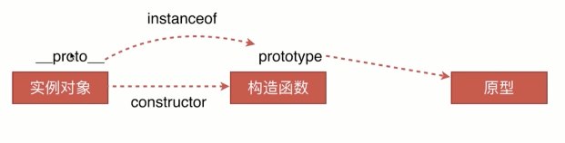

### 关于 js 原型链的简单理解

<!--more-->

### 1、原型链设计的意义:

**为了实现 OO 编程中的继承. 顶层是 null , js 万物皆 Object,一些类似 api 的函数或者属性定义在 Object 的 prototype 中.**

> eg:
> 1.hasOwnProperty()
> 判断对象自身属性中是否具有指定的属性。
> obj.hasOwnProperty('name')
>
> 3.Object.assign(target,source1,source2,...)
> 该方法主要用于对象的合并，将源对象 source 的所有可枚举属性合并到目标对象 target 上,此方法只拷贝源对象的自身属性，不拷贝继承的属性。
>
> 4.Object.keys(obj)
> 返回一个由一个给定对象的自身可枚举属性组成的数组，数组中属性名的排列顺序和使用 for...in 循环遍历该对象时返回的顺序一致 （两者的主要区别是 一个 for-in 循环还会枚举其原型链上的属性）。

### 2、js 是如何实现继承：


> 1.对象有属性\_\_proto\_\_,指向对象的构造函数的原型对象.  
> 2.函数除了有属性\_\_proto\_\_,还有属性 prototype，prototype 指向该方法的原型对象。  
> 3.原型对象也有\_\_proto\_\_,指向原型对象的构造函数的原型对象.(这就是原型链!!!)  
> 4.原型对象:包含构造函数,以及其他对象或者函数(共享的属性和方法).

### 3、proto prototype constructor 联系：

```Javascript
var M = function (name) { this.name = name; } (即 constructor)
var a = new M('o1')
a.__proto__ === M.prototype (都指向原型对象)
M.prototype 包含 M .
```

### 4、instanceof 原理：



```Javascript
var M = function (name) { this.name = name; }
var a = new M('o2')
a.__proto__ === M.prototype // instanceof 原理就是判断这个等式是否成立
```


### 5、原理图：


### Tips

1.原型链详解 简书: [链接](https://www.jianshu.com/p/dee9f8b14771)  
2.\_\_proto\_\_和 prototype 详解: [链接](https://www.cnblogs.com/fydxx/p/6656278.html)