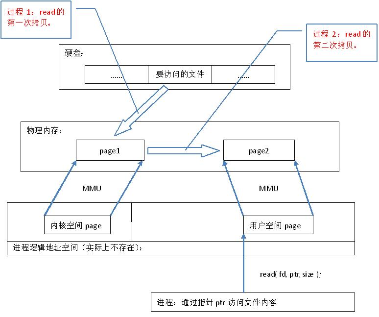
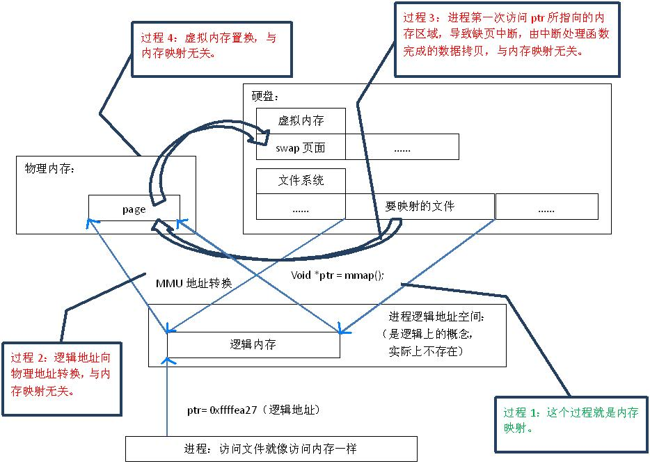
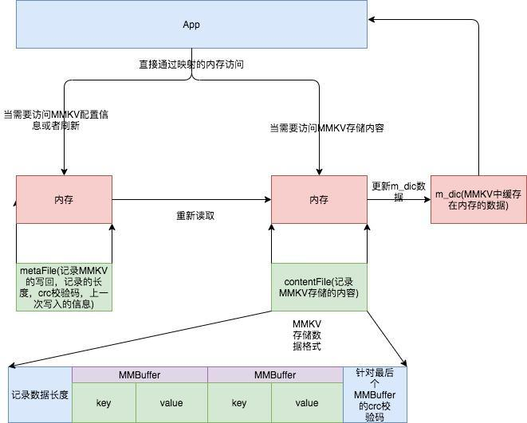
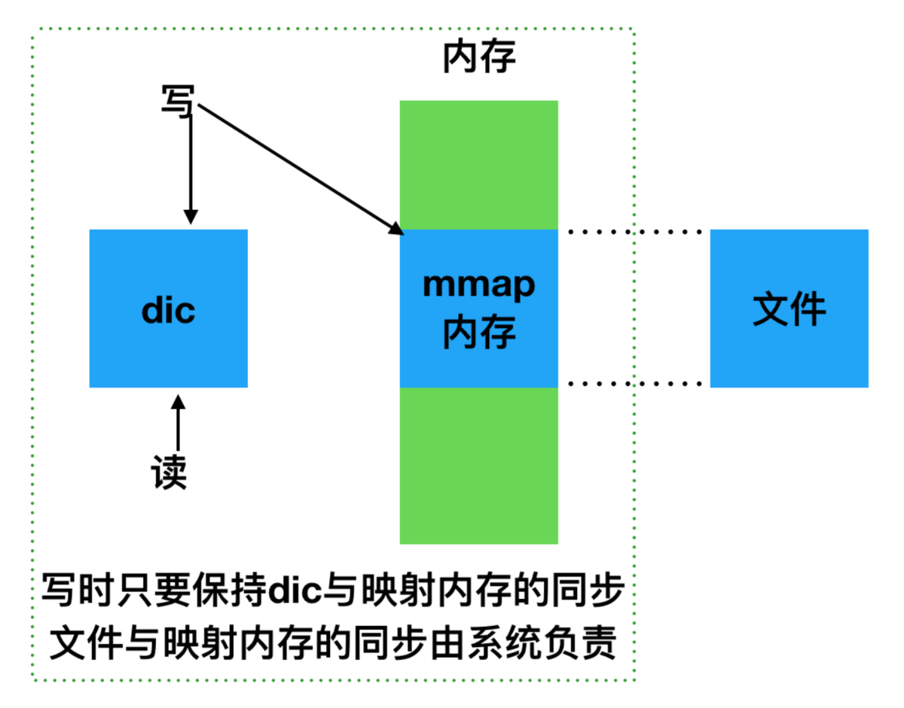
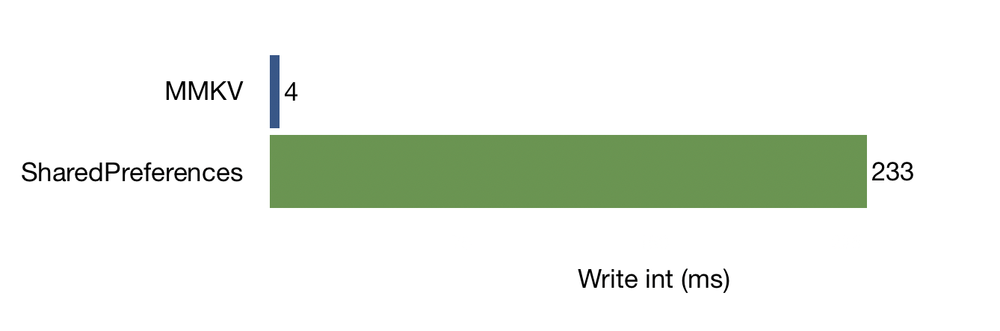
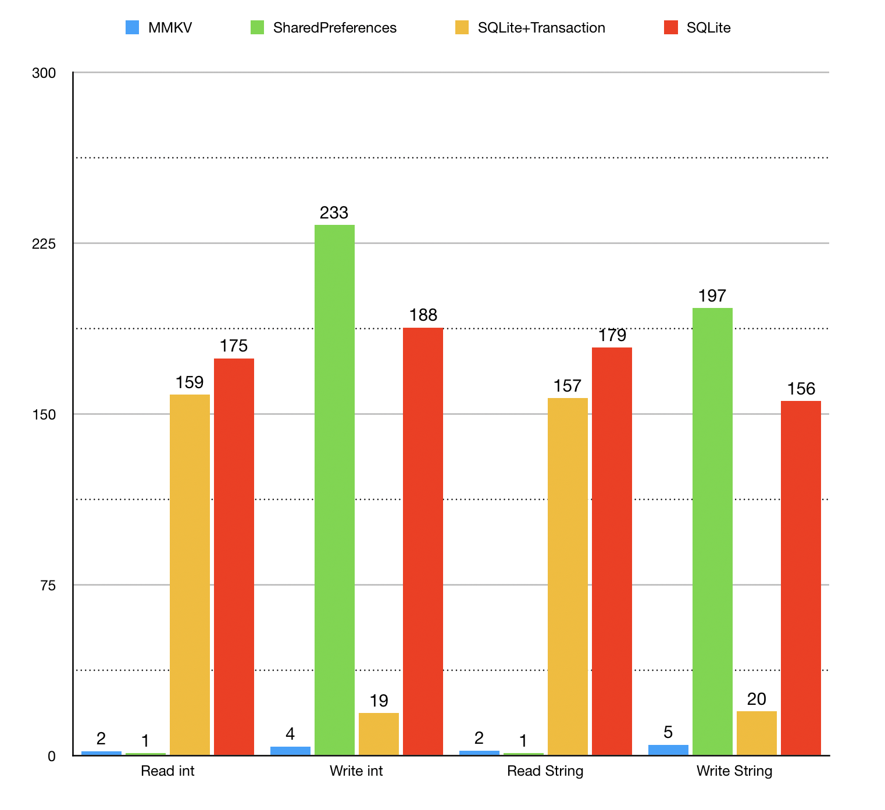
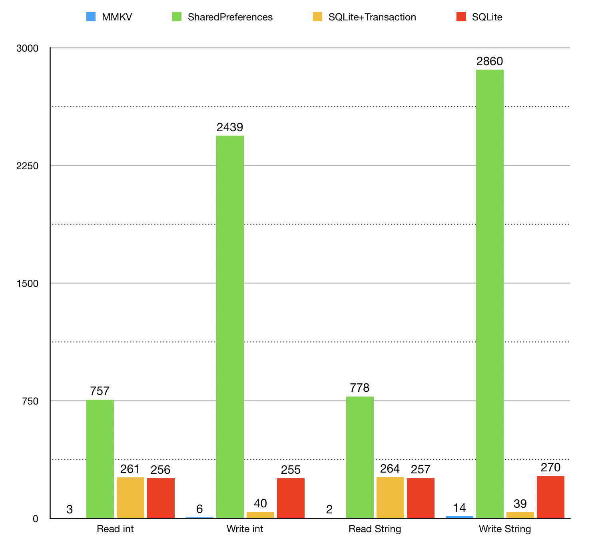

# MMKV初探

<!--more-->

#### 一.介绍

***功能：***一个高性能的 key-value 存储组件。

***诞生：***在微信客户端的日常运营中，时不时就会爆发特殊文字引起系统的 crash。微信团队设计一套技术方案来检测crash（[微信特殊字符保护方案](https://mp.weixin.qq.com/s?__biz=MzAwNDY1ODY2OQ==&mid=2649286826&idx=1&sn=35601cb1156617aa235b7fd4b085bfc4)）: ***关键代码前后进行计数器的加减，通过检查计数器的异常，来发现引起闪退的异常文字***。而这个计数器需要永久存储下来——因为闪退随时可能发生，希望新加的计时器不会影响滑动性能，mmap内存映射文件刚好满足，然后基于mmap的MMKV应运而生。

***核心：***利用mmap 内存映射文件。（[mmap官方文档](https://developer.apple.com/library/archive/documentation/FileManagement/Conceptual/FileSystemAdvancedPT/MappingFilesIntoMemory/MappingFilesIntoMemory.html)）


#### 二.mmap 原理

##### 1.普通文件访问流程：

从代码层面上看，从硬盘上将文件读入内存，都要经过文件系统进行数据拷贝，并且数据拷贝操作是由文件系统和硬件驱动实现的，理论上来说，拷贝数据的效率是一样的。但是通过内存映射的方法访问硬盘上的文件，效率要比read和write系统调用高，这是为什么呢？原因是read()是系统调用，其中进行了数据拷贝，它首先将文件内容从硬盘拷贝到内核空间的一个缓冲区，如图2中过程1，然后再将这些数据拷贝到用户空间，如图2中过程2，在这个过程中，实际上完成了 两次数据拷贝 ；而mmap()也是系统调用，如前所述，mmap()中没有进行数据拷贝，真正的数据拷贝是在缺页中断处理时进行的，由于mmap()将文件直接映射到用户空间，所以中断处理函数根据这个映射关系，直接将文件从硬盘拷贝到用户空间，只进行了 一次数据拷贝 。因此，内存映射的效率要比read/write效率高。




##### 2.mmap过程

 “映射” → 建立一种一一对应关系 :  硬盘上文件 的位置与进程 逻辑地址空间 中一块大小相同的区域之间的一一对应 。

[详解地址](https://www.zhihu.com/question/338216744/answer/781935310)

> 在内存映射的过程中，并没有实际的数据拷贝，***文件没有被载入内存，只是逻辑上被放入了内存***，具体到代码，就是建立并初始化了相关的数据结构（struct address_space），这个过程有系统调用mmap()实现，所以建立内存映射的效率很高





内存映射原理：

既然建立内存映射没有进行实际的数据拷贝，那么进程又怎么能最终直接通过内存操作访问到硬盘上的文件呢？那就要看内存映射之后的几个相关的过程了。

 

mmap()会返回一个指针ptr，它指向进程逻辑地址空间中的一个地址，这样以后，进程无需再调用read或write对文件进行读写，而只需要通过ptr就能够操作文件。但是ptr所指向的是一个逻辑地址，要操作其中的数据，必须通过MMU将逻辑地址转换成物理地址，如图1中过程2所示。这个过程与内存映射无关。

 

前面讲过，建立内存映射并没有实际拷贝数据，这时，MMU在地址映射表中是无法找到与ptr相对应的物理地址的，也就是MMU失败，将产生一个缺页中断，缺页中断的中断响应函数会在swap中寻找相对应的页面，如果找不到（也就是该文件从来没有被读入内存的情况），则会通过mmap()建立的映射关系，从硬盘上将文件读取到物理内存中，如图1中过程3所示。这个过程与内存映射无关。

 

如果在拷贝数据时，发现物理内存不够用，则会通过虚拟内存机制（swap）将暂时不用的物理页面交换到硬盘上，如图1中过程4所示。这个过程也与内存映射无关。


#### 三.MMKV 原理

#### 




- **内存准备**
  通过 mmap 内存映射文件，提供一段可供随时写入的内存块，App 只管往里面写数据，由操作系统负责将内存回写到文件，不必担心 crash 导致数据丢失。

- **数据组织**
  数据序列化方面我们选用 protobuf 协议，pb 在性能和空间占用上都有不错的表现。(protobuf 协议 : 基于128bits的数值存储方式（Base 128 Varints）)

 ```objective-c
  message KV {
  	string key = 1;
  	buffer value = 2;
  }
  
  -(BOOL)setInt32:(int32_t)value forKey:(NSString*)key {
  	auto data = PBEncode(value);
  	return [self setData:data forKey:key];
  }
  
  -(BOOL)setData:(NSData*)data forKey:(NSString*)key {
  	auto kv = KV { key, data };
  	auto buf = PBEncode(kv);
  	return [self write:buf];
  }
 ```


- **写入优化**
  考虑到主要使用场景是频繁地进行写入更新，我们需要有增量更新的能力。我们考虑将增量 kv 对象序列化后，append 到内存末尾。

  

- **空间增长**
  使用 append 实现增量更新带来了一个新的问题，就是不断 append 的话，文件大小会增长得不可控。我们需要在性能和空间上做个折中。


```objc
-(BOOL)append:(NSData*)data {
	if (space >= data.length) {
		append(fd, data);
	} else {
		newData = unique(m_allKV);
		if (total_space >= newData.length) {
			write(fd, newData);
		} else {
			while (total_space < newData.length) {
				total_space *= 2;
			}
			ftruncate(fd, total_space);
			write(fd, newData);
		}
	}
}
```


- **数据有效性**

考虑到文件系统、操作系统都有一定的不稳定性，额外增加了 crc 校验，对无效数据进行甄别。

> CRC（Cyclic Redundancy Check，循环冗余校验）算法
>
>    在数据通讯过程中，用于检测接收到的数据是否正确。所谓的校验就是在传输的数据中加入一些附加信息，这些附加信息用于检验接收方接收到的数据是否和发送发发送的数据是否相同。


### 四. 性能

循环写入随机的`int` 1k 次，有如下性能对比




以下基于 **华为 Mate 20 Pro 128G，Android 10，每组操作重复 1k 次，时间单位是 ms。**

- 单进程

  

- 多进程



### 五. 应用场景

#### 1. 适合的场景

> - 有一个很大的文件，因为映射有额外的性能消耗，所以适用于频繁读操作的场景；（单次使用的场景不建议使用）
> - 有一个小文件，它的内容您想要立即读入内存并经常访问。这种技术最适合那些大小不超过几个虚拟内存页的文件。（页是地址空间的最小单位，虚拟页和物理页的大小是一样的，通常为 4KB。）
> - 需要在内存中缓存文件的特定部分。文件映射消除了缓存数据的需要，这使得系统磁盘缓存中的其他数据空间更大
>
> 当随机访问一个非常大的文件时，通常最好只映射文件的一小部分。映射大文件的问题是文件会消耗活动内存。如果文件足够大，系统可能会被迫将其他部分的内存分页以加载文件。将多个文件映射到内存中会使这个问题更加复杂。


#### 2.不适合的场景

> - 希望从开始到结束的顺序从头到尾读取一个文件
> - 文件有几百兆字节或者更大。将大文件映射到内存中会快速地填充内存，并可能导致分页，这将抵消首先映射文件的好处。对于大型顺序读取操作，禁用磁盘缓存并将文件读入一个小内存缓冲区
> - 该文件大于可用的连续虚拟内存地址空间。对于 64 位应用程序来说，这不是什么问题，但是对于 32 位应用程序来说，这是一个问题。32 位虚拟内存最大是 4GB，可以只映射部分。
> - 因为每次操作内存会同步到磁盘，所以不适用于移动磁盘或者网络磁盘上的文件；
> - 变长文件不适用；


参考链接地址：https://blog.csdn.net/u010919133/article/details/103747510

项目地址：https://github.com/Tencent/MMKV