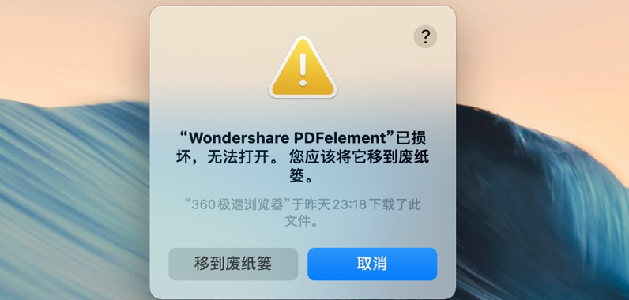
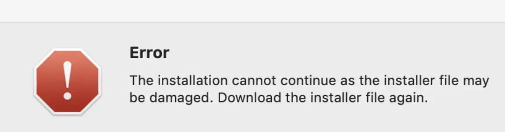
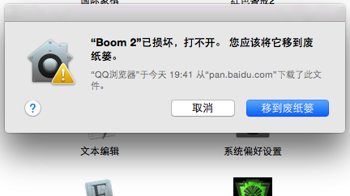

# Mac安装软件时各种异常情况的解决方法

<!--more-->


### 提示程序含有恶意代码或者已经打开所有来源还是提示扔到垃圾桶

基本上在11以后的系统上必备命令行，具体报错图如下

[](https://s4.ax1x.com/2022/01/24/7IbGt0.png)

解决方法：在终端输入 xattr -r -d com.apple.quarantine 加上程序的App绝对路径，App建议直接拖放到终端，会自动填写路径，比如QQ，最终应该是这样的一个终端命令

> xattr -r -d com.apple.quarantine /Applications/QQ.app**（/Applications/QQ.app 前面有一个空格）**

### Mac安装软件时提示“the installation cannot continue as”

这种错误常见于10.15以后的系统中安装Adobe系列软件时候出现，报错如下图



解决方法如下：

1. 双击打开dmg安装包
2. 在 install.app 上右键，选择 显示包内容
3. 依次进入 Contents 下的 MacOS 目录
4. 双击 MacOS 目录中的 install 即可开始正常的安装流程了

### MacOS Big Sur CORE keygen提示您没有权限打开应用程序怎么办

Mac升级BigSur后，很多的APP呀、注册机呀在使用的时候都会出现没有权限打开应用程序的问题，比如提示您没有权限打开应用程序“CORE Keygen”,请联系您的电脑或网络管理员以获得帮助。乍一看，很麻烦，其实这个问题非常容易搞定，它这个是MacOS 11 Big Sur才会出现的情况，解决方法也是非常的简单，通过安装upx即可解决Big Sur系统提示没有权限的问题。

#### 使用说明（可以下载附件已经打包好的upx，跳到第四步）

1、首先要注意以下操作全部都是在终端里进行,终端是Mac系统的一个系统软件,在实用菜单文件夹中,找不到就用Mac系统搜索"终端"两个字)注：在终端下输入密码不会显示，输入完成直接回车即可，如果输入错误会用英文提示错误请重试，再次输入正确的密码回车即可;

2、安装Homebrew,直接在终端里执行下面的命令,选择下载节点,在安装过程中会提示安装 GIt,根据提示安装即可(git安装完后重新运行脚本)如果提示输入密码,直接输入电脑的密码确认即可(在终端下输入密码不会显示,直接键盘回车即可)
/bin/zsh -c "$(curl -fsSL http://ys-e.ys168.com/617266424/16241427/n3277555IJLHXgvu8fH69/Homebrew.sh)"

3、安装upx

```
brew install upx
```

4、使用UPX对CORE Keygen修补

把没有权限的CORE Keygen拷贝到桌面，右键显示包内容，进入Macos目录，里面有一个文件

如果你是直接下载的附件，把解压的upx拷贝到 应用程序，然后在终端输入一下命令

sudo /Applications/upx -d 后面一个空格，然后把Macos目录里面文件拖过来，形成后一个类似这样的命令，回车

sudo /Applications/upx -d /Users/iMacso/Desktop/OmniFocus\ \ 注册机.app/Contents/MacOS/CORE\ Keygen

5、这个时候应该就可以打开了,如果提示没有认证的开发者,就输入下面的命令

sudo spctl --master-disable ([参看安装报错各种问题解决方法](https://www.imacso.com/knowledge/installation-wrong)）

6、再打开就可以正常使用啦

[UPX下载](http://yunpan.imacso.com/file/160721-477753250)

### 安装 提示已损坏，打不开，您应该将它移至废纸篓

从本站下载的Sketch、Principle等设计软件，以及输入法等常用软件，安装时总是提示“已损坏，移至废纸篓”这类信息，根本无法打开。如下图：

[](https://www.imacso.com/wp-content/uploads/2019/07/2019071514561574.png)

其实，这是新系统（macOS Sierra 10.12.X）惹的祸。新系统加强了安全机制，默认不允许用户自行下载安装应用程序，只能从Mac App Store里安装应用。

#### 解决方法

**步骤一**：打开终端


**步骤二**：输入代码：sudo spctl **--**master-disable（**master前面为两个短横线，看下面的截图**）

[](https://www.imacso.com/wp-content/uploads/2019/07/2019071514563073.png)

注意红框处应有空格
**步骤三**：按回车输入自己电脑密码，再次回车（密码不会显示出来，放心输就好）

[](https://www.imacso.com/wp-content/uploads/2019/07/2019071514563190.png)

不显示密码，输完按回车

**步骤四**：打开系统偏好设置 » 安全性与隐私，若显示*任何来源*，大功告成；若没有此选项，一定是你前面的步骤不对

[](https://www.imacso.com/wp-content/uploads/2019/07/2019071514561981.png)
回到桌面双击安装文件，发现都可以打开啦，尽情享受Mac带给你的乐趣吧！

### 安装出现闪退等其他情况

2019年7月10号开始，很多TNT破解软件大面积报错，原因不多说，讲一下具体的解决方案

#### 步骤一：

安装xcode，这个在商店里面有，不想安装的，按步骤二来。

#### 步骤二：

安装Command Line Tool 工具

打开终端输入以下命令

> xcode-select --install **（install前面为两个短横线）**

#### 步骤三：

终端继续输入以下命令

> codesign --force --deep --sign - **（force、deep、sign前面为两个短横线）**

然后拖入需要签名的软件，最后类似于这样

> codesign --force --deep --sign - /Applications/name.app **（/Applications前面有一个空格）**

回车搞定

### 安装提示 App 未针对您的Mac进行最优化，需要更新

32位程序不兼容，报类似以下的错误

[](https://www.imacso.com/wp-content/uploads/2019/08/2019080309052549.jpg)

终端输入

> defaults write -g CSUIDisable32BitWarning -boolean TRUE``

### Parallels Desktop 16.0.0 无法安装

报错的本质是10.15以上的系统，安装程序本身不能执行，解决思路就是xattr处理，由于安装包本身为隐藏文件，所以不能简单拷贝后处理，列出命令行步骤，大家照着处理下

1、取消隐藏文件

> defaults write com.apple.finder AppleShowAllFiles Yes && killall Finder

2、把隐藏的 Parallels Desktop 拖到 Applications（应用程序）

3、分别执行 xattr和codesign 两个10.15系统必备操作命令

> chflags nohidden /Applications/Parallels\ Desktop.app
>
> xattr -cr /Applications/Parallels\ Desktop.app
>
> codesign --sign - --force --deep /Applications/Parallels\ Desktop.app

4、双击即可正常使用

5、关闭隐藏文件

> defaults write com.apple.finder AppleShowAllFiles No && killall Finder

### Parallels Desktop 17 无法联网 无法连接USB

详看这里(PD16通用)：[完美解决 Parallels Desktop 17 无法联网 无法连接USB](https://www.imacso.com/knowledge/parallels-desktop-17-net-usb)