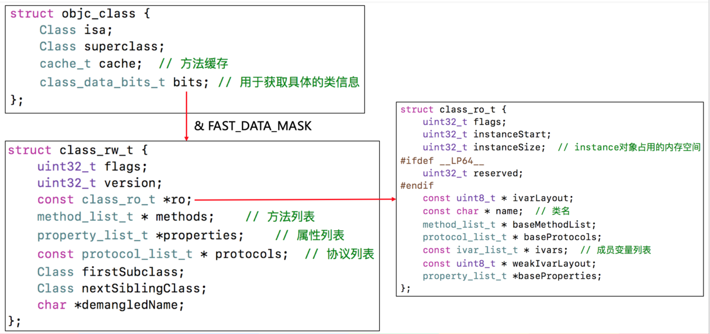
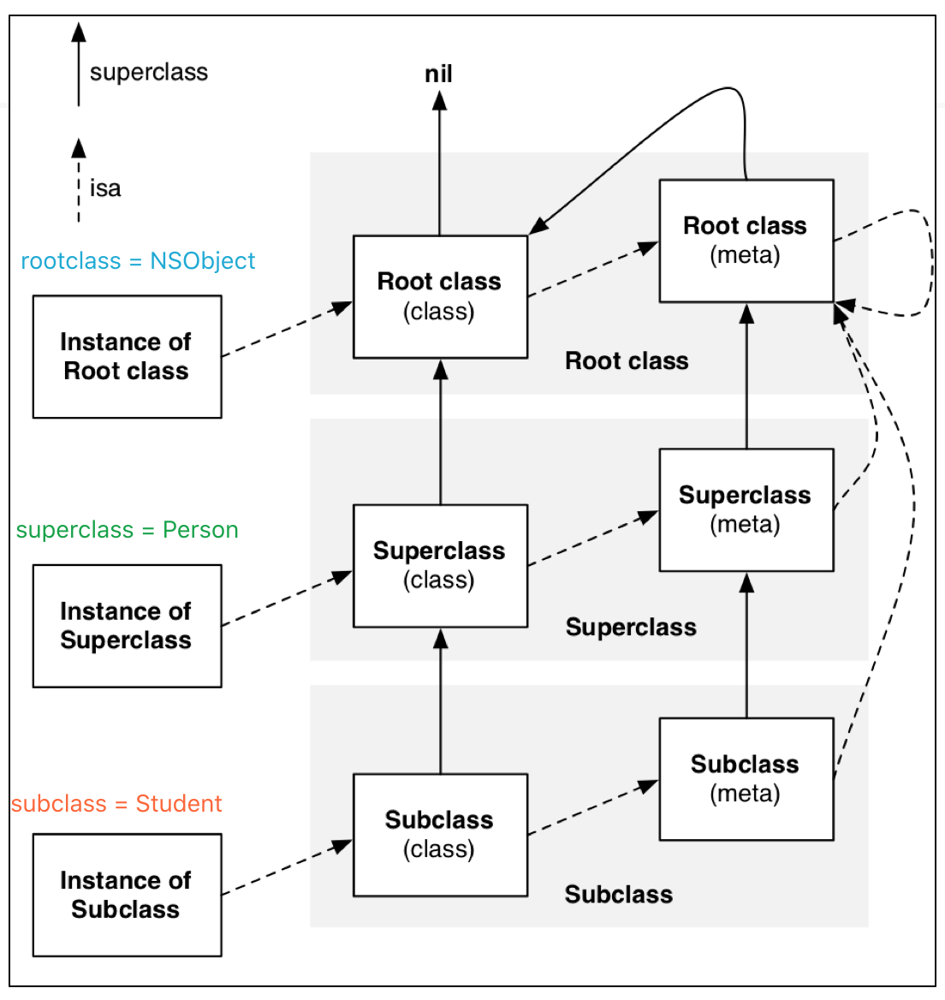

# 关于 NSobject

<!--more-->

NSobject-> A -> B

```objective-c
struct NSObject_IMPL {
    ``Class isa; ``// 8个字节
};
```

```objective-c
@``interface` `A : NSObject
{
    ``int` `_no;
    ``int` `_age;
}
```

```objective-c
struct A {
    ``Class NSObject_IMP NSObject_IVARS;
    ``int` `_no;
    ``int` `_age;
};
```

```objective-c
struct A {
    ``Class isa;
    ``int` `_no;
    ``int` `_age;
};
```

```objective-c
@``interface` `B : A
{
    ``int` `_birthday;
}
struct B {
    ``Class NSObject_IMP NSObject_IVARS;
    ``int` `_no;
    ``int` `_age;
};
struct B {
    ``Class isa;   (Class NSObject_IMP) 
    ``int` `_no;   (NSObject_IVARS)
    ``int` `_age;  (NSObject_IVARS)
    ``int` `_birthday;
};
```








> - `instance`的`isa`指向`class`
> - `class`的`isa`指向`meta-class`
> - `meta-class`的`isa`指向基类的`meta-class`

> - `class`的`superclass`指向父类的`class`，**如果没有父类，superclass指针为nil**
> - `meta-class`的`superclass`指向父类的`meta-class`,**基类的meta-class的superclass指向基类的class**

> isa(of instance) --> isa(of class) --> isa(of meta-class)


> 面试题解答
>
> - 对象的isa指针指向哪里？
>
> 1. `instance`对象的`isa`指针指向`class`对象
> 2. `class`对象的`isa`指针指向`meta-class`对象
> 3. `meta-class`对象的`isa`指针指向基类（也就是NSObject）的`meta-class`对象
>
> - OC的类信息存放在哪里？
>
> 1. 对象方法，属性信息，成员变量信息，协议信息，存放在`class`对象中
> 2. 类方法，存放在`meta-class`对象中
> 3. 成员变量的具体值，存放在`instance`对象中
>
>