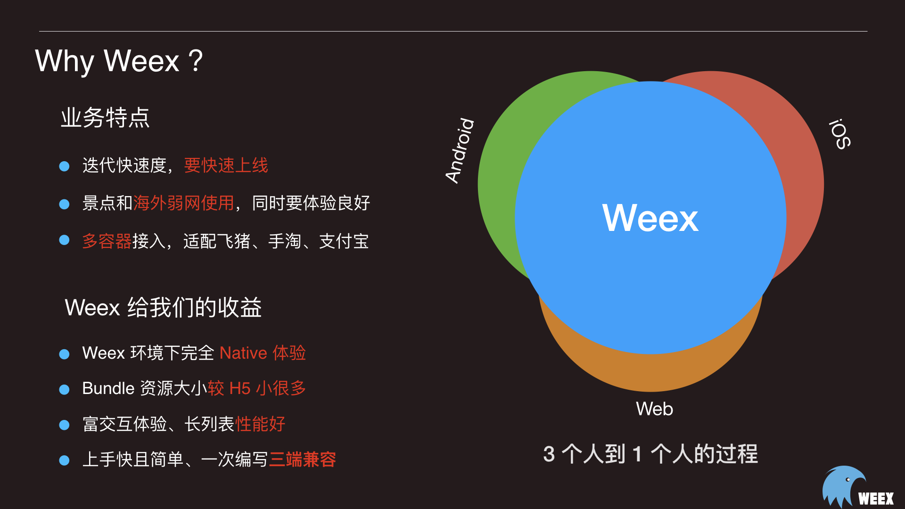
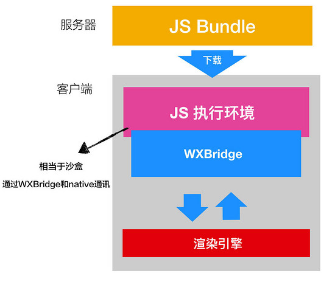

# Weex 实战

<!--more-->

#### 关于Weex



官网 http://emas.weex.io/zh/

Weex 致力于使开发者能基于通用跨平台的 Web 开发语言和开发经验，来构建 Android、iOS 和 Web 应用。简单来说，在集成了 WeexSDK 之后，你可以使用 JavaScript 语言和前端开发经验来开发移动应用。

*** ps: 使用vue开发实现跨三端。阿里把vue作者挖过去当技术顾问,然而weex并不争气。***

#### Weex工作原理

大致工作流程：

1. 前端开发可以写熟悉vue语法的单文件，然后打包成出来一份dist —— JS Bundle，然后部署到服务器上

2. 客户端打开某一个页面，通过网络下载 `JS Bundle` ，然后在客户端本地执行该 `JS Bundle`

3. 客户端提供了JS的执行引擎(JSCore)用于执行远程加载到 `JS Bundle`

4. JS执行引擎执行 `JS Bundle` ，和浏览器的过程类似， `JS Bundle` 的代码被执行，生成VNode 树进行patch，找出最小操作DOM节点的操作，把对DOM节点的操作转变为 `Native DOM API` , 调用 `WXBridge` 进行通信 

5. `WXBridge` 将渲染指令分发到native（Andorid、iOS）渲染引擎，由native渲染引擎完成最终的页面渲染

   

#### Weex上手指南

1 请确保你已经安装了 [Node.js](https://nodejs.org/)，然后全局安装 `weex-toolkit`。

```
npm install weex-toolkit -g
```

2 创建一个空的模板项目：

```bash
weex create awesome-app
```

3 运行

```bash
cd awesome-app
npm install
npm start
```

4 使用WeexUI (非必须)

```
npm i weex-ui@latest -S
```

WeexUI官网: https://github.com/apache/incubator-weex-ui


5 添加iOS平台

```bash
weex platform add ios
weex run ios
```


#### Weex开发核心概念

#### Module

```
拓展js调用客户端的方法的能力
```

1. 新建一个基类为 NSObject 的 class `WXCustomEventModule`，让该类遵循 `WXModuleProtocol` 的协议。 
2. 添加打印的方法，通过 `WX_EXPORT_METHOD` 暴露该方法。 
3. 在初始化完成 Weex SDK 之后注册该 module。 

4. JS 里使用方法如下：

```javascript
weex.requireModule("event").showParams("hello Weex)
```


#### Component

```
提供客户端原生组件 eg:MapView
```

1. 新建一个基类为 `WXComponent` 的类。如果这个类里什么代码也不写，它和默认的的 `div` 组件能力是一致的。
2. 覆盖 `WXComponent` 中的生命周期方法

- `loadView`
  一个组件默认对应于一个 view，如果未覆盖 `loadView` 提供自定义 view，会让 `WXComponent` 基类创建 `WXView`。`WXView` 继承自 `UIView`。比如我们要实现一个组件支持地图功能，我们可以返回系统的 `MKMapView`。

```text
- (UIView *)loadView {
    return [MKMapView new];
}
```

- `viewDidLoad` 对组件 view 需要做一些配置，比如设置 delegate，可以在 `viewDidLoad` 生命周期做。如果当前 view 没有添加 subview 的话，不要设置 view 的 frame，WeexSDK 会根据 style 进行排版后设置。

```text
- (void)viewDidLoad {
      ((MKMapView*)self.view).delegate = self;
}
```

1. 注册组件

```text
[WXSDKEngine registerComponent:@"map" withClass:[WXMapComponent class]];
```

1. 在前端代码中使用新组件

```html
<template>
    <div>
        <map style="width:200px;height:200px"></map>
    </div>
</template>
```


 #### Handler

```
‘协议解耦’ 把耦合在WeexSDK的功能模块通过协议的方式解耦出来,同时业务方也通过该方式拓展功能模块。
```

Handler 的作用是什么？比如 WeexSDK 目前没有提供图片下载的能力，而是在 `WXImgLoaderProtocol` 定义了一些获取图片的接口。Image 组件正是通过 `WXImgLoaderProtocol` 获得并展示图片，开发者可以实现该 protocol 中的接口方法，这样 `image` 标签才能正常展示图片。

开发者也可以定义自己的 `protocol` 和对应的实现来使用 `handler` 机制。常见的一个场景就是在每个 App 中需要特定的 Handler 来实现一些公共的能力。

1. 新建基类为 NSObject 的类，并实现 `WXImgLoaderProtocol` 协议，实现 `WXImgLoaderProtocol` 的方法。 下面加载图片的逻辑需要依赖 SDWebImage，你也可以不依赖 SDWebimage 使用自己的方式加载对应 URL 图片。

```text
@implementation WXImgLoaderDefaultImpl
- (id<WXImageOperationProtocol>)downloadImageWithURL:(NSString *)url imageFrame:(CGRect)imageFrame userInfo:(NSDictionary *)userInfo completed:(void(^)(UIImage *image,  NSError *error, BOOL finished))completedBlock {
    if ([url hasPrefix:@"//"]) {
        url = [@"http:" stringByAppendingString:url];
    }
    return (id<WXImageOperationProtocol>)[[SDWebImageManager sharedManager] downloadImageWithURL:[NSURL URLWithString:url] options:0 progress:^(NSInteger receivedSize, NSInteger expectedSize) {
    } completed:^(UIImage *image, NSError *error, SDImageCacheType cacheType, BOOL finished, NSURL *imageURL) {
    if (completedBlock) {
        completedBlock(image, error, finished);
    }
    }];
}
@end
```

2. 注册

```text
[WXSDKEngine registerHandler:[WXImgLoaderDefaultImpl new] withProtocol:@protocol(WXImgLoaderProtocol)];
```

3. 使用

```text
id<WXImgLoaderProtocol> imageLoader = [WXSDKEngine handlerForProtocol:@protocol(WXImgLoaderProtocol)];
[iamgeLoader downloadImageWithURL:imageURl imageFrame:frame userInfo:customParam completed:^(UIImage *image, NSError *error, BOOL finished) {
}];
```


#### 相关文档

```
https://www.jianshu.com/p/41cde2c62b81
```

#### Weex原理超神之路

```
https://www.jianshu.com/p/53f69bfcbc50
```

#### 未来观望

```
https://zhuanlan.zhihu.com/p/373582962
```


