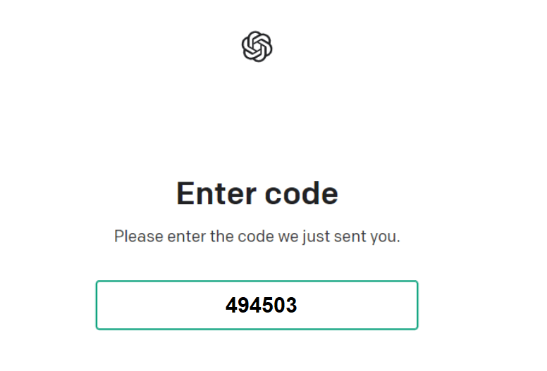

# chatGPT注册教程

<!--more-->

#### 一. 注册前准备

1. **一个邮箱**（建议用的Gmail邮箱，经测试其他邮箱也可以）
2. **科学上网工具**（如果没有可以参考文章:[V2NET](https://www.xnbeast.com/v2net-definitive-guide/)）
3. **一个国外手机号**（后文将详细告诉你如何花1.42元人民币获取一个临时国外手机号）

4. **chatGPT官网：**https://chat.openai.com/chat

#### 二. 购买一个外国账号 (核心)

##### 官网：[https://sms-activate.org/](https://sms-activate.org/?ref=3433621)

**1. 点击右上角注册 **

**2. 注册成功后，在账号中，点击右上角的充值**

**3. 选择支付宝进行充值**

**4. 输入金额：0.2美元，点支付**

**5. 支付成功后，回到账号后台，点击左侧的OpenAI（或者在服务搜索中搜索OpenAI）**

**6. 买一个手机号，这里建议选英国。（我们第一次购买的印度号码无法接受短信验证码，英国号很快便可以收到短信验证码）, 点击如下图右侧的购物框即可完成购买。**

**7. 购买后，账号页面右侧，可以看到你购买的手机号：**

**注意事项 :**

- 这是一个临时手机号，有效时长20分钟
- 20分钟内如果没有收到验证码，可以点右侧的叉号，退订，费用还会返还。（注：**一般在ChatGPT注册页面发出验证码后一分钟左右便可以收到验证码。收不到验证短信可以在20分钟到期前退订，三分钟以上收不到验证码建议就不用再等了**）
- 如遇到无法登录的情况，请打开谷歌浏览器的无痕窗口进行登录，一般会很快登录账号。

#### 第三步：ChatGPT账号注册

**1. 打开科学上网**

**2. 访问ChatGPT的官方网站：https://chat.openai.com/chat**

**3. 点击注册**

**4. 输入邮箱，并点击继续：**

**5. 输入账号密码，并点击继续：**

**6. 打开邮箱，点击OpenAI发来的验证邮件，点击验证按钮**

**7. 选择手机号国别，并输入第二步中购买的手机号码，点击发送验证短信（send code）：（例如，我们买的是英国手机号，则选择英国，后面输入手机号时注意国家区号不要重复输入）**

**8. 然后返回到第二步中购买手机号的页面，查收短信：(一般一分钟左右可以收到短信）**

**9. 输入验证码：**

**10. chatGPT 注册完成**