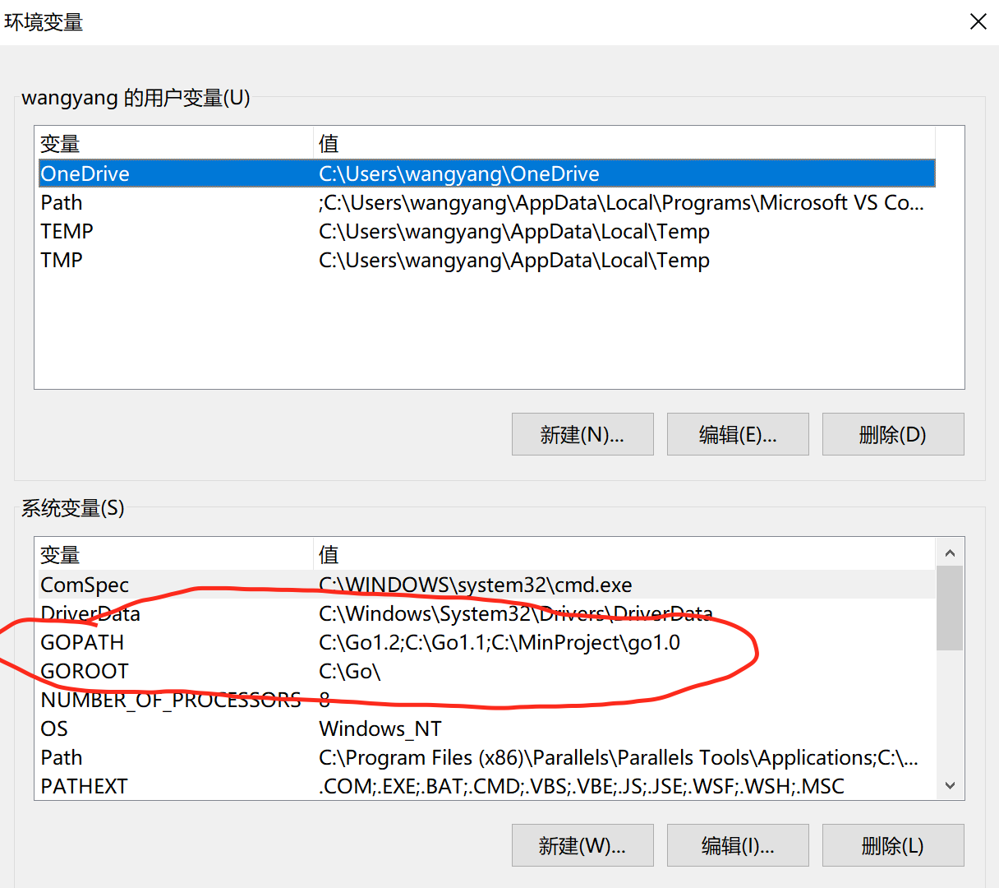
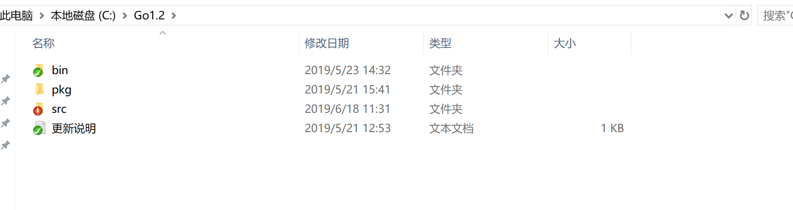
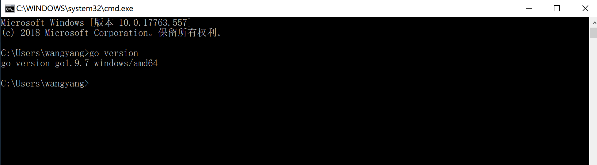
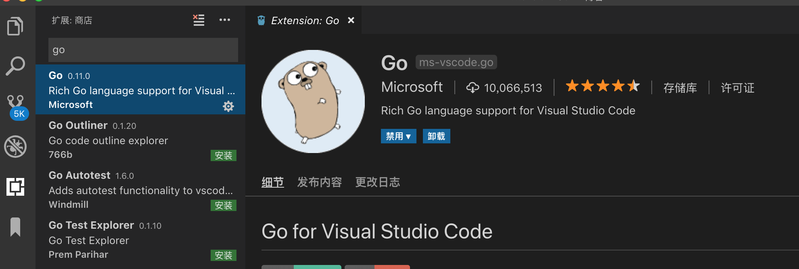

### golang 环境搭建步骤:(windows)

<!--more-->

#### 一 .安装 Go 语言,go1.7.1.windows-amd64.msi

> 下载地址https://studygolang.com/dl

#### 二 .Go 环境变量:

1.安装 go 的时候，安装程序会自动把相关目录写到系统环境。但是如果是 zip 的安装，需要自己手动添加。

> 主要配置以下几个：
>
> - GOROOT：Go 安装后的根目录（例如：D:\Go），安装过程中会由安装程序自动写入系统环境变量中。(重点)
> - GOBIN：Go 的二进制文件存放目录（%GOROOT%\bin）
> - PATH：需要将 %GOBIN% 加在 PATH 变量的最后，方便在命令行下运行。

2.计算机->属性->高级系统设置->环境变量

> 注意：
>
> 1.需要将 GOPATH 路径，手动写入到系统环境变量。(重点)
>
> 2.不要把 GOPATH 设置成 Go 的安装路径
>
> 3.你自己创建依赖的 package，也要放到 GOPATH 目录下，这样才能够被引用到。

#### 三 .Go 工作空间(代码目录):

1.GOPATH : Go 的工作空间，就是我们的开发和依赖包的目录（eg： C:\Go1.2） ，此目录需要手动配置到系统环境变量

> GOPATH 工作空间是一个目录层次结构，其根目录包含三个子目录：
>
> - src：包含 Go 源文件，注意：你自己创建依赖的 package，也要放到 GOPATH 目录下，这样才能够被引用到。
> - pkg：包含包对象，编译好的库文件
> - bin：包含可执行命令

2.工程如下:

#### 四 .验证 Go 是否安装成功:

打开 cmd 输入 go version:

如图,go 安装成功!

#### 五 .安装 vsCode

> https://code.visualstudio.com

#### 六 .打开 VSCode,安装 Go 扩展

#### 至此结束

### 相关资料:

> 1.学习资料: https://github.com/Unknwon/the-way-to-go_ZH_CN/blob/master/eBook/directory.md

> 2.golang 中文网: https://studygolang.com
