## iOS 知识整理

<!--more-->

###一.设计模式

##### 面向对象特性:

***1.封装***

> 封装，也就是把客观事物封装成抽象的类，并且类可以把自己的数据和方法只让可信的类或者对象操作，对不可信的进行信息隐藏。   ***封装是对象和类概念的主要特性***

***2.继承***

> 通过继承创建的新类称为“子类”或“派生类”，被继承的类称为“基类”、“父类”或“超类”。

***3.多态***

> 允许你将父对象设置成为和一个或更多的他的子对象相等的技术，赋值之后，父对象就可以根据当前赋值给它的子对象的特性以不同的方式运作。    ***覆盖,重载***


##### 面向对象编程原则:

| S    | [单一功能原则](https://zh.wikipedia.org/wiki/%E5%8D%95%E4%B8%80%E5%8A%9F%E8%83%BD%E5%8E%9F%E5%88%99) | 认为[对象](https://zh.wikipedia.org/wiki/%E5%AF%B9%E8%B1%A1_(%E8%AE%A1%E7%AE%97%E6%9C%BA%E7%A7%91%E5%AD%A6))应该仅具有一种单一功能的概念。 |
| ---- | ------------------------------------------------------------ | ------------------------------------------------------------ |
| O    | [开闭原则](https://zh.wikipedia.org/wiki/%E5%BC%80%E9%97%AD%E5%8E%9F%E5%88%99) | 认为“软件体应该是对于扩展开放的，但是对于修改封闭的”的概念。 |
| L    | [里氏替换原则](https://zh.wikipedia.org/wiki/%E9%87%8C%E6%B0%8F%E6%9B%BF%E6%8D%A2%E5%8E%9F%E5%88%99) | 认为“程序中的对象应该是可以在不改变程序正确性的前提下被它的子类所替换的”的概念。参考[契约式设计](https://zh.wikipedia.org/wiki/%E5%A5%91%E7%BA%A6%E5%BC%8F%E8%AE%BE%E8%AE%A1)。 |
| I    | [接口隔离原则](https://zh.wikipedia.org/wiki/%E6%8E%A5%E5%8F%A3%E9%9A%94%E7%A6%BB%E5%8E%9F%E5%88%99) | 认为“多个特定客户端接口要好于一个宽泛用途的接口”[[5\]](https://zh.wikipedia.org/wiki/SOLID_(%E9%9D%A2%E5%90%91%E5%AF%B9%E8%B1%A1%E8%AE%BE%E8%AE%A1)#cite_note-martin-design-principles-5) 的概念。 |
| D    | [依赖反转原则](https://zh.wikipedia.org/wiki/%E4%BE%9D%E8%B5%96%E5%8F%8D%E8%BD%AC%E5%8E%9F%E5%88%99) | 认为一个方法应该遵从“依赖于抽象而不是一个实例”[[5\]](https://zh.wikipedia.org/wiki/SOLID_(%E9%9D%A2%E5%90%91%E5%AF%B9%E8%B1%A1%E8%AE%BE%E8%AE%A1)#cite_note-martin-design-principles-5) 的概念。 [依赖注入](https://zh.wikipedia.org/wiki/%E4%BE%9D%E8%B5%96%E6%B3%A8%E5%85%A5)是该原则的一种实现方式。 |


##### 设计模式:


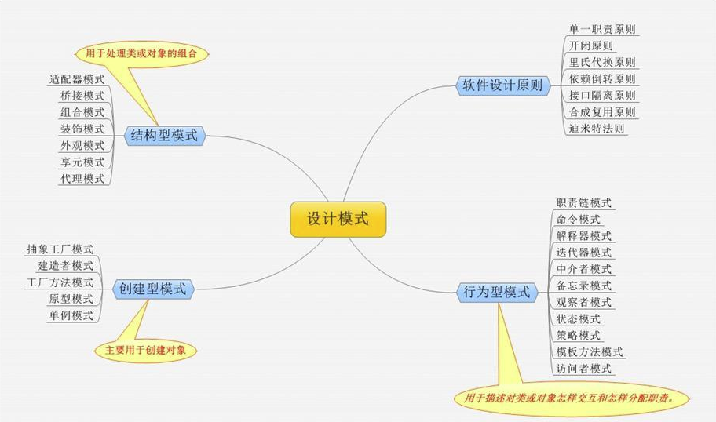

####iOS常用设计模式:

***1.单例***

> 保证一个类仅有一个实例，并提供一个访问它的全局访问点。该类需要跟踪单一的实例，并确保没有其它实例被创建。单例类适合于需要通过单个对象访问全局资源的场合。
>
> eg: 各种管理类,值传递,消息通信.(生命周期与应用程序绑定)

***2.观察者***

> 定义一种对象间一对多的依赖关系，使得当一个对象的状态发生变化时，其它具有依赖关系的对象可以自动地被通知和更新。
>
> eg:NSNotification、KVO

***3.抽象工厂***

> 提供一个接口，用于创建与某些对象相关或依赖于某些对象的类家族，而又不需要指定它们的具体类。
>
> eg:Foundation的NSString`、`NSData`、`NSDictionary`、`NSSet`、和`NSArray -->NSMutableString`、`NSMutableData`、`NSMutableDictionary`、`NSMutableSet`、和`NSMutableArray

***4.原型模式***

> 用原型实例指定创建对象的种类，并且通过拷贝这些原型创建新的对象。
>
> eg:对象的深浅复制

***5.适配器模式***

> 将一个类的接口转换成另外一个客户希望的接口。Adapter 模式使得原本由于接口不兼容而不能一起工作的那些类可以一起工作。
>
> eg:UITableView二次封装减少代码量

***6.代理模式***

> 为其他对象提供一种代理以控制对这个对象的访问。
>
> eg:delegate,protocol

***7.中介者模式***

> 用一个中介对象来封装一系列的对象交互。中介者使各对象不需要显式地相互引用，从而使其耦合松散，而且可以独立地改变它们之间的交互。
>
> eg:组件化 Mediator 

***8.MVC***

> iOS 开发中，**MVC（Model View Controller）**是构建iOS App的标准模式，是苹果推荐的一个用来组织代码的权威范式。Apple甚至是这么说的。在**MVC**下，所有的对象被归类为一个**Model**，一个**View**，和一个**Controller**。( **Massive View Controller** )

***9.MVVM***

> **MVC**引申出来一种**维护性较强**、**耦合性低**的新的架构**MVVM（Model View View-Mode）**，**MVVM**正式规范了视图和控制器紧耦合的性质，并引入新的组件。

***10.MVP***

>MVP 即 Modal View Presenter


###二.数据结构

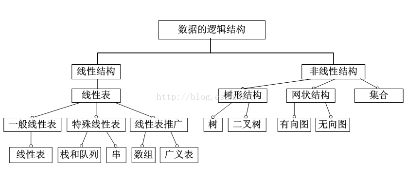

> 1.数组:按序排列的同类数据元素的集合称为数组
>
> 2.栈:只能在某一端插入和删除的特殊线性表
>
> 3.队列:一种特殊的线性表，它只允许在表的前端（front）进行删除操作，而在表的后端（rear）进行插入操作
>
> 4.链表:一种物理存储单元上非连续、非顺序的存储结构，它既可以表示线性结构，也可以用于表示非线性结构，数据元素的逻辑顺序是通过链表中的指针链接次序实现的. 每个结点包括两个部分：一个是存储[数据元素](https://baike.baidu.com/item/%E6%95%B0%E6%8D%AE%E5%85%83%E7%B4%A0)的数据域，另一个是存储下一个结点地址的[指针](https://baike.baidu.com/item/%E6%8C%87%E9%92%88/2878304)域。
>
> 5.树:包含n（n>0）个结点的有穷集合K，且在K中定义了一个关系N，N满足 以下条件：
>
> （1）有且仅有一个结点 K0，他对于关系N来说没有前驱，称K0为树的根结点。简称为根（root）。　 
>
> （2）除K0外，K中的每个结点，对于关系N来说有且仅有一个前驱。
>
> （3）K中各结点，对关系N来说可以有m个后继（m>=0）。
>
> 6.图:由结点的有穷集合V和边的集合E组成
>
> 7.堆:堆是一种特殊的树形数据结构，每个结点都有一个值。通常我们所说的堆的数据结构，是指二叉堆。堆的特点是根结点的值最小（或最大），且根结点的两个子树也是一个堆
>
> 8.哈希表(Hash table) : 哈希表(Hash Table)也叫散列表，是根据关键码值（Key Value）而直接进行访问的数据结构。它通过把关键码值映射到哈希表中的一个位置来访问记录，以加快查找的速度。这个映射函数就做散列函数，存放记录的数组叫做散列表。
>
> [**Hash table 在iOS 中的各种应用**](http://www.cocoachina.com/cms/wap.php?action=article&id=26391)


###三.算法


###四.应用的生命周期

####**1.main()之前经历什么:**

> 1.动态库链接库 dylib
>
> 2.ImageLoader加载可执行文件, 里边是被编译过的符号,代码等
>
> 3.runtime与+load

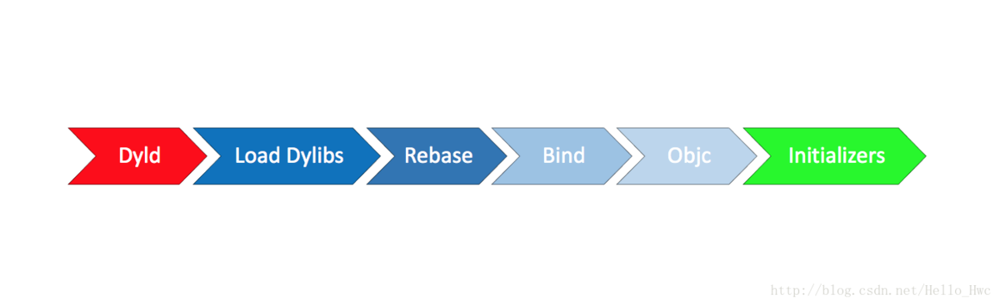

####***2.main()之后:***

> 1.执行AppDelegate的代理方法，主要是didFinishLaunchingWithOptions
>
> 2.初始化Window，初始化基础的ViewController结构(一般是UINavigationController+UITabViewController)
>
> 3.获取数据(Local DB／Network)，展示给用户。


####***3.启动优化思路:***

**能延迟初始化的尽量延迟初始化，不能延迟初始化的尽量放到后台初始化。**

> - 三方SDK初始化，比如Crash统计; 像分享之类的，可以等到第一次调用再出初始化。
>
> - 初始化某些基础服务，比如WatchDog，远程参数。
>
> - 启动相关日志，日志往往涉及到DB操作，一定要放到后台去做
>
> - 业务方初始化，这个交由每个业务自己去控制初始化时间。

#### 4.内存中的5大区

> - 栈区（stack）：由编译器自动分配释放 ，存放函数的参数值，局部变量的值等。其 操作方式类似于数据结构中的栈。
> - 堆区（heap）：一般由程序员分配释放， 若程序员不释放，程序结束时可能由OS回收 。注意它与数据结构中的堆是两回事，分配方式倒是类似于链表。
> - 全局区（静态区）（static）：全局变量和静态变量的存储是放在一块的，初始化的 全局变量和静态变量在一块区域， 未初始化的全局变量和未初始化的静态变量在相邻的另一块区域。 - 程序结束后由系统释放。
> - 文字常量区：常量字符串就是放在这里的。 程序结束后由系统释放。
> - 程序代码区：存放函数体的二进制代码。


###五. OC语言设计原理

####**1. synthesize , dynamic**

> `@synthesize`的语义是如果你没有手动实现 `setter` 方法和 `getter` 方法，那么编译器会自动为你加上这两个方法。
>
> `@dynamic`告诉编译器：属性的 `setter` 与 `getter` 方法由用户自己实现，不自动生成。（当然对于 `readonly` 的属性只需提供 `getter` 即可）。编译时没问题，运行时才执行相应的方法，这就是所谓的动态绑定。

####2.+(void)load和+(void)initialize

>- 当类被引用进项目的时候就会执行***load***函数(在main函数开始执行之前）,与这个类是否被用到无关,每个类的load函数只会自动调用一次
>- ***initialize***在类或者其子类的第一个方法被调用前调用


####3.各种关键字

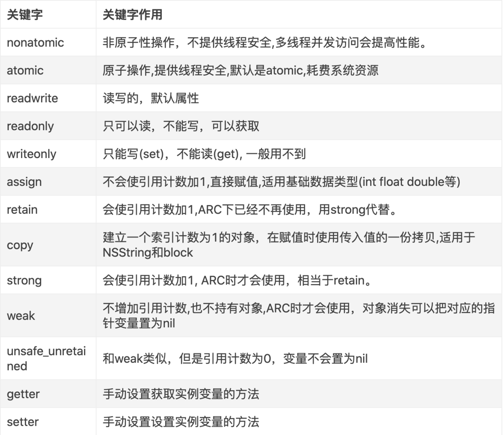


>##### atomic : 只能实现读写的线程安全，并不能保证该属性本身的线程安全.
>
>Weak: **Weak表是一个hash（哈希）表，然后里面的key是指向对象的地址，Value是Weak指针的地址（这个地址的值是所指对象指针的地址）的数组**
>
>Copy: **setter方法进行Copy操作，与retain处理流程一样，先旧值release，再Copy出新的对象，retainCount为1**
>
>unsafe_unretained : **修饰的指针纯粹只是指向对象，没有任何额外的操作**
>
>Assign: **简单赋值，不改变引用计数**


#### 4.ARC和MRC,AutoRelease

> ***ARC***: **Automatic Reference Counting 自动引用,完全消除了手动管理内存的烦琐，编译器会自动在适当的地方插入适当的retain、release、autorelease语句**
>
> ***MRC***: **手动管理内存（retain, release, autorelease,不多说） 持有对象,retain+1 ,引用计数加1, 释放对象:release -1, 引用计数减1,当引用计数为0时,会自动释放内存**
>
> 经过分析，`AutoreleasePool`的内存结构如上图所示，特点如下：
>
> - 自动释放池是一个栈的结构，是一个以`AutoreleasePoolPage`为结点的双向链表，根据需要来动态添加或删除页面。
> - 每一页`AutoreleasePoolPage`的大小为`4096`字节，地址从低到高依次存储`page自身成员`、`哨兵`、`对象指针`。其中，自身成员占用`56`字节，且哨兵作为对象指针的边界，在释放池里只会有一个，因此：
>   - 第一页，内部存放：`page成员` + `1个哨兵` + `504个对象指针`。
>   - 其它页，内部存放：`page成员` + `505个对象指针`。
> - 已存满的页面被标记为`full page`，当前正在操作的页被标记为`hot page`。
> - `AutoreleasePoolPage`继承自`AutoreleasePoolPageData`，内部成员情况如下：
>   - `magic`：用来校验`AutoreleasePoolPage`的结构是否完整。
>   - `next` ：下次新添加的`autoreleased`对象的位置，初始化时指向`begin()`。
>   - `thread`：当前线程，说明自动释放池和线程有关联。
>   - `parent` ：指向父节点，即上一个页面，第一个页面的`parent`值为`nil`。
>   - `child`：指向子节点，即下一个页面，最后一个页面的`child`值为`nil`。
>   - `depth` ：表示页面深度，从0开始，往后递增1。
>   - `hiwat` ：即`high water mark`，表示最大入栈数量标记

**Runloop和Autorelease Pool联系:**

> **在没有手加Autorelease Pool的情况下，Autorelease对象是在当前的runloop迭代结束时释放的**

```
根据苹果官方文档中对 NSRunLoop 的描述，我们可以知道每一个线程，包括主线程，都会拥有一个专属的 NSRunLoop 对象，并且会在有需要的时候自动创建。子线程的runloop需要自己手动创建，如果子线程的runloop没有任何事件，runloop会马上退出。（曾经我在写异步网络请求时想利用runloop来暂停线程来执行回调，但是由于没有添加任何事件源，导致runloop马上结束。网络请求失败）如果在每个 event loop 开始前，系统会自动创建一个 autoreleasepool ，并在 event loop 结束时 drain 。我们上面提到的场景 1 中创建的 autoreleased 对象就是被系统添加到了这个自动创建的 autoreleasepool 中，并在这个 autoreleasepool 被 drain 时得到释放。另外，NSAutoreleasePool 中还提到，每一个线程都会维护自己的 autoreleasepool 堆栈。换句话说 autoreleasepool 是与线程紧密相关的，每一个 autoreleasepool 只对应一个线程。
```


#### 5. Category和Extension

#####Category :

> ```objective-c
> typedef struct category_t {
>     const char *name;//类的名字 主类名字
>     classref_t cls;//类
>     struct method_list_t *instanceMethods;//实例方法的列表
>     struct method_list_t *classMethods;//类方法的列表
>     struct protocol_list_t *protocols;//所有协议的列表
>     struct property_list_t *instanceProperties;//添加的所有属性
> } category_t;
> ```
>
> 作用:可以在不修改原来类的基础上，为一个类扩展方法 . category_t 中的方法列表是插入到主类的方法列表前面（类似利用链表中的 next 指针来进行插入），所以这里 Category 中实现的方法并不会真正的覆盖掉主类中的方法，只是将 Category 的方法插到方法列表的前面去了.
>
> ```objective-c
> @interface NSObject (Extension)
> @property (nonatomic,copy  ) NSString *name;
> @end
> @implementation NSObject (Extension)
> - (void)setName:(NSString *)name {
>     objc_setAssociatedObject(self, @selector(name), name, OBJC_ASSOCIATION_COPY_NONATOMIC);
> }
> - (NSString *)name {
>     return objc_getAssociatedObject(self,@selector(name));
> } 
> ```
>
> ***category是在运行时添加到类中,因为类的内存已经确定所以无法添加实例变量,但是可以添加@property生成setter,getter (实质还是方法). 注:`关联对象` 以哈希表的格式，存储在一个全局的单例中。***

#####Extension :

>  类扩展与分类相比只少了分类的名称，所以称之为“匿名分类” .
>
> ***extension 可以添加方法和属性(包括实例变量), 因为它是编译时被添加到类中.***


####6.@property和实例变量

> - @property是是声明属性的语法
> - @property用在声明文件中告诉编译器声明成员变量的的访问器(getter/setter)方法
> - 使用@property的好处是：免去我们手工书写getter和setter方法繁琐的代码


###六. Swift语言设计原理

####***1.[swift中高阶函数map、flatMap、filter、reduce](https://www.cnblogs.com/muzijie/p/6542650.html)***

>  map：可以对数组中的每一个元素做一次处理.
>
> flatMap: 对元素进行操作同时 会解包和展开二维数组,且去除nil.
>
> filer：过滤，可以对数组中的元素按照某种规则进行一次过滤.
>
> reduce：计算，可以对数组的元素进行计算.


####***2.结构体和类对比***

> Swift 中结构体和类有很多共同点。两者都可以：
>
> - 定义属性用于存储值
> - 定义方法用于提供功能
> - 定义下标操作用于通过下标语法访问它们的值
> - 定义构造器用于设置初始值
> - 通过扩展以增加默认实现之外的功能
> - 遵循协议以提供某种标准功能
>
> 更多信息请参见 [属性]()、[方法]()、[下标]()、[构造过程]()、[扩展]() 和 [协议]()。
>
> 与结构体相比，类还有如下的附加功能：
>
> - 继承允许一个类继承另一个类的特征
> - 类型转换允许在运行时检查和解释一个类实例的类型
> - 析构器允许一个类实例释放任何其所被分配的资源
> - 引用计数允许对一个类的多次引用


####***3.值类型有哪些***

> 结构体,枚举
>
> Swift 中所有的基本类型：整数（integer）、浮点数（floating-point number）、布尔值（boolean）、字符串（string)、数组（array）和字典（dictionary），都是值类型，其底层也是使用结构体实现的.


####***4.copy on write***

> Swift 中的值类型,并不会在一开始赋值的时候就开辟新的内存空间,只有在需要改变这个值的时候才去开辟新的内存空间,以达到优化内存的目的.
>
> 标准库定义的集合，例如数组，字典和字符串，都对复制进行了优化以降低性能成本。新集合不会立即复制，而是跟原集合共享同一份内存，共享同样的元素。在集合的某个副本要被修改前，才会复制它的元素。而你在代码中看起来就像是立即发生了复制。


####***5.optiinal原理***

> ```swift
> enum Optional<T> {
>     case some(T)   //对于所有成功的情况，我们用case some，并且把成功的结果保存在associated value里；
>     case none        对于所有错误的情况，我们用case none来表示；
> }
> ```


####***6.Swift中如何使用runtime***

Swift代码中已经没有了Objective-C的运行时消息机制, 在代码编译时即确定了其实际调用的方法. 所以纯粹的Swift类和对象没有办法使用runtime, 更不存在method swizzling. 
为了兼容Objective-C, 凡是继承NSObject的类都会保留其动态性, 依然遵循Objective-C的运行时消息机制, 因此可以通过runtime获取其属性和方法, 实现method swizzling.


####***7.闭包***

为了优化，如果一个值不会被闭包改变，或者在闭包创建后不会改变，Swift 可能会改为捕获并保存一份对值的拷贝。

Swift 也会负责被捕获变量的所有内存管理工作，包括释放不再需要的变量。


####***8.作用域修饰符***


> *open* 和 *public* 级别可以让实体被同一模块源文件中的所有实体访问，在模块外也可以通过导入该模块来访问源文件里的所有实体。通常情况下，你会使用 open 或 public 级别来指定框架的外部接口。open 只能作用于类和类的成员，它和 public 的区别主要在于 open 限定的类和成员能够在模块外能被继承和重写.
>
> *internal* 级别让实体被同一模块源文件中的任何实体访问，但是不能被模块外的实体访问。通常情况下，如果某个接口只在应用程序或框架内部使用，就可以将其设置为 internal 级别。
>
> *fileprivate* 限制实体只能在其定义的文件内部访问。如果功能的部分实现细节只需要在文件内使用时，可以使用 fileprivate 来将其隐藏。
>
> *private* 限制实体只能在其定义的作用域，以及同一文件内的 extension 访问。如果功能的部分细节只需要在当前作用域内使用时，可以使用 private 来将其隐藏。


###七.iOS各种机制和原理

####***1.Runloop***

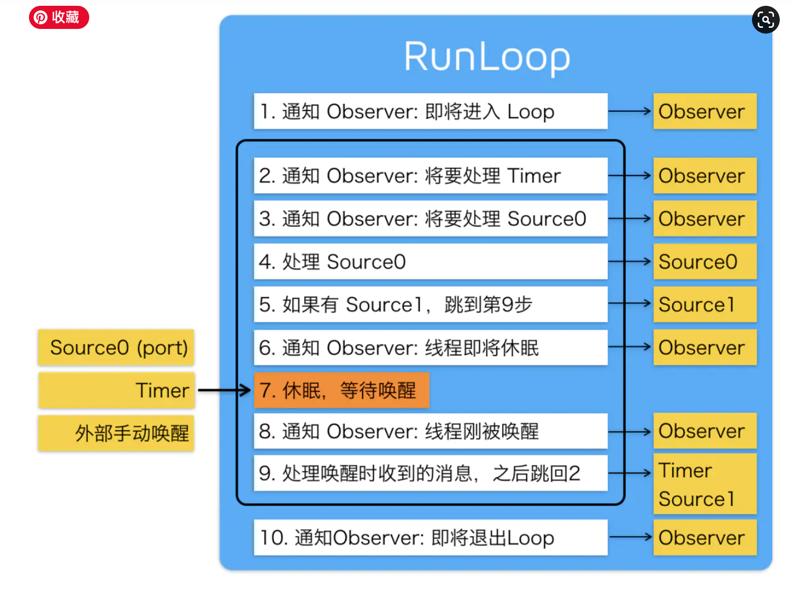

> 可以理解为字面意思：Run 表示运行，Loop 表示循环。结合在一起就是运行的循环的意思。哈哈，我更愿意翻译为『跑圈』。直观理解就像是不停的跑圈。
>
> - RunLoop 实际上是一个对象，这个对象在循环中用来处理程序运行过程中出现的各种事件（比如说触摸事件、UI刷新事件、定时器事件、Selector事件），从而保持程序的持续运行。
> - RunLoop 在没有事件处理的时候，会使线程进入睡眠模式，从而节省 CPU 资源，提高程序性能。


####***2.Runtime***


##### 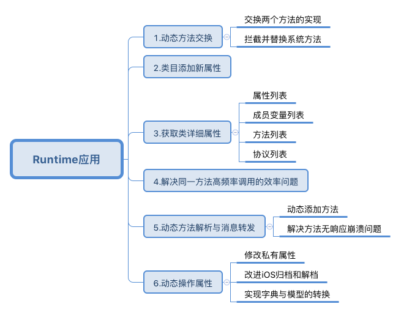


> ##### Runtime API提供的接口基本都是C语言的，源码由C\C++\汇编语言编写.
>
> ##### Objective-C成为动态性语言的基石.
>
> - 动态方法解析  : 让你有机会提供一个函数实现
> - 备用接收者 : 给你把这个消息转发给其他对象的机会
> - 完整消息转发 :`-methodSignatureForSelector:`消息获得函数的参数和返回值,如果返回了一个函数签名，`Runtime`就会创建一个`NSInvocation` 对象并发送 `-forwardInvocation:`消息给目标对象


####***3.dsym符号表***

```xml
<起始地址> <结束地址> <函数> [<文件名:行号>]
```


####***4.NULL***

> 标识                  值                          含义
> NULL         (void *)0            C指针的字面零值
> nil                  (id)0                Objective-C对象的字面零值
> Nil               (Class)0            Objective-C类的字面零值
> NSNull   [NSNull null]        用来表示零值的单独的对象


####***5.静态库和动态库***

- 动态库和静态库介绍

  ```undefined
  首先静态库和动态库都是以二进制提供代码复用的代码库
  静态库 常见的是 .a
  动态库常见的是 .dll(windows)，.dylib(mac)，so(linux)
  framework(in Apple): Framework 是Cocoa/Cocoa Touch程序中使用的一种资源打包方式，可以将代码文件、头文件、资源文件、说明文档等集中在一起，方便开发者使用。也就是说我们的 framework其实是资源打包的方式，和静态库动态库的本质是没有关系的
  ```

- 静态库和动态库的区别

  ```undefined
  静态库: 链接时会被完整的复制到可执行文件中，所以如果两个程序都用了某个静态库，那么每个二进制可执行文件里面其实都含有这份静态库的代码
  动态库: 链接时不复制，在程序启动后用dyld加载，然后再决议符号，所以理论上动态库只用存在一份，好多个程序都可以动态链接到这个动态库上面，达到了节省内存(不是磁盘是内存中只有一份动态库)，还有另外一个好处，由于动态库并不绑定到可执行程序上，所以我们想升级这个动态库就很容易，windows和linux上面一般插件和模块机制都是这样实现的。
  But我们的苹果爸爸在iOS平台上规定不允许存在动态库，并且所有的 IPA 都需要经过苹果爸爸的私钥加密后才能用，基本你用了动态库也会因为签名不对无法加载，(越狱和非 APP store 除外)。于是就把开发者自己开发动态库掐死在幻想中。
  直到有一天，苹果爸爸的iOS升级到了8，iOS出现了APP Extension，swift编程语言也诞生了，由于iOS主APP需要和Extension共享代码，Swift语言的机制也只能有动态库，于是苹果爸爸尴尬了，不过这难不倒我们的苹果爸爸，毕竟我是爸爸，规则是我来定，我想怎样就怎样，于是提出了一个概念Embedded Framework，这种动态库允许APP和APP Extension共享代码，但是这份动态库的生命被限定在一个APP进程内。简单点可以理解为被阉割的动态库。
  ```


####***6.KVC 、KVO***

***kvc:使用字符串直接访问对象的属性，或者给对象属性赋值***

***kvo:键值观察机制，它提供了观察对象属性变化的方法***


**kvc底层实现 :**

> **当一个对象调用setValue方法时，方法内部会做以下操作：**
>
> 1.检查是否存在相应key的set方法，如果存在，就调用set方法
>
> 2.如果set方法不存在，就会查找与key相同名称并且带下划线的成员属性，如果有，则直接给成员属性赋值
>
> 3.如果没有找到_key，就会查找相同名称的属性key，比如_iskey,iskey，如果有就直接赋值
>
> 4.如果还没找到，则调用valueForUndefinedKey：和setValue：forUndefinedKey：方法
>
> 如果开发者想让这个类禁用KVC，那么重写+ (BOOL)accessInstanceVariablesDirectly方法让其返回NO即可，这样的话如果KVC没有找到set:属性名时，会直接用setValue：forUndefinedKey：方法。


**KVO的底层实现** :

> kvo基于runtime机制实现
>
> 使用了isa混写（isa-swizzling），当一个对象（假设是person对象，person的类是MyPerson）的属性值（假设person的age）被观察时（addObserver:），系统会自动生成一个类，继承自MyPerson，NSKVONotifying_MyPerson，打印这个子类可以看到内部也有一个 setName:方法 还重写了 class 和 dealloc 方法 , _isKVOA
>
> **官方解释：当某个类的对象一次被观察时，系统就会在运行时动态的创建该类的一个派生类（子类）**
>
> 在这个类的setAge方法里面，调用
>
> ```text
> [self willChangeValueForKey:@"age"] 
> [self setAge:age] 
> [self didChangeValueForKey:@"age"]
> ```
>
> 而这两个方法内部会主动调用监听者内部的- (void)observeValueForKeyPath 这个方法。


####***7.Notification***

> **`NSNotificationCenter`内部保存了两张(链)表：一张用户保存添加观察者时传入了NotificationName的情况，一种用户保存添加观察者时没有传入NoficationName的情况**


**Named Table**
在named table中，NotificationName作为表的key，但因注册观察者的时可传入一个object参数用于接收指定对象发出的通知，并且一个通知可注册多个观察者，所以还需要一张表来保存object和observer的对应关系。这张表以object为key，observer为value。

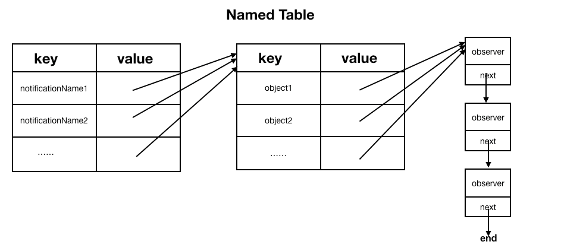


named table最终的数据结构如上图所示：

- 外层是一个table，以通知名称NotificationName为key，其value为一个table（简称内层table）。

- 内层table以object为key，其value为一个链表，用来保存所有的观察者。


**Nameless Table**
Nameless Table比Named Table要简单很多，因为没有NotificationName作为key，直接用object作为key。相较于Named Table要少一层table嵌套。

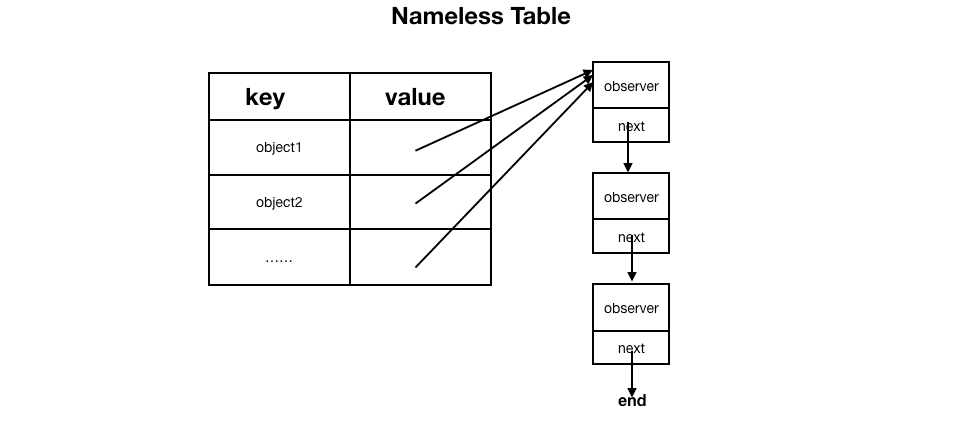


**wildcard**
wildcard是链表的数据结构，如果在注册观察者时既没有传入NotificationName，也没有传入object，就会添加到wildcard的链表中。注册到这里的观察者能接收到 所有的系统通知。


**添加观察者流程**
有了上面基本的结构关系，再来看添加过程就会很简单。在初始化NotificationCenter时会创建一个对象，这个对象里保存了Named Table、Nameless Table、wildcard和一些其它信息。所有注册观察者的操作最后都会调用`addObserver:selector:name:object:`。

1. 首先会根据传入的参数实例化一个Observation，Observation对象保存了观察者对象，接收到通知观察者所执行的方法，以及下一个Observation对象的地址。
2. 根据是否传入NotificationName选择操作Named Table还是Nameless Table。
3. 若传入了NotificationName，则会以NotificationName为key去查找对应的Value，若找到value，则取出对应的value；若未找到对应的value，则新建一个table，然后将这个table以NotificationName为key添加到Named Table中。
4. 若在保存Observation的table中，以object为key取对应的链表。若找到了则直接在链接末尾插入之前实例化好的Observation；若未找到则以之前实例化好的Observation对象作为头节点插入进去。

没有传入NotificationName的情况和上面的过程类似，只不过是直接根据对应的object为key去找对应的链表而已。如果既没有传入NotificationName也没有传入object，则这个观察者会添加到wildcard链表中。

**发送通知流程**
发送通知一般调用`postNotificationName:object:userInfo:`来实现，内部会根据传入的参数实例化一个NSNotification对象，包含name、object、userinfo等信息。

> 发送通知的流程总体来说是根据NotificationName和object找到对应的链表，然后遍历整个链表，给每个Observation节点中保存的oberver发送对应的SEL消息。

1. 首先会创建一个数组observerArray用来保存需要通知的observer。
2. 遍历wildcard链表，将observer添加到observerArray数组中。
3. 若存在object，在nameless table中找到以object为key的链表，然后遍历找到的链表，将observer添加到observerArray数组中。
4. 若存在NotificationName，在named table中以NotificationName为key找到对应的table，然后再在找到的table中以object为key找到对应的链表，遍历链表，将observer添加到observerArray数组中。如果object不为nil，则以nil为key找到对应的链表，遍历链表，将observer添加到observerArray数组中。
5. 至此所有关于当前通知的observer（wildcard+nameless+named）都已经加入到了数组observerArray中。遍历observerArray数组，取出其中的observer节点（包含了观察者对象和selector），调用形式如下：

```objective-c
[o->observer performSelector: o->selector withObject: notification];
```

这种处理通知的方式也就能说明，**发送通知的线程和接收通知的线程是同一线程**。

####***8.***多线程

在 iOS 中其实目前有 `4` 套多线程方案，他们分别是：

> - Pthreads
> - NSThread
> - GCD
> - NSOperation & NSOperationQueue

```objc
    pthread_t thread;
    //创建一个线程并自动执行
    pthread_create(&thread, NULL, start, NULL);
```


```swift
方式一:
   //创建
  let thread = NSThread(target: self, selector: "run:", object: nil)
  //启动
  thread.start()

方式二:
  NSThread.detachNewThreadSelector("run:", toTarget: self, withObject: nil)
```

**GCD**

1. GCD 简介
2. GCD 任务和队列
3. GCD 的使用步骤
4. GCD 的基本使用（六种组合不同区别，队列嵌套情况区别，相互关系形象理解）
5. GCD 线程间的通信
6. GCD 的其他方法（栅栏方法：dispatch_barrier_async、延时执行方法：dispatch_after、一次性代码（只执行一次）：dispatch_once、快速迭代方法：dispatch_apply、队列组：dispatch_group、信号量：dispatch_semaphore）

**GCD 栅栏方法：dispatch_barrier_async**

`dispatch_barrier_async` 方法会等待前边追加到并发队列中的任务全部执行完毕之后，再将指定的任务追加到该异步队列中

```objc
/**
 * 一次性代码（只执行一次）dispatch_once
 */
- (void)once {
    static dispatch_once_t onceToken;
    dispatch_once(&onceToken, ^{
        // 只执行 1 次的代码（这里面默认是线程安全的）
    });
}
```

**dispatch_after**

```objc
/**
 * 延时执行方法 dispatch_after
 */
- (void)after {
    NSLog(@"currentThread---%@",[NSThread currentThread]);  // 打印当前线程
    NSLog(@"asyncMain---begin");
    
    dispatch_after(dispatch_time(DISPATCH_TIME_NOW, (int64_t)(2.0 * NSEC_PER_SEC)), dispatch_get_main_queue(), ^{
        // 2.0 秒后异步追加任务代码到主队列，并开始执行
        NSLog(@"after---%@",[NSThread currentThread]);  // 打印当前线程
    });
}
```


**dispatch_once**

```objc
/**
 * 一次性代码（只执行一次）dispatch_once
 */
- (void)once {
    static dispatch_once_t onceToken;
    dispatch_once(&onceToken, ^{
        // 只执行 1 次的代码（这里面默认是线程安全的）
    });
}
```


**dispatch_apply**

`dispatch_apply` 按照指定的次数将指定的任务追加到指定的队列中，并等待全部队列执行结束

```objc
/**
 * 快速迭代方法 dispatch_apply
 */
- (void)apply {
    dispatch_queue_t queue = dispatch_get_global_queue(DISPATCH_QUEUE_PRIORITY_DEFAULT, 0);
    
    NSLog(@"apply---begin");
    dispatch_apply(6, queue, ^(size_t index) {
        NSLog(@"%zd---%@",index, [NSThread currentThread]);
    });
    NSLog(@"apply---end");
}
```

**dispatch_group,dispatch_group_notify**

```objc
/**
 * 队列组 dispatch_group_notify
 */
- (void)groupNotify {
    NSLog(@"currentThread---%@",[NSThread currentThread]);  // 打印当前线程
    NSLog(@"group---begin");
    
    dispatch_group_t group =  dispatch_group_create();
    
    dispatch_group_async(group, dispatch_get_global_queue(DISPATCH_QUEUE_PRIORITY_DEFAULT, 0), ^{
        // 追加任务 1
        [NSThread sleepForTimeInterval:2];              // 模拟耗时操作
        NSLog(@"1---%@",[NSThread currentThread]);      // 打印当前线程
    });
    
    dispatch_group_async(group, dispatch_get_global_queue(DISPATCH_QUEUE_PRIORITY_DEFAULT, 0), ^{
        // 追加任务 2
        [NSThread sleepForTimeInterval:2];              // 模拟耗时操作
        NSLog(@"2---%@",[NSThread currentThread]);      // 打印当前线程
    });
    
    dispatch_group_notify(group, dispatch_get_main_queue(), ^{
        // 等前面的异步任务 1、任务 2 都执行完毕后，回到主线程执行下边任务
        [NSThread sleepForTimeInterval:2];              // 模拟耗时操作
        NSLog(@"3---%@",[NSThread currentThread]);      // 打印当前线程

        NSLog(@"group---end");
    });
}
```


**NSOperation和NSOperationQueue**

NSOperation 是苹果公司对 GCD 的封装，完全面向对象，所以使用起来更好理解。 大家可以看到 `NSOperation 和 NSOperationQueue` 分别对应 GCD 的 `任务 和 队列` 。操作步骤也很好理解：

1. 将要执行的任务封装到一个 `NSOperation` 对象中。
2. 将此任务添加到一个 `NSOperationQueue` 对象中。


```swift
//1.任务一：下载图片
let operation1 = NSBlockOperation { () -> Void in
    NSLog("下载图片 - %@", NSThread.currentThread())
    NSThread.sleepForTimeInterval(1.0)
}

//2.任务二：打水印
let operation2 = NSBlockOperation { () -> Void in
    NSLog("打水印   - %@", NSThread.currentThread())
    NSThread.sleepForTimeInterval(1.0)
}

//3.任务三：上传图片
let operation3 = NSBlockOperation { () -> Void in
    NSLog("上传图片 - %@", NSThread.currentThread())
    NSThread.sleepForTimeInterval(1.0)
}

//4.设置依赖
operation2.addDependency(operation1)    //任务二依赖任务一
operation3.addDependency(operation2)    //任务三依赖任务二

//5.创建队列并加入任务
let queue = NSOperationQueue()
queue.addOperations([operation3, operation2, operation1], waitUntilFinished: false)
```


> **队列：**用于存放任务。一共有两种队列， **串行队列** 和 **并行队列**。
>
> **串行队列** 中的任务会根据队列的定义 FIFO 的执行，一个接一个的先进先出的进行执行。
>
> 放到串行队列的任务，GCD 会 `FIFO（先进先出）` 地取出来一个，执行一个，然后取下一个，这样一个一个的执行。
>
> **主队列**：这是一个特殊的 `串行队列`。什么是主队列，大家都知道吧，它用于刷新 UI，任何需要刷新 UI 的工作都要在主队列执行，所以一般耗时的任务都要放到别的线程执行。
>
> **任务：**即操作，你想要干什么，说白了就是一段代码，在 GCD 中就是一个 Block，所以添加任务十分方便。


|          | 同步执行               | 异步执行               |
| -------- | ---------------------- | ---------------------- |
| 串行队列 | 当前线程，一个一个执行 | 其他线程，一个一个执行 |
| 并行队列 | 当前线程，一个一个执行 | 开很多线程，一起执行   |

**任务：**

计算机工作的基本工作单元，它由控制程序处理的一个或者多个指令序列。

**线程：**

是 <u>操作系统</u> 能够**进行运算调度**的**最小**单位。它被包含在进程中，是进程中实际运作单位。

一条线程：指的是进程中某一单一顺序的控制流，
一个进程可以并发多个线程，每条线程执行不同的任务。

**小总结**：线程是任务实际运作单位。(任务需要被放入线程中，才能执行)

**队列：**

[数据结构](https://links.jianshu.com/go?to=https%3A%2F%2Fbaike.baidu.com%2Fitem%2F%25E9%2598%259F%25E5%2588%2597%2F14580481)，拥有先进先出的特点。是计算机中，用于存放任务的基本单位，分为串行队列和并行队列(GCD)。


**队列与线程，就是两个不同的对象，其处理的业务逻辑本质就不一样。一个是执行任务(线程)，一个是存储并分发任务(队列)**

**死锁:** **主队列中追加的同步任务** 和 **主线程本身的任务** 两者之间相互等待，阻塞了 **『主队列』**，最终造成了主队列所在的线程（主线程）死锁问题


####9.锁

>我们在使用多线程的时候多个线程可能会访问同一块资源，这样就很容易引发数据错乱和数据安全等问题，这时候就需要我们保证每次只有一个线程访问这一块资源，**锁** 应运而生。
>
>**悲观锁：总是假设最坏的情况，认为竞争总是存在，每次拿数据的时候都认为会被修改，因此每次都会先上锁。其他线程阻塞等待释放锁。
>乐观锁：总是假设最好的情况，认为竞争总是不存在，每次拿数据的时候都认为不会被修改，因此不会先上锁，在最后更新的时候比较数据有无更新，可通过版本号或CAS实现。**
>
>***悲观锁：用于写比较多的情况，避免了乐观锁不断重试从而降低性能
>乐观锁：用于读比较多的情况，避免了不必要的加锁的开销***

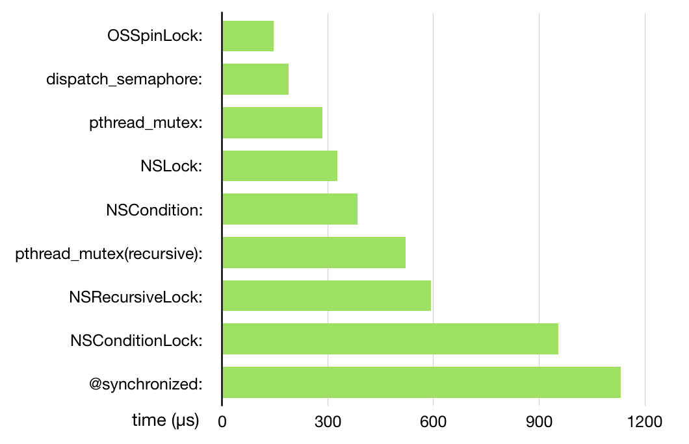

**OSSpinLock**

```objectivec
__block OSSpinLock oslock = OS_SPINLOCK_INIT;
//线程1
dispatch_async(dispatch_get_global_queue(DISPATCH_QUEUE_PRIORITY_DEFAULT, 0), ^{
    NSLog(@"线程1 准备上锁");
    OSSpinLockLock(&oslock);
    sleep(4);
    NSLog(@"线程1");
    OSSpinLockUnlock(&oslock);
    NSLog(@"线程1 解锁成功");
    NSLog(@"--------------------------------------------------------");
});

//线程2
dispatch_async(dispatch_get_global_queue(DISPATCH_QUEUE_PRIORITY_DEFAULT, 0), ^{
    NSLog(@"线程2 准备上锁");
    OSSpinLockLock(&oslock);
    NSLog(@"线程2");
    OSSpinLockUnlock(&oslock);
    NSLog(@"线程2 解锁成功");
});
```


**dispatch_semaphore 信号量**

```objectivec
dispatch_semaphore_t signal = dispatch_semaphore_create(1); //传入值必须 >=0, 若传入为0则阻塞线程并等待timeout,时间到后会执行其后的语句
dispatch_time_t overTime = dispatch_time(DISPATCH_TIME_NOW, 3.0f * NSEC_PER_SEC);

//线程1
dispatch_async(dispatch_get_global_queue(DISPATCH_QUEUE_PRIORITY_DEFAULT, 0), ^{
    NSLog(@"线程1 等待ing");
    dispatch_semaphore_wait(signal, overTime); //signal 值 -1
    NSLog(@"线程1");
    dispatch_semaphore_signal(signal); //signal 值 +1
    NSLog(@"线程1 发送信号");
    NSLog(@"--------------------------------------------------------");
});

//线程2
dispatch_async(dispatch_get_global_queue(DISPATCH_QUEUE_PRIORITY_DEFAULT, 0), ^{
    NSLog(@"线程2 等待ing");
    dispatch_semaphore_wait(signal, overTime);
    NSLog(@"线程2");
    dispatch_semaphore_signal(signal);
    NSLog(@"线程2 发送信号");
});
```

**dispatch_semaphore_create(1)：** 传入值必须 `>=0`, 若传入为 `0` 则阻塞线程并等待timeout,时间到后会执行其后的语句
**dispatch_semaphore_wait(signal, overTime)：**可以理解为 `lock`,会使得 `signal` 值 `-1`
**dispatch_semaphore_signal(signal)：**可以理解为 `unlock`,会使得 `signal` 值 `+1`

#### pthread_mutex

```objectivec
static pthread_mutex_t pLock;
pthread_mutex_init(&pLock, NULL);
 //1.线程1
dispatch_async(dispatch_get_global_queue(DISPATCH_QUEUE_PRIORITY_DEFAULT, 0), ^{
    NSLog(@"线程1 准备上锁");
    pthread_mutex_lock(&pLock);
    sleep(3);
    NSLog(@"线程1");
    pthread_mutex_unlock(&pLock);
});

//1.线程2
dispatch_async(dispatch_get_global_queue(DISPATCH_QUEUE_PRIORITY_DEFAULT, 0), ^{
    NSLog(@"线程2 准备上锁");
    pthread_mutex_lock(&pLock);
    NSLog(@"线程2");
    pthread_mutex_unlock(&pLock);
});
```

#### pthread_mutex(recursive)

```csharp
static pthread_mutex_t pLock;
pthread_mutexattr_t attr;
pthread_mutexattr_init(&attr); //初始化attr并且给它赋予默认
pthread_mutexattr_settype(&attr, PTHREAD_MUTEX_RECURSIVE); //设置锁类型，这边是设置为递归锁
pthread_mutex_init(&pLock, &attr);
pthread_mutexattr_destroy(&attr); //销毁一个属性对象，在重新进行初始化之前该结构不能重新使用

//1.线程1
dispatch_async(dispatch_get_global_queue(DISPATCH_QUEUE_PRIORITY_DEFAULT, 0), ^{
    static void (^RecursiveBlock)(int);
    RecursiveBlock = ^(int value) {
        pthread_mutex_lock(&pLock);
        if (value > 0) {
            NSLog(@"value: %d", value);
            RecursiveBlock(value - 1);
        }
        pthread_mutex_unlock(&pLock);
    };
    RecursiveBlock(5);
});
```

#### NSLock

**lock、unlock**：不多做解释，和上面一样
**trylock**：能加锁返回 YES 并执行**加锁**操作，相当于 lock，反之返回 NO
**lockBeforeDate :  **这个方法表示会在传入的时间内尝试加锁，若能加锁则执行**加锁**操作并返回 YES，反之返回 NO


#### NSCondition

**wait**：进入等待状态
**waitUntilDate:**：让一个线程等待一定的时间
**signal**：唤醒一个等待的线程
**broadcast**：唤醒所有等待的线程

#### NSRecursiveLock

```objective-c
NSLock *rLock = [NSLock new];
dispatch_async(dispatch_get_global_queue(DISPATCH_QUEUE_PRIORITY_DEFAULT, 0), ^{
    static void (^RecursiveBlock)(int);
    RecursiveBlock = ^(int value) {
        [rLock lock];
        if (value > 0) {
            NSLog(@"线程%d", value);
            RecursiveBlock(value - 1);
        }
        [rLock unlock];
    };
    RecursiveBlock(4);
});
```


#### @synchronized

**内部原理**

```cpp
typedef struct SyncData {
    id object;
    recursive_mutex_t mutex;
    struct SyncData* nextData;
    int threadCount;
} SyncData;
typedef struct SyncList {
    SyncData *data;
    spinlock_t lock;
} SyncList;
// Use multiple parallel lists to decrease contention among unrelated objects.
#define COUNT 16
#define HASH(obj) ((((uintptr_t)(obj)) >> 5) & (COUNT - 1))
#define LOCK_FOR_OBJ(obj) sDataLists[HASH(obj)].lock
#define LIST_FOR_OBJ(obj) sDataLists[HASH(obj)].data
static SyncList sDataLists[COUNT];
```

```objectivec
//线程1
dispatch_async(dispatch_get_global_queue(DISPATCH_QUEUE_PRIORITY_DEFAULT, 0), ^{
    @synchronized (self) {
        sleep(2);
        NSLog(@"线程1");
    }
});

//线程2
dispatch_async(dispatch_get_global_queue(DISPATCH_QUEUE_PRIORITY_DEFAULT, 0), ^{
    @synchronized (self) {
        NSLog(@"线程2");
    }
});
```

**NSConditionLock**

```objectivec
NSConditionLock *cLock = [[NSConditionLock alloc] initWithCondition:0];

//线程1
dispatch_async(dispatch_get_global_queue(DISPATCH_QUEUE_PRIORITY_DEFAULT, 0), ^{
    if([cLock tryLockWhenCondition:0]){
        NSLog(@"线程1");
       [cLock unlockWithCondition:1];
    }else{
         NSLog(@"失败");
    }
});

//线程2
dispatch_async(dispatch_get_global_queue(DISPATCH_QUEUE_PRIORITY_DEFAULT, 0), ^{
    [cLock lockWhenCondition:3];
    NSLog(@"线程2");
    [cLock unlockWithCondition:2];
});

//线程3
dispatch_async(dispatch_get_global_queue(DISPATCH_QUEUE_PRIORITY_DEFAULT, 0), ^{
    [cLock lockWhenCondition:1];
    NSLog(@"线程3");
    [cLock unlockWithCondition:3];
});
```


####10.Block和闭包

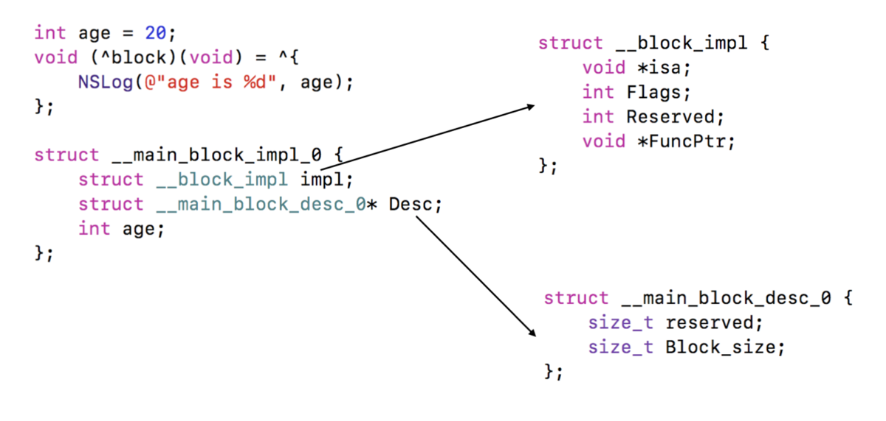

> block 是一个封装了函数调用和局部变量的运行环境的结构体对象
>
> 只要是栈上的block都不会捕获变量。
> 只要是堆上的block 如果引用了外部的局部变量，会根据局部变量使用__strong 还是用__weak来决定是否强引用；
>
> **Block修改外部变量**
> Soultion1:用static修饰或者改成全局变量
> Soultion2:用__block修饰或者改成全局变量
> 编译器会将__block变量包装成一个对象，并且被Block强引用
>
> **闭包 : ** *闭包*是自包含的函数代码块，可以在代码中被传递和使用。Swift 中的闭包与 C 和 Objective-C 中的代码块（blocks）以及其他一些编程语言中的匿名函数（Lambdas）比较相似。


####11.响应者链

**3.1.事件的产生**


> - 发生触摸事件后，系统会将该事件加入到一个由UIApplication管理的事件队列中,为什么是队列而不是栈？因为队列的特点是FIFO，即先进先出，先产生的事件先处理才符合常理，所以把事件添加到队列。
> - UIApplication会从事件队列中取出最前面的事件，并将事件分发下去以便处理，通常，先发送事件给应用程序的主窗口（keyWindow）。
> - 主窗口会在视图层次结构中找到一个最合适的视图来处理触摸事件，这也是整个事件处理过程的第一步。
>   找到合适的视图控件后，就会调用视图控件的touches方法来作具体的事件处理。


**3.2.事件的传递**

> - 触摸事件的传递是从父控件传递到子控件
> - 也就是UIApplication->window->寻找处理事件最合适的view
>
> `注 意`: 如果父控件不能接受触摸事件，那么子控件就不可能接收到触摸事件

##### 应用如何找到最合适的控件来处理事件？

> - 1.首先判断主窗口（keyWindow）自己是否能接受触摸事件
> - 2.判断触摸点是否在自己身上
> - 3.子控件数组中从后往前遍历子控件，重复前面的两个步骤（所谓从后往前遍历子控件，就是首先查找子控件数组中最后一个元素，然后执行1、2步骤）
> - 4.view，比如叫做fitView，那么会把这个事件交给这个fitView，再遍历这个fitView的子控件，直至没有更合适的view为止。
> - 5.如果没有符合条件的子控件，那么就认为自己最合适处理这个事件，也就是自己是最合适的view。
>
> UIView不能接收触摸事件的三种情况：
>
> - **不允许交互**：userInteractionEnabled = NO
> - **隐藏**：如果把父控件隐藏，那么子控件也会隐藏，隐藏的控件不能接受事件
> - **透明度**：如果设置一个控件的透明度<0.01，会直接影响子控件的透明度。alpha：0.0~0.01为透明。


> 　　产生触摸事件->UIApplication事件队列->[UIWindow hitTest:withEvent:]->返回**更合适**的view->[子控件 hitTest:withEvent:]->返回**最合适**的view
>
> **事件传递给窗口或控件的后，就调用hitTest:withEvent:方法寻找更合适的view。所以是，先传递事件，再根据事件在自己身上找更合适的view。**
> **不管子控件是不是最合适的view，系统默认都要先把事件传递给子控件，经过子控件调用子控件自己的hitTest:withEvent:方法验证后才知道有没有更合适的view。即便父控件是最合适的view了，子控件的hitTest:withEvent:方法还是会调用，不然怎么知道有没有更合适的！即，如果确定最终父控件是最合适的view，那么该父控件的子控件的hitTest:withEvent:方法也是会被调用的。**


###八.网络通信原理


##### 1.tcp的三次握手,4次挥手


> [TCP的状态 (SYN, FIN, ACK, PSH, RST, URG)](https://www.cnblogs.com/azraelly/archive/2012/12/25/2832393.html)
>
> 在TCP层，有个FLAGS字段，这个字段有以下几个标识：**SYN, FIN, ACK, PSH, RST, URG**.
>
> 其中，对于我们日常的分析有用的就是前面的五个字段。
>
> 它们的含义是：
>
> **SYN ** 表示建立连接，
>
> **FIN** 表示关闭连接，
>
> **ACK ** 表示响应，
>
> **PSH** 表示有 DATA数据传输，
>
> **RST** 表示连接重置。


> ***三次握手确认双方收发功能都正常，四次也可以但是显得比较多余***
>
> SYN : 发起一个新连接 
>
> seq : packet的数据部分的第一位应该在整个data stream中所在的位置 .(sequence number)
>
> ACK : 确认序号有效. (acknowledge number)
>
> FIN : 释放一个连接。


首先，源端口号和目标端口号是不可少的，如果没有这两个端口号，数据就不知道应该发给哪个应用。 

接下来有包的序号，这个是为了解决包乱序的问题。 

还有应该有的是确认号，目的是确认发出去对方是否有收到。如果没有收到就应该重新发送，直到送 

达，这个是为了解决不丢包的问题。 

接下来还有一些状态位。例如 SYN 是发起一个连接， ACK 是回复， RST 是重新连接， FIN 是 

结束连接等。TCP 是面向连接的，因而双方要维护连接的状态，这些带状态位的包的发送，会引起双方 

的状态变更。 

还有一个重要的就是窗口大小。TCP 要做流量控制，通信双方各声明一个窗口（缓存大小），标识自己 

当前能够的处理能力，别发送的太快，撑死我，也别发的太慢，饿死我。除了做流量控制以外，TCP还会做拥塞控制，对于真正的通路堵车不堵车，它无能为力，唯一能做的就 

是控制自己，也即控制发送的速度。不能改变世界，就改变自己嘛。 


> TCP 头里有一个字段叫 Window ，也就是窗口大小。 
>
> 这个字段是接收端告诉发送端自己还有多少缓冲区可以接收数据。于是发送端就可以根据这个接收端的 
>
> 处理能力来发送数据，而不会导致接收端处理不过来。 
>
> 所以，通常窗口的大小是由接收方的窗口大小来决定的。

##### 2.三次握手实现的过程:


**三次握手建立连接的首要目的是「同步序列号」。 只有同步了序列号才有可靠传输，TCP 许多特性都依赖于序列号实现，比如流量控制、丢包重传等，这 也是三次握手中的报文称为 SYN 的原因，SYN 的全称就 Synchronize Sequence Numbers（同步序 列号）**

**ACK: ACKnowledgment**


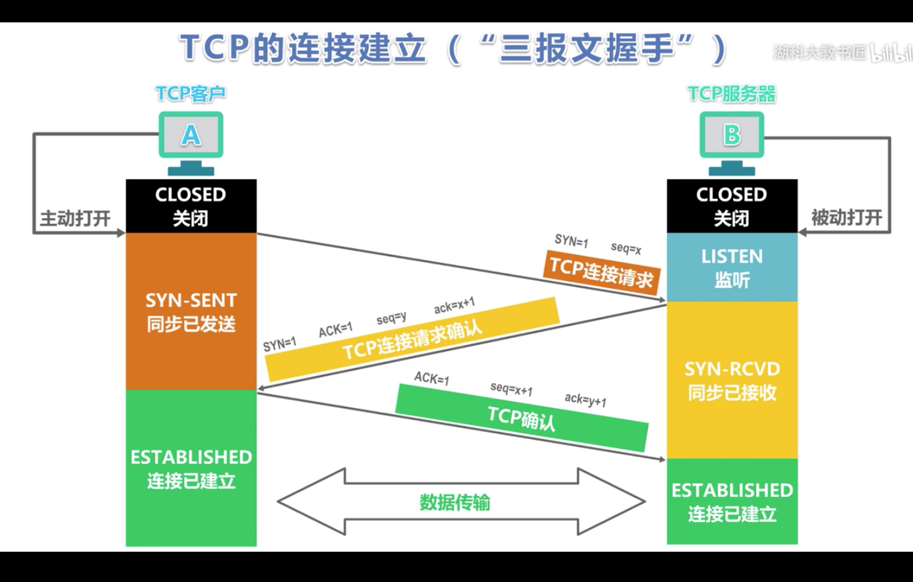

    第一次握手：建立连接时，客户端发送同步序列编号到服务器，并进入发送状态，等待服务器确认 (SYN+seq)
    
    第二次握手：服务器收到同步序列编号，确认并同时自己也发送一个同步序列编号+确认标志，此时服务器进入接收状态(SYN+ACK+seq)
    
    第三次握手：客户端收到服务器发送的包，并向服务器发送确认标志，随后链接成功。(ACK+seq)


##### 3.四次挥手:

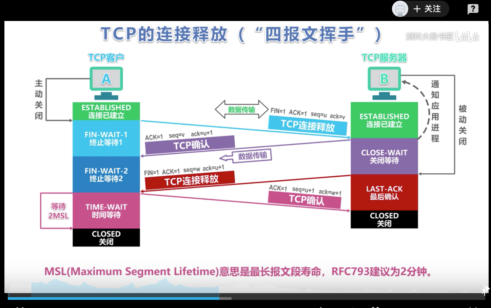

    第一次：客户端向服务器发送一个带有结束标记的报文 (FIN + ACK + seq)
    
    第二次：服务器收到报文后，向客户端发送一个确认序号，同时通知自己相应的应用程序，对方要求关闭连接 (ACK + seq)
    
    第三次：服务器向客户端发送一个带有结束标记的报文 (FIN + ACK + seq)
    
    第四次：客户端收到报文后，向服务器发送一个确认序号，链接关闭。(ACK + seq)


##### 4.Socket

> socket是对TCP/IP协议的封装，Socket本身并不是协议，而是一个调用接口（API），通过Socket，我们才能使用TCP/IP协议。实际上，Socket跟TCP/IP协议没有必然的联系。Socket编程接口在设计的时候，就希望也能适应其他的网络协议。所以说，Socket的出现只是使得程序员更方便地使用TCP/IP协议栈而已，是对TCP/IP协议的抽象，从而形成了我们知道的一些最基本的函数接口，比如create、listen、connect、accept、send、read和write等等。网络有一段关于socket和TCP/IP协议关系的说法比较容易理解：
>
>   “TCP/IP只是一个协议栈，就像操作系统的运行机制一样，必须要具体实现，同时还要提供对外的操作接口。这个就像操作系统会提供标准的编程接口，比如win32编程接口一样，TCP/IP也要提供可供程序员做网络开发所用的接口，这就是Socket编程接口。”

> socket是纯C语言的,跨平台
>
> 应用层：TFTP，HTTP，SNMP，FTP，SMTP，DNS，Telnet 等等
>
> 传输层：TCP，UDP
>
> 网络层：IP，ICMP，OSPF，EIGRP，IGMP
>
> 数据链路层：SLIP，CSLIP，PPP，MTU


##### 5.单双工

> **单工: **单工通信只支持信号在一个方向上传输（正向或反向），任何时候不能改变信号的传输方向。
>
> (读卡器,打印机)
>
> **半双工: **半双工通信允许信号在两个方向上传输，但某一时刻只允许信号在一个信道上单向传输。
>
> (BB机)
>
> **全双工: **全双工通信允许数据同时在两个方向上传输，即有两个信道，因此允许同时进行双向传输。
>
> (电话机)


#####6.http和websocket的长连接区别

> HTTP1.1通过使用Connection:keep-alive进行长连接，HTTP 1.1默认进行持久连接。在一次 TCP 连接中可以完成多个 HTTP 请求，但是对每个请求仍然要单独发 header，Keep-Alive不会永久保持连接，它有一个保持时间，可以在不同的服务器软件（如Apache）中设定这个时间。这种长连接是一种“伪链接”
>
> websocket的长连接，是一个真的全双工。长连接第一次tcp链路建立之后，后续数据可以双方都进行发送，不需要发送请求头。
>
> keep-alive双方并没有建立正真的连接会话，服务端可以在任何一次请求完成后关闭。WebSocket 它本身就规定了是正真的、双工的长连接，两边都必须要维持住连接的状态。


**7.HTTPS**

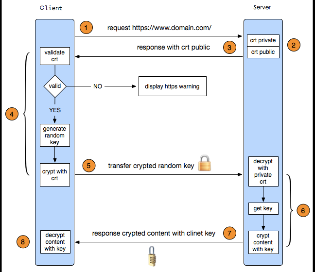


**8.DNS**

那么实现这一技术的就是 DNS 域名解析，DNS 可以将域名网址自动转换为具体的 IP 地址。 

域名的层级关系 

DNS 中的域名都是用句点来分隔的，比如 www.server.com ，这里的句点代表了不同层次之间的界限。 

在域名中，越靠右的位置表示其层级越高。


> 所以域名的层级关系类似一个树状结构： 
>
> 根 DNS 服务器 
>
> 顶级域 DNS 服务器（com） 
>
> 权威 DNS 服务器（server.com）


**9.NAT**


> Version:0.9 StartHTML:0000000105 EndHTML:0000002360 StartFragment:0000000141 EndFragment:0000002320   
>
> 此时，两个私有 IP 地址都转换 IP 地址为公有地址 120.229.175.121，但是以不同的端口号作为区分。 
>
> 于是，生成一个 NAPT 路由器的转换表，就可以正确地转换地址跟端口的组合，令客户端 A、B 能同时 
>
> 与服务器之间进行通信。
>
>

**10.ICMP** 

> ICMP 全称是 Internet Control Message Protocol，也就是互联网控制报文协议。


**11.响应者链**

> - 正因为hitTest：withEvent：方法可以返回最合适的view，所以可以通过重写hitTest：withEvent：方法，返回指定的view作为最合适的view。
> - 不管点击哪里，最合适的view都是hitTest：withEvent：方法中返回的那个view。
> - 通过重写hitTest：withEvent：，就可以拦截事件的传递过程，想让谁处理事件谁就处理事件。
>
> 事件传递给谁，就会调用谁的hitTest:withEvent:方法。
> `注 意`：如果hitTest:withEvent:方法中返回nil，那么调用该方法的控件本身和其子控件都不是最合适的view，也就是在自己身上没有找到更合适的view。那么最合适的view就是该控件的父控件。
> **所以事件的传递顺序是这样的：**
> 　　产生触摸事件->UIApplication事件队列->[UIWindow hitTest:withEvent:]->返回**更合适**的view->[子控件 hitTest:withEvent:]->返回**最合适**的view
>
> **事件传递给窗口或控件的后，就调用hitTest:withEvent:方法寻找更合适的view。所以是，先传递事件，再根据事件在自己身上找更合适的view。**
> **不管子控件是不是最合适的view，系统默认都要先把事件传递给子控件，经过子控件调用子控件自己的hitTest:withEvent:方法验证后才知道有没有更合适的view。即便父控件是最合适的view了，子控件的hitTest:withEvent:方法还是会调用，不然怎么知道有没有更合适的！即，如果确定最终父控件是最合适的view，那么该父控件的子控件的hitTest:withEvent:方法也是会被调用的。**
> **技巧：**想让谁成为最合适的view就重写谁自己的父控件的hitTest:withEvent:方法返回指定的子控件，或者重写自己的hitTest:withEvent:方法 return self。但是，**建议在父控件的hitTest:withEvent:中返回子控件作为最合适的view！**
>
>


###九.iOS本地持久化

>- NSUserDefaults
>
>- plist
>
>- Keychain(钥匙串)
>
>- 归档
>
>- 沙盒写入数据库


**1.NSUserDefaults**

> 用于存储用户的偏好设置和用户信息,如用户名,是否自动登录,字体大小等.
> 数据自动保存在沙盒的Libarary/Preferences目录下.
> NSUserDefaults将输入的数据储存在.plist格式的文件下,这种存储方式就决定了它的安全性几乎为0,所以不建议存储一些敏感信息如:用户密码,token,加密私钥等!
> 它能存储的数据类型为:NSNumber（NSInteger、float、double），NSString，NSDate，NSArray，NSDictionary，BOOL. 不支持自定义对象的存储.


**2.plist**

> 即属性列表文件，全名是Property List，这种文件的扩展名为.plist，因此，通常被叫做plist文件。它是一种用来存储串行化后的对象的文件，用于存储程序中经常用到且数据量小而不经常改动的数据。
> 可以存储的类型:NSNumber，NSString，NSDate，NSData ,NSArray，NSDictionary，BOOL.
> 不支持自定义对象的存储.


**3.Keychain**

> 用于本地重要数据的存储,将数据加密后存储在本地更安全.如:密码,秘钥,序列号等.当你删除APP后Keychain存储的数据不会删除，所以在重装App后，Keychain里的数据还能使用。从ios 3.0开始，跨程序分享keychain变得可行而NSUserDefaults存储的数据会随着APP而删掉.
> 使用keychain时苹果官方已经为我们封装好了文件KeychainItemWrapper,引入即可使用.当然也可是使用其他优秀的第三方的封装,比如ssKeychain,使用方法如下:
> [使用方法](https://link.jianshu.com/?t=https%3A%2F%2Fwww.cnblogs.com%2Fm4abcd%2Fp%2F5242254.html)


**4.归档(NSKeyedArchiver)**

> 归档是iOS开发中数据存储常用的技巧，归档可以直接将对象储存成文件，把文件读取成对象。
> 相对于plist或者userdefault形式，归档可以存储的数据类型更加多样，并且可以存取自定义对象。对象归档的文件是保密的，在磁盘上无法查看文件中的内容，更加安全。
> 遵守NSCoding协议，并实现该协议中的两个方法。如果是继承，则子类一定要重写那两个方法。因为子类在存取的时候，会去子类中去找调用的方法，没找到那么它就去父类中找，所以最后保存和读取的时候新增加的属性会被忽略。需要先调用父类的方法，先初始化父类的，再初始化子类的。
> 保存数据的文件的后缀名可以随意命名。
> [demo](https://link.jianshu.com/?t=https%3A%2F%2Fgithub.com%2Fhuyangwork%2FNSKeyedArchiverDemo.git)


**5.沙盒写入**

> 持久化在Document目录下，一般存储非机密数据。当App中涉及到电子书阅读、听音乐、看视频、刷图片列表等时，推荐使用沙盒存储。因为这可以极大的节约用户流量，而且也增强了app的体验效果.
>
> Application：存放程序源文件，上架前经过数字签名，上架后不可修改。
> Documents: 保存应⽤运行时生成的需要持久化的数据,iTunes同步设备时会备份该目录。例如,游戏应用可将游戏存档保存在该目录。
> tmp: 保存应⽤运行时所需的临时数据,使⽤完毕后再将相应的文件从该目录删除。应用 没有运行时,系统也可能会清除该目录下的文件。iTunes同步设备时不会备份该目录。
> Library/Caches: 保存应用运行时⽣成的需要持久化的数据,iTunes同步设备时不会备份 该目录。⼀一般存储体积大、不需要备份的非重要数据，比如网络数据缓存存储到Caches下
> Library/Preference: 保存应用的所有偏好设置，如iOS的Settings(设置) 应⽤会在该目录中查找应⽤的设置信息。iTunes同步设备时会备份该目录。


**6.数据库**

> 适合储存数据量较大的数据,一般使用FMDB和CoreData来实现.
>
> FMDB:
> FMDB是iOS平台的SQLite数据库框架，FMDB以OC的方式封装了SQLite的C语言API，使用起来更加面向对象，省去了很多麻烦、冗余的C语言代码，对比苹果自带的Core Data框架，更加轻量级和灵活，提供了多线程安全的数据库操作方法，有效地防止数据混乱。
>
> CoreData:
> Core Data是iOS5之后才出现的一个框架，它提供了对象-关系映射(ORM)的功能，即能够将OC对象转化成数据，保存在SQLite数据库文件中，也能够将保存在数据库中的数据还原成OC对象。在此数据操作期间，我们不需要编写任何SQL语句.但是直接操作CoreData显的不是那么容易,所以我多数的时候会使用MagicRecord来实现.MagicRecord是对CoreData的二次封装,使用起来简单操作方便.


###十.hybrid app 开发原理 , flutter原理

####ReactNative 和 weex 对比

> **JS引擎：**
>
> weex使用V8， ReactNative使用JSCore
>
> **JS开发框架：**
>
> weex基于vue.js(2W+ star)。小巧轻量的前端开发框架，组件化，数据绑定，2.0引入virtual dom。
>
> ReactNative使用React(4W+ star)。革命性的前端开发框架，组件化，数据绑定，virtual dom。
>
> Weex和React Native不同的是，Weex把JS Framework内置在SDK里面，用来解析从服务器上下载的JS Bundle，这样也减少了每个JS Bundle的体积，不再有React Native需要分包的问题。


####flutter

> **前言: ** 比如使用 WebView 跨平台方式，优点确实非常明显。基于 WebView 的框架集成了当下 Web 开发的诸多优势：丰富的控件库、动态化、良好的技术社区、测试自动化等等。但是缺点也同样明显：渲染效率和 JavaScript 的执行能力都比较差，使页面的加载速度和用户体验都不尽如人意。
>
> 而使用以 React Native（简称 RN）为代表的框架时，维护又成了大难题。RN 使用类 HTML+JS 的 UI 创建逻辑，生成对应的原生页面，将页面的渲染工作交给了系统，所以渲染效率有很大的优势。但由于 RN 代码是通过 JS 桥接的方式转换为原生的控件，所以受各个系统间的差异影响非常大，虽然可以开发一套代码，但对各个平台的适配却非常的繁琐和麻烦。


> **Flutter 架构和实现原理**
>
> Flutter 使用 Dart 语言开发，主要有以下几点原因：
>
> - Dart 一般情况下是运行 DartVM 上，但是也可以编译为 ARM 代码直接运行在硬件上。
> - Dart 同时支持 AOT 和 JIT 两种编译方式，可以更好的提高开发以及 App 的执行效率。
> - Dart 可以利用独特的隔离区（Isolate）实现多线程。而且不共享内存，可以实现无锁快速分配。
> - 分代垃圾回收，非常适合 UI 框架中常见的大量 Widgets 对象创建和销毁的优化。
> - 在为创建的对象分配内存时，Dart 是在现有的堆上移动指针，保证内存的增长是程线性的，于是就省了查找可用内存的过程。
>
>
> Dart 主要由 Google 负责开发和维护。目前 Dart 最新版本已经是 2.2，针对 App 和 Web 开发做了很多优化。并且对于大多数的开发者而言，Dart 的学习成本非常低。
>
> Flutter 架构也是采用的分层设计。从下到上依次为：Embedder（嵌入器）、Engine、Framework。
>
> 混编教程:https://github.com/flutter/flutter/wiki/Add-Flutter-to-existing-apps


> **展望 : **
>
> 1. 虽然 1.2 版本已经发布，但是目前没有达到完全稳定状态，1.2 发布完了就出现了控件渲染的问题。加上 Dart 语言生态小，学习资料可能不够丰富。
> 2. 关于动态化的支持，目前 Flutter 还不支持线上动态性。如果要在 Android 上实现动态性相对容易些，iOS 由于审核原因要实现动态性可能成本很高。
> 3. Flutter 中目前拿来就用的能力只有 UI 控件和 Dart 本身提供能力，对于平台级别的能力还需要通过 channel 的方式来扩展。
> 4. 已有工程迁移比较复杂，以前沉淀的 UI 控件，需要重新再实现一套。
> 5. 最后一点比较有争议，Flutter 不会从程序中拆分出额外的模板或布局语言，如 JSX 或 XM L，也不需要单独的可视布局工具。有的人认为配合 HotReload 功能使用非常方便，但我们发现这样代码会有非常多的嵌套，阅读起来有些吃力。


### 十一.性能优化

####1.卡顿检测以及原理
> **runloop卡顿检测 : **平时所说的“卡顿”主要是因为在主线程执行了比较耗时的操作
> 除了用xcode的Time profiler (程序耗时检测), Core Animation(检测刷新帧率)工具外,代码层面也可以检测.
> 可以添加Observer到主线程RunLoop中，通过监听RunLoop状态切换的耗时，以达到监控卡顿的目的
> 检测runloop间隔,打印主线程堆栈
>
> **消息转发解决定时器循环引用 : **
>
> **GCD定时器封装: **
>
> ```cpp
>     //队列
>     dispatch_queue_t queue = dispatch_get_main_queue();
>     //只要不是主队列,gcd定时器就在子线程执行任务
> //    dispatch_queue_t queue = dispatch_queue_create("timer", DISPATCH_QUEUE_SERIAL);
> 
>     //创建定时器
>     dispatch_source_t timer = dispatch_source_create(DISPATCH_SOURCE_TYPE_TIMER, 0, 0, queue);
>     
>     // 设置时间
>     uint64_t start = 2.0;
>     uint64_t interval = 1.0;
>     dispatch_source_set_timer(timer,
>                               dispatch_time(DISPATCH_TIME_NOW, start * NSEC_PER_SEC),
>                               interval * NSEC_PER_SEC, 0);
>     
>     // 设置回调
>     dispatch_source_set_event_handler(timer, ^{
> 
>     });   
>     // 启动定时器
>     dispatch_resume(timer);
> ```
>
> **NSProxy消息转发 : **NSProxy是苹果用来消息转发的类,消息转发效率更高.
>
> **Tagged Pointerv : **从64bit开始，iOS引入了Tagged Pointer技术，用于优化NSNumber、NSDate、NSString等小对象的存储 . 在没有使用Tagged Pointer之前， NSNumber等对象需要动态分配内存、维护引用计数等，NSNumber指针存储的是堆中NSNumber对象的地址值
>
>
>
>
>
>


####二: 性能优化,卡顿产生原理以及优化

> ##### 2.1 CPU和GPU卡顿原因
>
> CPU和GPU
> 在屏幕成像的过程中，CPU和GPU起着至关重要的作用
> CPU（Central Processing Unit，中央处理器）
> 对象的创建和销毁、对象属性的调整、布局计算、文本的计算和排版、图片的格式转换和解码、图像的绘制（Core Graphics）
>
> GPU（Graphics Processing Unit，图形处理器）
> 纹理的渲染
>
> 在iOS中是双缓冲机制，有前帧缓存、后帧缓存 .每次垂直同步信号出来时候,把处理好的帧显示在屏幕上.按照60FPS的刷帧率，每隔16ms就会有一次VSync信号.垂直同步信号来的时候,GPU如果没有处理完成,只能将上一次处理好的帧显示出来,这就是掉帧,等下一次垂直同步信号出来后,这个数据处理好后再显示.
> 卡顿解决的主要思路
> 尽可能减少CPU、GPU资源消耗
>
> ##### 2.2 卡顿解决方案
>
> - 卡顿优化 - CPU
>
> 1 尽量用轻量级的对象，比如用不到事件处理的地方，可以考虑使用CALayer取代UIView(下划线)
>
> 2 不要频繁地调用UIView的相关属性，比如frame、bounds、transform等属性，尽量减少不必要的修改
>
> 3 尽量提前计算好布局，在有需要时一次性调整对应的属性，不要多次修改属性
>
> 4 Autolayout会比直接设置frame消耗更多的CPU资源
>
> 5 图片的size最好刚好跟UIImageView的size保持一致
>
> 6 控制一下线程的最大并发数量
>
> 7 尽量避免日期格式转换 [NSDate dateWithString:@"1990-11-11" format:@"yyyy-MM-dd"]
>
> 8 尽量把耗时的操作放到子线程
> 文本处理（尺寸计算、绘制）
> 图片处理（解码、绘制）
>
> 9 tableView不要动态创建子控件,尽可能使用懒加载,尽量少设置透明度.
>
> - 卡顿优化 - GPU
>
> 尽量避免短时间内大量图片的显示，尽可能将多张图片合成一张进行显示
>
> GPU能处理的最大纹理尺寸是4096x4096，一旦超过这个尺寸，就会占用CPU资源进行处理，所以纹理尽量不要超过这个尺寸
>
> 尽量减少视图数量和层次
>
> 减少透明的视图（alpha<1），不透明的就设置opaque为YES
>
> 尽量避免出现离屏渲染
> 在OpenGL中，GPU有2种渲染方式
> On-Screen Rendering：当前屏幕渲染，在当前用于显示的屏幕缓冲区进行渲染操作
> Off-Screen Rendering：离屏渲染，在当前屏幕缓冲区以外新开辟一个缓冲区进行渲染操作
>
> 离屏渲染消耗性能的原因
> 需要创建新的缓冲区
> 离屏渲染的整个过程，需要多次切换上下文环境，先是从当前屏幕（On-Screen）切换到离屏（Off-Screen）；等到离屏渲染结束以后，将离屏缓冲区的渲染结果显示到屏幕上，又需要将上下文环境从离屏切换到当前屏幕
>
> - 离屏渲染
>   哪些操作会触发离屏渲染？
>   光栅化，layer.shouldRasterize = YES
>
> 遮罩，layer.mask
>
> 圆角，同时设置layer.masksToBounds = YES、layer.cornerRadius大于0
> 考虑通过CoreGraphics绘制裁剪圆角，或者叫UI提供圆角图片
>
> 用 Instuments 的 GPU Driver 预设，能够实时查看到 CPU 和 GPU 的资源消耗。在这个预设内，你能查看到几乎所有与显示有关的数据，比如 Texture 数量、CA 提交的频率、GPU 消耗等，在定位界面卡顿的问题时。
>
> - 图片加载
>   1.加载小图片\使用频率比较高的图片
>   1> 利用imageNamed:方法加载过的图片, 永远有缓存, 这个缓存是由系统管理的, 无法通过代码销毁缓存
>   通过 imageNamed 创建 UIImage 时，系统实际上只是在 Bundle 内查找到文件名，然后把这个文件名放到 UIImage 里返回，并没有进行实际的文件读取和解码。当 UIImage 第一次显示到屏幕上时，其内部的解码方法才会被调用，同时解码结果会保存到一个全局缓存去。在图片解码后，App 第一次退到后台和收到内存警告时，该图片的缓存才会被清空，其他情况下缓存会一直存在。
>   2.加载大图片\使用频率比较低的图片(一次性的图片, 比如版本新特性的图片)
>   1> 利用initWithContentsOfFile:\imageWithContentsOfFile:等方法加载过的图片, 没有缓存, 只要用完了, 就会自动销毁
>
> ##### 2.3 耗电网络优化
>
> CPU处理，Processing
>
> 网络，Networking
>
> 定位，Location
>
> 图像，Graphics
>
> - 耗电优化
>   尽可能降低CPU、GPU功耗,少用定时器
>   PerformSelecter
>   当调用 NSObject 的 performSelecter:afterDelay: 后，实际上其内部会创建一个 Timer 并添加到当前线程的 RunLoop 中。所以如果当前线程没有 RunLoop，则这个方法会失效。
>
> 当调用 performSelector:onThread: 时，实际上其会创建一个 Timer 加到对应的线程去，同样的，如果对应线程没有 RunLoop 该方法也会失效。
>
> - 优化I/O操作
>   尽量不要频繁写入小数据，最好批量一次性写入
>   读写大量重要数据时，考虑用dispatch_io，其提供了基于GCD的异步操作文件I/O的API。用dispatch_io系统会优化磁盘访问
>   数据量比较大的，建议使用数据库（比如SQLite、CoreData）
> - 网络优化
>   减少、压缩网络数据
>   如果多次请求的结果是相同的，尽量使用缓存
>   使用断点续传，否则网络不稳定时可能多次传输相同的内容
>   网络不可用时，不要尝试执行网络请求
>   让用户可以取消长时间运行或者速度很慢的网络操作，设置合适的超时时间
>   批量传输，比如，下载视频流时，不要传输很小的数据包，直接下载整个文件或者一大块一大块地下载。如果下载广告，一次性多下载一些，然后再慢慢展示。如果下载电子邮件，一次下载多封，不要一封一封地下载
> - 定位优化
>   如果只是需要快速确定用户位置，最好用CLLocationManager的requestLocation方法。定位完成后，会自动让定位硬件断电
>   如果不是导航应用，尽量不要实时更新位置，定位完毕就关掉定位服务
>   尽量降低定位精度，比如尽量不要使用精度最高的kCLLocationAccuracyBest
>   需要后台定位时，尽量设置pausesLocationUpdatesAutomatically为YES，如果用户不太可能移动的时候系统会自动暂停位置更新
>   尽量不要使用startMonitoringSignificantLocationChanges，优先考虑startMonitoringForRegion:
> - 硬件检测优化
>   用户移动、摇晃、倾斜设备时，会产生动作(motion)事件，这些事件由加速度计、陀螺仪、磁力计等硬件检测。在不需要检测的场合，应该及时关闭这些硬件
>
>


####三: app启动速度优化

> ##### 3.1 启动流程
>
> APP的启动可以分为2种
> 冷启动（Cold Launch）：从零开始启动APP
> 热启动（Warm Launch）：APP已经在内存中，在后台存活着，再次点击图标启动APP
>
> APP启动时间的优化，主要是针对冷启动进行优化
>
> 通过添加环境变量可以打印出APP的启动时间分析（Edit scheme -> Run -> Arguments）
> DYLD_PRINT_STATISTICS设置为1
> 如果需要更详细的信息，那就将DYLD_PRINT_STATISTICS_DETAILS设置为1
>
>
>
> 
>
> 启动.png
>
> dyld（dynamic link editor），Apple的动态链接器，可以用来装载Mach-O文件（可执行文件、动态库等）
>
> 启动APP时，dyld所做的事情有
> 装载APP的可执行文件(可执行文件包含代码和动态库依赖信息)，同时会递归加载所有依赖的动态库
>
>
>
> 
>
> 可执行文件
>
> 当dyld把可执行文件、动态库都装载完毕后，会通知Runtime进行下一步的处理
> 启动APP时，runtime所做的事情有
> 调用map_images进行可执行文件内容的解析和处理
> 在load_images中调用call_load_methods，调用所有Class和Category的+load方法
> 进行各种objc结构的初始化（注册Objc类 、初始化类对象等等）
> 调用C++静态初始化器和**attribute**((constructor))修饰的函数
>
> 到此为止，可执行文件和动态库中所有的符号(Class，Protocol，Selector，IMP，…)都已经按格式成功加载到内存中，被runtime 所管理
> 总结一下
> APP的启动由dyld主导，将可执行文件加载到内存，顺便加载所有依赖的动态库
> 并由runtime负责加载成objc定义的结构
> 所有初始化工作结束后，dyld就会调用main函数
> 接下来就是UIApplicationMain函数，AppDelegate的application:didFinishLaunchingWithOptions:方法
>
> ##### 3.2 启动优化
>
> 按照不同的阶段
> dyld
> 减少动态库、合并一些动态库（定期清理不必要的动态库）
> 减少Objc类、分类的数量、减少Selector数量（定期清理不必要的类、分类）, 装在可执行文件时候有加载类分类的操作.
> 减少C++虚函数数量
>
> runtime
> 少在+load方法里写逻辑代码可以用+initialize方法和dispatch_once取代
>
> main
> 在不影响用户体验的前提下，尽可能将一些操作延迟，不要全部都放在finishLaunching方法中
> 按需加载
>
>


####四: 包大小优化

> 安装包（IPA）主要由可执行文件(源代码文件 编译链接生产的)、资源(图片 音视频 stroyboard xib)组成
> 项目编译完生产app文件,app文件压缩后成IPA文件
>
> 1 资源（图片、音频、视频等）采取无损压缩
>
> 2 去除没有用到的资源：  [https://github.com/tinymind/LSUnusedResources](https://links.jianshu.com/go?to=https%3A%2F%2Fgithub.com%2Ftinymind%2FLSUnusedResources)
>
>
>
> 
>
> 无用资源.png
>
>
>
> 3 编译器优化
> Deployment Postprocessing和Strip Linked Product，两个需要都设置为YES才有用。
> 原理是打开这两个选项后构建ipa会去除掉symbol符号，就是那些类名啊函数名啊啥的。这样子的影响就是运行时你没法进行线程回溯，符号都没了回溯了也是乱码。但是不会影响正常的崩溃日志生成和解析。
>
> 4 利用AppCode（[https://www.jetbrains.com/objc/](https://links.jianshu.com/go?to=https%3A%2F%2Fwww.jetbrains.com%2Fobjc%2F)）检测未使用的代码：菜单栏 -> Code -> Inspect Code
>
> 5 手动移除代码
>
> - 梳理项目里的第三方代码,没有直接用的全部删除.
> - 梳理用到的第三方代码,如果有功能类似的,移除一个.
> - 如果只使用了第三方一部分代码,可以自己实现这个功能,移除这个第三方.
> - 项目里旧的类,要及时移除,类里面引用的类也要逐一检查,看是否可以移除
>
> 6 视频/音频 大图片资源不要放到包里,可以从服务端下载.
> 7 图片尽可能放到Assets.xcassets,放进去下载安装包只下载 x2或x3图片.
> 8 使用 xib/storyboard 来开发视图界面会一定程序增加安装包的大小。尽可能用diamante布局.
> 9 引入第三方库之前要调研导致包增大多少.
>
> - 编写LLVM插件检测出重复代码、未被调用的代码
>
> - LinkMap分析哪里占用包资源大
>   Build settings 搜索 link map Write Link Map File 设置成yes, 上面路径前缀设置成桌面,编译后桌面会多一个当前架构下 .txt格式的文件(例如:TImer循环引用-LinkMap-normal-x86_64)
>   生成LinkMap文件，可以查看可执行文件的具体组成
>
>
>
>   
>
>   屏幕快照 2019-03-10 17.37.31.png
>
> 可借助第三方工具解析LinkMap文件：  [https://github.com/huanxsd/LinkMap](https://links.jianshu.com/go?to=https%3A%2F%2Fgithub.com%2Fhuanxsd%2FLinkMap)
>
>
>
> 
>
> 掌通代码分析.png
>
> #### [bitcode](https://links.jianshu.com/go?to=https%3A%2F%2Fwww.cnblogs.com%2FQianChia%2Fp%2F6223047.html)
>
> Bitcode 类似于一个中间码，被上传到 AppleStore 之后，苹果会根据下载应用的用户的手机指令集类型生成只有该指令集的二进制，进行下发，从而达到精简安装包体积的目的。不同的设备只下载支持自己设备架构的包.
>
>
>
> 
>
> 屏幕快照 2019-03-15 上午10.20.56.png
>
> 但是如果其中包含第三方库，不支持 Bitcode 时候，需要将 Enable BitCode 设置成 NO。而且这个选项是项目里只要有一个第三方库不支持，就不能开的，否则连接错误。
>
>
>
> 
>
> 
>
> #### [Other linker flags](https://links.jianshu.com/go?to=https%3A%2F%2Fblog.csdn.net%2Fbobo553443%2Farticle%2Fdetails%2F78633340)
>
> Targets选项下有Other linker flags的设置，用来填写XCode的链接器参数，如：-ObjC -all_load -force_load等。
>
> 在ios开发中，我们经常会使用到第三方的一些静态库,导入第三方类库运行程序后你会发现,编译时可以正常编译但是运行时会app会闪退,报出selector not recognized的错误。一般的第三方库的开发文档中都会写出这种问题的解决方法,如在Other Linker Flags中加入-ObjC或者-all_load或者-force_load这样的解决方法。为什要这要做呢?报错为什么编译的时候有问题呢,首先我们先引入一个链接器的概念.
>
> 还记得我们在学习C程序的时候，从C代码到可执行文件经历的步骤是：
>
> 源代码 > 预处理器 > 编译器 > 汇编器 > 机器码 > 链接器 > 可执行文件
>
> 在最后一步需要把.o文件和C语言运行库链接起来，这时候需要用到ld命令。源文件经过一系列处理以后，会生成对应的.obj文件，然后一个项目必然会有许多.obj文件，并且这些文件之间会有各种各样的联系，例如函数调用。链接器做的事就是把这些目标文件和所用的一些库链接在一起形成一个完整的可执行文件
>
> 那我们为什么要设置Other Linker Flags呢 因为Other Linker Flags其实就是链接器工作时除了默认参数外的其他参数。
>
> 运行时的异常时由于静态库, 链接器,与OC语言的动态的特性之间的问题, 如果一个类有了分类,那么链接器就不会将静态库的类与分类之间的代码完成进行合并,这就阻止了在最终的应用程序中的可执行文件缺失了分类中的代码,这样函数调用接失败了.
>
> -ObjC
>
> 一般这个参数足够解决前面提到的问题,这个flag告诉链接器把库中定义的Objective-C类和Category都加载进来。这样编译之后的app会变大,因为加载了很多不必要的文件而导致可执行文件变大。
>
> -all_load
> 但是如果静态库中有类和category的话只有加入这个flag才行,但是Objc也不是万能的,当静态库中只有分类而没有类的时候,Objc就失效了,这就需要使用-all_load或者-force_load了。
> -all_load会强制链接器把目标文件都加载进来，即使没有objc代码。但是这个参数也有一个弊端,那就是你使用了不止一个静态库文件，那么你很有可能会遇到ld: duplicate symbol错误，因为不同的库文件里面可能会有相同的目标文件 这里会有两种方法解决 1:用命令行就行拆包. 2:就是用下面的这个参数
>
> -force_load
>
> 这个flag所做的事情跟-all_load其实是一样的，只是-force_load需要指定要进行全部加载的库文件的路径，这样的话，你就只是完全加载了一个库文件，不影响其余库文件的按需加载 .
>
> 如果静态库,不加-ObjC 的话,只把使用到的类加载进来,不会加载分类,会减少一些包大小,但是需要把使用到的功能点一遍,确保没有崩溃.如果部分静态库需要用分类,可以部分分类加-force_load.
>
>


### 十二.常用框架原理

#### 1.SDWebimage

```css
1、入口 setImageWithURL:placeholderImage:options: 会先把 placeholderImage 显示，然后 SDWebImageManager 根据 URL 开始处理图片。

2、进入 SDWebImageManager-downloadWithURL:delegate:options:userInfo:，交给 SDImageCache 从缓存查找图片是否已经下载 queryDiskCacheForKey:delegate:userInfo:.

3、先从内存图片缓存查找是否有图片，如果内存中已经有图片缓存，SDImageCacheDelegate 回调 imageCache:didFindImage:forKey:userInfo: 到 SDWebImageManager。

4、SDWebImageManagerDelegate 回调 webImageManager:didFinishWithImage: 到 UIImageView+WebCache 等前端展示图片。

5、如果内存缓存中没有，生成 NSInvocationOperation 添加到队列开始从硬盘查找图片是否已经缓存。

6、根据 URLKey 在硬盘缓存目录下尝试读取图片文件。这一步是在 NSOperation 进行的操作，所以回主线程进行结果回调 notifyDelegate:。

7、如果上一操作从硬盘读取到了图片，将图片添加到内存缓存中（如果空闲内存过小，会先清空内存缓存）。SDImageCacheDelegate 回调 imageCache:didFindImage:forKey:userInfo:。进而回调展示图片。

8、如果从硬盘缓存目录读取不到图片，说明所有缓存都不存在该图片，需要下载图片，回调 imageCache:didNotFindImageForKey:userInfo:。

9、共享或重新生成一个下载器 SDWebImageDownloader 开始下载图片。

10、图片下载由 NSURLConnection 来做，实现相关 delegate 来判断图片下载中、下载完成和下载失败。

11、connection:didReceiveData: 中利用 ImageIO 做了按图片下载进度加载效果。connectionDidFinishLoading: 数据下载完成后交给 SDWebImageDecoder 做图片解码处理。

12、图片解码处理在一个 NSOperationQueue 完成，不会拖慢主线程 UI。如果有需要对下载的图片进行二次处理，最好也在这里完成，效率会好很多。

13、在主线程 notifyDelegateOnMainThreadWithInfo: 宣告解码完成，imageDecoder:didFinishDecodingImage:userInfo: 回调给 SDWebImageDownloader。imageDownloader:didFinishWithImage: 回调给 SDWebImageManager 告知图片下载完成。

14、通知所有的 downloadDelegates 下载完成，回调给需要的地方展示图片。将图片保存到 SDImageCache 中，内存缓存和硬盘缓存同时保存。写文件到硬盘也在以单独 NSInvocationOperation 完成，避免拖慢主线程。

15、SDImageCache 在初始化的时候会注册一些消息通知，在内存警告或退到后台的时候清理内存图片缓存，应用结束的时候清理过期图片。

16、SDWI 也提供了 UIButton+WebCache 和 MKAnnotationView+WebCache，方便使用。

17、SDWebImagePrefetcher 可以预先下载图片，方便后续使用。
```


####2.AFNetworking

> ##### AFNetworking 底层原理分析
>
> - AFNetworking是封装的NSURLSession的网络请求，由五个模块组成：分别由NSURLSession,Security,Reachability,Serialization,UIKit五部分组成
>
> - NSURLSession：网络通信模块（核心模块） 对应 AFNetworking中的 AFURLSessionManager和对HTTP协议进行特化处理的AFHTTPSessionManager,AFHTTPSessionManager是继承于AFURLSessionmanager的
>
> - Security：网络通讯安全策略模块 对应 AFSecurityPolicy
>
> - Reachability：网络状态监听模块 对应AFNetworkReachabilityManager
>
> - Seriaalization：网络通信信息序列化、反序列化模块 对应 AFURLResponseSerialization
>
> - UIKit：对于iOS UIKit的扩展库
>

###十三.编译原理


> 前端
>
> - 预处理（Pre-process）：他的主要工作就是将宏替换，删除注释展开头文件，生成.i文件。
> - 词法分析（Lexical Analysis）：将代码切成一个个 token，比如大小括号，等于号还有字符串等。是计算机科学中将字符序列转换为标记序列的过程。
> - 语法分析（Semantic Analysis）：验证语法是否正确，然后将所有节点组成抽象语法树 AST 。Clang 中 Parser 和 Sema 配合完成
> - 静态分析（Static Analysis）：使用它来表示用于分析源代码以便自动发现错误。
> - 中间代码生成（Code Generation）：开始IR中间代码的生成了，CodeGen 会负责将语法树自顶向下遍历逐步翻译成 LLVM IR，IR 是编译过程的前端的输出后端的输入。
>
> 后端
>
> - 优化（Optimize）：LLVM 会去做些优化工作，在 Xcode 的编译设置里也可以设置优化级别-01，-03，-0s，还可以写些自己的 Pass，官方有比较完整的 Pass 教程： Writing an LLVM Pass — LLVM 5 documentation 。如果开启了 bitcode 苹果会做进一步的优化，有新的后端架构还是可以用这份优化过的 bitcode 去生成。
> - 生成目标文件（Assemble）：苹果平台生成Mach-O
> - 链接（Link）：生成 Executable 可执行文件。
>
>


###十四.蓝牙,wifi原理

####蓝牙

**CoreBluetooth中涉及以下对象类：**

- CBCentralManager：中心设备类
- CBPeripheral：外围设备类
- CBCharacteristic：设备特征类


**关于蓝牙开发的一些重要的理论概念：**

1. CoreBluetooth框架的核心其实是两个东西，peripheral和central, 可以理解成外设和中心，就是你的苹果手机就是中心，外部蓝牙称为外设。
2. 服务和特征(service and characteristic)：简而言之，外部蓝牙中它有若干个服务service（服 务你可以理解为蓝牙所拥有的能力），而每个服务service下拥有若干个特征characteristic（特征你可以理解为解释这个服务的属性）。
3. Descriptor（描述）用来描述characteristic变量的属性。例如，一个descriptor可以规定一个可读的描述，或者一个characteristic变量可接受的范围，或者一个characteristic变量特定的单位。
4. UUID：蓝牙上的唯一标示符，为了区分不同设备、服务及特征，就用UUID来表示。( iOS不提供MAC地址,所以设备的UUID是由手机的ID和MAC地址算出来的 )


**CBCentralMannager 中心模式**

> 以手机（app）作为中心，连接其他外设的场景。详细流程如下：
> 1.建立一个Central Manager实例进行蓝牙管理
>
> 1. 扫描外设（discover）
> 2. 连接外设(connect)
> 3. 获得外设中的服务和特征(discover)
>    4.1 获取外设的services
>    4.2 获取外设的Characteristics,获取Characteristics的值，
> 4. 获取外设服务特征（Characteristics）的Descriptor和Descriptor的值
> 5. 从外围设备读数据（直接读取和订阅两种方法）
> 6. 与外设做数据交互(explore and interact)
> 7. 断开连接(disconnect)


**CBPeripheralManager 外设模式**

> 1. 建立外设角色
> 2. 设置本地外设的服务和特征
> 3. 发布外设和特征
> 4. 广播服务
> 5. 响应中心的读写请求
> 6. 发送更新的特征值，订阅中心


#### wifi


**AP(Access Point)：**

无线接入点，这个概念特别广，在这里，用大白话说，你可以把CC3200当做一个无线路由器，这个路由器的特点不能插入网线，没有接入Internet，只能等待其他设备的链接，并且智能接入一个设备。类似于点对点模式啦。
STA(Station)：任何一个接入无线AP的设备都可以称为一个站点。大白话说也就是平时接入路由器的设备

**SSID(Service Set Identifier)：**

SSID,每个无线AP都应该有一个标示用于用户识别，SSID就是这个用于用户识别的的名字，也就是我们经常说到的wifi名。

**BSSID：**

每一个网络设备都有其用于识别的物理地址，这个东西呢就叫MAC地址，这个东西一般情况下出厂会有一个默认值，可更改，也有其固定的命名格式，也是设备识别的标识符。这个BSSID呢是针对设备说的，对于STA的设备来说，拿到AP接入点的MAC地址就是这个BSSID。

**ESSID：**

是一个比较抽象的概念，它实际上就和ssid相同（本质也是一串字符），只是能如果有好几个无线路由器都叫这个名字，那么我们就相当于把这个ssid扩大了，所以这几个无线路由器共同的这个名字就叫ESSID。（也就是如果在一台路由器上释放的wifi信号叫某个名字如“China_CMCC”，这个名字“China_CMCC”就称为SSID；如果在好几个路由器上都释放了这个wifi信号，那么大家都叫“China_CMCC”，这个时候大家都遵循的这个名字就是ESSID

举个例子，一家公司面积比较大，安装了若干台无线接入点（AP或者无线路由器），公司员工只需要知道一个SSID就可以在公司范围内任意地方接入无线网络。BSSID其实就是每个无线接入点的MAC地址。当员工在公司内部移动的时候，SSID是不变的。但BSSID随着你切换到不同的无线接入点，是在不停变化的。

用戏称来说，bssid就是具体的某个连锁店编号（001）或地址，ssid就是连锁店的名字或者照片，essid就是连锁店的总公司或者招牌or品牌。一般ssid和essid都是相同的。

**RSSI：**

这个理解起来更简单，就是通过STA扫描到AP站点的信号强度。


##未完待续


> if #available(iOS 11.0, *) {
>
>             self.tableView.contentInsetAdjustmentBehavior = .never
>
>   } else {
>
>             self.automaticallyAdjustsScrollViewInsets = false
>
>   }
>
> 对称加密算法有DES、3DES、TDEA、Blowfish、RC5和IDEA


**学习方向: 1. Leedcode  2.第三方源码解读和模仿  3.RXSwift   4.C++  5.FFmpeg  6.openGL**


**线程图解**

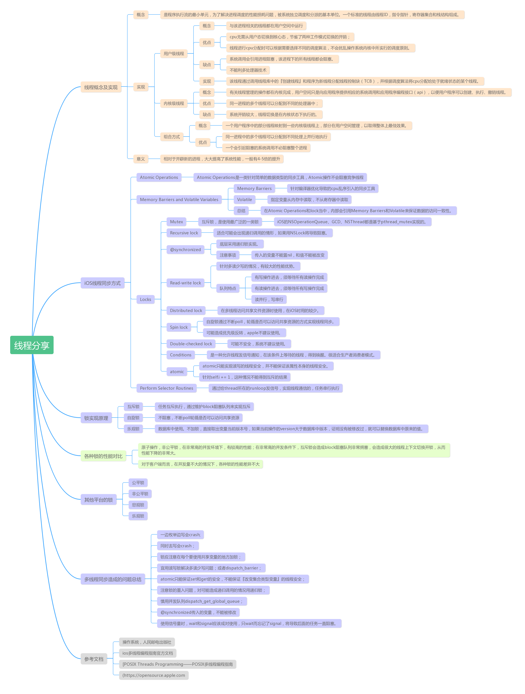