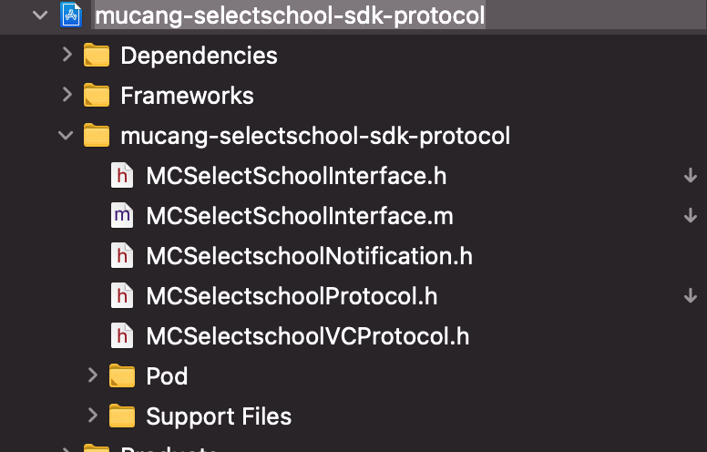

## iOS组件化几种方案调研和实践

<!--more-->

#### 一、背景

**1. 什么是组件化**

将业务模块单独抽离、分层，并制定模块间通信的方式，从而实现解耦，以及适应团队开发。

**2. 为什么要组件化**

随着业务的发展，系统变得越来越复杂，App 内各子系统之间耦合严重, 边界越来越模糊，经常发生你中有我我中有你的情况（图一）。这对代码质量、功能扩展以及开发效率都会造成很大的影响。此时，一般会将各个子系统划分为相对独立的模块，通过中介者模式收敛交互代码，把模块间交互部分进行集中封装, 所有模块间调用均通过中介者来做（图二）。这时架构逻辑会清晰很多，但因为中介者仍然需要反向依赖业务模块，这并没有从根本上解除循坏依赖等问题。时不时发生一个模块进行改动，多个模块受影响编译不过的情况。进一步的，通过技术手段消除中介者对业务模块依赖，即形成了业务模块化架构设计（图三）。


组件化可以明确模块职责及边界，提升代码质量，减少复杂依赖，优化编译速度，提升开发效率，方便单元测试

**3. 组件化方案的理想指标**

一个组件化方案需要达到怎样的效果,下面给出了几个理想情况下的指标：

1. 模块间没有直接耦合，一个模块内部的修改不会影响到另一个模块；
2. 模块可以被单独编译；
3. 模块间能够清晰地进行调用和数据传递；
4. 模块可以随时被另一个提供了相同功能的模块替换；
5. 模块的对外接口容易查找和维护，当模块的接口改变时，使用此模块的外部代码能够被高效地重构；
6. 尽量用最少的修改和代码，让现有的项目实现模块化；
7. 支持 Objective-C 和 Swift，以及混编。

#### 二、组件化几种方案

**1.URL路由**

URL路由是页面解耦的最常见方式，大量应用于前端页面。通过把一个 URL 与一个页面绑定，需要时通过 URL 可以方便的打开相应页面。

代表框架：[MGJRouter](https://github.com/meili/MGJRouter)、[JLRoutes](https://github.com/joeldev/JLRoutes)、[routable-ios](https://github.com/clayallsopp/routable-ios)、[HHRouter](https://github.com/lightory/HHRouter)

代码示例：

```Objective-C
// 注册某个URL

  [MGJRouter registerURLPattern:@"lx://AMoudle" toHandler:^(NSDictionary *routerParameters) {

    void (^completion)(UIViewController *) = routerParameters[MGJRouterParameterCompletion];

    AModuleViewController *vc = [[AModuleViewController alloc] init];

    if (completion) {

      completion(vc);

    }

  }];
// 调用路由

  [MGJRouter openURL:@"lx://AMoudle" completion:^(id result) {

    UIViewController *vc = (UIViewController *)result;

    [self.navigationController pushViewController:vc animated:YES];

  }];
```

**优点**

- 极高的动态性，适合经常开展运营活动的 app，例如电商
- 方便地统一管理多平台 (H5, iOS，Android，Weex和RN等)的路由规则
- 易于适配 URL Scheme

**缺点**

- 传参方式有限，并且无法利用编译器进行参数类型检查，因此所有的参数都只能从字符串中转换而来
- 只适用于界面模块，不适用于通用模块
- 不能使用 designated initializer 声明必需参数
- 要让 view controller 支持 url，需要为其新增初始化方法，因此需要对模块做出修改
- 不支持 storyboard
- 无法明确声明模块提供的接口，只能依赖于接口文档，重构时无法确保修改正确
- 依赖于字符串硬编码，难以管理
- 无法保证所使用的模块一定存在
- 解耦能力有限，url 的”注册”、”实现”、”使用”必须用相同的字符规则，一旦任何一方做出修改都会导致其他方的代码失效，并且重构难度大
- 部分功能使用此方案，存在被拒风险，例如调起支付功能

**2. target-action方案**

有一些模块管理工具基于 Objective-C 的 runtime、category 特性动态获取模块。例如通过`NSClassFromString`获取类并创建实例，通过`performSelector:` `NSInvocation`动态调用方法。

代表框架 [CTMediator](https://github.com/casatwy/CTMediator)基于 target-action 模式的设计，大致是利用 category 为路由工具添加新接口，在接口中通过字符串获取对应的类，再用 runtime 创建实例，动态调用实例的方法。


**代码示例：**

```Objective-C
// 模块管理者，提供了动态调用 target-action 的基本功能

@interface Mediator : NSObject

+ (instancetype)sharedInstance;

- (id)performTarget:(NSString *)targetName action:(NSString *)actionName params:(NSDictionary *)params;

@end
// 在 category 中定义新接口

@interface Mediator (ModuleActions)

- (UIViewController *)Mediator_editorViewController;

@end

@implementation Mediator (ModuleActions)

- (UIViewController *)Mediator_editorViewController {

    // 使用字符串硬编码，通过 runtime 动态创建 Target_Editor，并调用 Action_viewController:

    UIViewController *viewController = [self performTarget:@"Editor" action:@"viewController" params:@{@"key":@"value"}];

    return viewController;

}

@end

  

// 调用者通过 Mediator 的接口调用模块

UIViewController *editor = [[Mediator sharedInstance] Mediator_editorViewController];
// 模块提供者提供 target-action 的调用方式

@interface Target_Editor : NSObject

- (UIViewController *)Action_viewController:(NSDictionary *)params;

@end

@implementation Target_Editor

- (UIViewController *)Action_viewController:(NSDictionary *)params {

    // 参数通过字典传递，无法保证类型安全

    EditorViewController *viewController = [[EditorViewController alloc] init];

    viewController.valueLabel.text = params[@"key"];

    return viewController;

}

@end
```

**优点**

- 利用 category 可以明确声明接口，进行编译检查
- 实现方式轻量

**缺点**

- 需要在 mediator 和 target 中重新添加每一个接口，模块化时代码较为繁琐
- 在 category 中仍然引入了字符串硬编码，内部使用字典传参，一定程度上也存在和 URL 路由相同的问题
- 无法保证所使用的模块一定存在，target 模块在修改后，使用者只有在运行时才能发现错误
- 过于依赖 runtime 特性，无法应用到纯 Swift 上。在 Swift 中扩展 mediator 时，无法使用纯 Swift 类型的参数
- 可能会创建过多的 target 类
- 使用 runtime 相关的接口调用任意类的任意方法，需要注意别被苹果的审核误伤。

**3. 基于 protocol 匹配的方案**

通过服务注册的方式来实现远程接口调用的。即每个模块提供自己对外服务的协议声明，然后将此声明注册到中间层。调用方能从中间层看到存在哪些服务接口，然后直接调用即可。

代表框架：[BeeHive](https://github.com/alibaba/BeeHive)、[Bifrost](https://github.com/youzan/Bifrost)、[MCProtocolRouter](https://git.mucang.cn/ios-mucang/MCProtocolRouter)


**代码示例：**

```Objective-C
// 注册模块 (protocol-class 匹配)

[[BeeHive shareInstance] registerService:@protocol(EditorViewProtocol) service:[EditorViewController class]];
// 获取模块 (用 runtime 创建 EditorViewController 实例)

id<EditorViewProtocol> editor = [[BeeHive shareInstance] createService:@protocol(EditorViewProtocol)];
```

**优点**

- 利用接口调用，实现了参数传递时的类型安全
- 直接使用模块的 protocol 接口，无需再重复封装
- 同时对外暴露的只有协议，符合团队协作的“面向协议编程”的思想
- 可以快速实现项目中不同业务模块插拔

**缺点**

- 服务提供方和使用方依赖的是公共模块中的同一份协议（protocol）, 当协议内容改变时，会存在所有服务依赖模块编译失败的风险
- 大量使用协议，协议方法名或者属性名更改后，实现协议地方只能依赖警告提示变更，不会显式报错
- 对模块纯Swift编码支持不太友好

**4. 通知广播模式**

基于通知的模块间通讯方案，实现思路非常简单, 直接基于系统的 NSNotificationCenter 即可。 优势是实现简单，非常适合处理一对多的通讯场景。 劣势是仅适用于简单通讯场景。复杂数据传输，同步调用等方式都不太方便。 模块化通讯方案中，更多的是把通知方案作为以上几种方案的补充。

#### 三、木仓组件化第零阶段组件化实践

##### 1. 模块间通信方案设计

首先是梳理我们的模块间通信需求，主要包括以下三种：

1. **UI 页面跳转**。比如社区点击选择驾校详情页。
2. **动作执行及复杂数据传输**。比如社区模块跳转选车模块传递数据并获取选车模型数据。
3. **一对多的通知广播**。比如消息盒子消息数量变化通知各业务模块红点数量变化。

我们选择了路由 URL([MCCURLActionManager](https://git.mucang.cn/ios-mucang/ios-core/-/tree/master/src/mucang-core/urlActionManager)) + Protocol接口调用封装([MCProtocolRouter](https://git.mucang.cn/ios-mucang/MCProtocolRouter)) + 广播相结合([MCNotificationCenter](https://git.mucang.cn/ios-mucang/MCNotificationCenter))的方式。


##### 2. Interface模式

为子系统中的一组接口提供一个一致的界面， Interface 模式定义了一个高层接口，这个接口使得这一子系统更加容易使用。引入外观角色之后，用户只需要直接与外观角色交互，用户与子系统之间的复杂关系由外观角色来实现，外观角色内部还可以统一处理内部错误，从而降低了系统的耦合度。


##### 3. 复杂对象传输

复杂对象的传输。例如选车模型，它包含几十个字段。如果是传字典或传 json, 那么数据提供方（选车sdk）和使用方（社区）都需要专门理解并实现一下这种模型的各种字段，对开发效率影响很大。服务提供方和使用方共同依赖同一个 Protocol，如果model对象无其他任何依赖，可以考虑把model文件直接提取到共同依赖Protocol文件夹中。如果model对象内部有其他依赖这种方式不太合适，可以把使用放需要的model属性抽到一个XXXModelProtocol中，然后model内部实现这个XXXModelProtocol协议，XXXModelProtocol协议放在数据提供方的Protocol文件即可

```Objective-C
@protocol MCXCarBrandModelProtocol <MCXBaseModelProtocol>

@required

@property (nonatomic, strong) NSString *name;

@property (nonatomic, strong) NSString *logoUrl;

@end


@protocol MCXuancheProtocol <NSObject>

+ (void)notifySelectedBrand:(id<MCXCarBrandModelProtocol>)brandModel

                serialModel:(id<MCXCarSerialModelProtocol>)serialModel

                  typeModel:(id<MCXCarTypeModelProtocol>)typeModel;

@end
```


##### 4. 改造后架构和项目结构

通常ModuleProtocol单独抽出一个pod库，主要包含ModuleInterface、ModuleProtocol、ModuleNotification等文件，例如选择mucang-selectschool-sdk-protocol：




基于以上设计，木仓第零阶段改造后，App 架构关系如图:


App项目结构图


##### 5. MCProtocolRouter需要改进的

1.可以增加一个继承 UIApplicationDelegate 的协议 ，令每个模块的 Module 对象都遵守这个协议。 AppDelegate接收代理方法后，轮询所有注册了的业务模块并进行必要的调用；

2.Module之间的依赖，有时候需要AModule在BModule之前加载，现在都在+ (void)load注册，可能无法控制Module的加载顺序。

#### 四、总结

移动应用的业务模块化架构设计，其真正的目标是提升开发质量和效率。单从实现角度来看并没有什么黑魔法或技术难点，更多的是结合团队实际开发协作方式和业务场景的具体考量，适合自己的才是最好的。一味的追求性能，绝对的追求模块间编译隔离，过早的追求模块代码管理隔离等方式都偏离了模块化设计的真正目的，是得不偿失的。更合适的方式是在可控的改造代价下，一定程度考虑未来的优化方式，更多的考虑当前的实际场景，来设计适合自己的模块化方式。