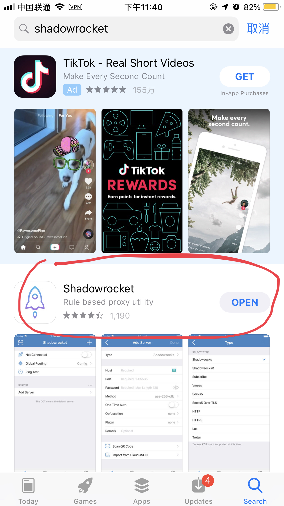

这是一篇拿到SSR配置后的使用教程

<!-- more -->

### 关于SSR代理服务器的使用教程

#### 一.安装 Shadowsocks (电脑版):

下载地址:https://github.com/qinyuhang/ShadowsocksX-NG-R/releases/tag/1.4.4-r8

> 请下载dmg文件!

输入SSR配置:

**加密方法,协议**两个参数是关键切记填写.

> 注意:如果二维码读取SSR配置,务必检查每一项是否填写正确!!!

#### 二.安装手机版Shadowrocks:

1.申请国外App Store账号(淘宝6块钱一个).

2.搜索Shadowrocks并安装 ,如下图:(似乎要收费,忍忍吧,为了新世界)

3.点击右上角输入配置:

**类型一定要选ShadowsocketsR!!!**

4.最后点击打开就可以愉快地玩耍了

