## 内卷、双循环与危机：中国经济的基本判断

***原文知乎点赞4w+被迫删除,这里存档留念下.***

[原文地址](https://mp.weixin.qq.com/s/0eMKk2CzveWJ6hfWkAD_2A)

<!--more-->

**所谓内卷化，是经济必然走向危机的另一种说法。问中国怎么走出内卷，其实是在问，中国能否避免危机。所以，要理解内卷的必然性，就需要理解经济走向危机的必然性。而要理解经济走向危机的必然性，就需要从我国经济史的角度去分析。**

首先讲一个基本结论。1996年之后，我国经济曾经两次面临危机，缓解这两次危机的方法，决定了中国经济的基本面貌，也决定了中国经济走向危机的基本方式。所以要理解中国经济，就得从这两次危机讲起。

我分三部分来讲。第一部分、1996年危机、解决方法和后续矛盾。第二部分、2008年危机、解决方法和后续矛盾。第三部分、当前经济的基本情况。

**第一部分、1996年危机及其解决**

**一、1996年危机**

一个商品，如果卖出去了，最终只可能有三种去向：第一、被国内终端消费者买了，用于日常吃喝玩乐，这就是消费。第二、被国内企业买了，用于生产或扩建厂房，这就是投资。第三、被国外的消费者或企业买了，这就是出口。当然，我们也会买国外的产品，所以计算出口的时候会把进口和出口抵消，算净出口。

消费+投资+净出口，这三者的总和用货币来计量，就是GDP。

一个商品，如果国内消费者不买、国内企业不买、国外的消费者或企业也不买，那就卖不出去。当大规模的商品卖不出去的时候，就出现了经济危机。

所以经济危机又叫做生产相对过剩的危机，生产相对于消费能力出现了过剩。

生产相对消费出现过剩的事情常有发生。前段时间全球多个国家奶农倒牛奶，就是因为市场过度竞争，导致牛奶大规模过剩。当然，除了倒牛奶，生产过剩还有很多其他体现，比如让卖不出去的苹果烂在地里。

1996年的中国，经济第一次出现了这种过剩。当时一半以上的工业企业产能利用率不到50%。产能利用率可以简单理解为机器利用的程度。国际通用标准认为，产能利用率低于80%就是产能过剩，低于75%就是产能严重过剩。按照这个标准，1996年的产能过剩已经很严重了。事实上也是这样，当时很多企业都处于破产边缘，只能通过不断倒腾资金，来维持现金流不断裂。1997年亚洲金融危机之后，中国外贸进一步下降，更多的商品卖不出去了。到了1998年，商品库存已经占到了国民生产总值的50%，产能过剩更严重了。如果按照这个趋势发展下去，经济一定会出现危机。当时很多人也是这么想的。国家经贸委的赵晓甚至破天荒地写了一篇文章，名叫《大萧条的历史会在中国重演吗》。把中国经济和大萧条联系在一起，这种行为在之前压根是不可想象的，这说明当时经济形势确实是岌岌可危。

但是1998年的生产过剩，并没有转化为经济危机，反倒是在之后几年被逐步消化掉了。

**二、危机的缓解**

我们之前说过，经济危机体现为商品卖不出去。那么一个很自然的逻辑就是，我只要想办法把商品卖出去了，经济危机就暂时过去了。所以自由资本主义时期有两种传统的方法可以延缓经济危机：一是进一步挖掘国内市场，二是进一步开拓海外市场。两者的实质都是一样的，把商品卖给以前不买的人。

1998年之后，我国就是通过“对内深挖国内市场，对外开拓海外市场”，来延缓经济危机的。注意，我这里说的是延缓，而不是解决。

深挖国内市场。1998年之后，我们通过各种方式来深挖国内市场，其中最典型的是房地产市场。1998年之前我国基本上没有住宅房地产市场，房地产商要死不活的。为什么呢，因为我国是福利分房。1998年的时候，为了刺激消费，缓解危机，国家终止了福利分房。也就是在这一年，庞大的房地产市场最终得以形成。这个市场具有极高的产业关联度，辐射冶金、化工、水泥、建筑、建材、金融、水电煤、保险、物业等众多行业。伴随着城镇化进程，房地产市场快速发展，一方面消化了大量重化工业过剩产能，另一方面也埋下了高房价的种子。

开拓海外市场。2001年前我们出口受到诸多限制，很多国家通过关税和配额限制我们产品出口。2001年我国加入WTO之后，这些限制大幅降低。也就是从这几年开始，我们外贸订单大幅增加，国内产品潮水一般涌向世界。这消化掉了巨量的轻工业过剩产能。外贸订单增多，现有规模不能满足海外需求，资本家又扩大厂房，购买更多的设备，进一步带动重化工业的发展。而资本的发展必然要求雇佣更多的工人，这又带动了城市消费，形成良性循环。

在内外两个新市场，也就是房地产和出口的带动下，经济迅速走出阴影，形成了“外贸-投资”双驱动的经济模式，并且形成了内部和外部两个非常重要的经济循环，这两个循环的有效运转，是中国经济持续增长的根本保障。

**三、两个循环**

**（一）外部循环**

外部循环对应着整个外贸出口。

首先，以美国为首的西方消费者购买中国产品，中国形成外贸顺差，获得大量外汇储备。

其次，以我国为首的发展中国家（出口导向型的）用外汇储备，购买美国国债等金融产品，资金回流到美国，支撑美国债市、股市等虚拟经济。美国虚拟经济市场不断膨胀，股市上升、房地产市场上升，美国老百姓的股票、房地产和手中的债券就不断增值，形成财富效应。什么是财富效应呢，就是他股票或房地产等账面财富增加之后，他更愿意去买买买，这就是财富效应。

最后财富效应刺激美国人不断地消费，继而购买更多的中国产品。这就是外部循环，外部循环的本质是不断通过出口来带动经济。

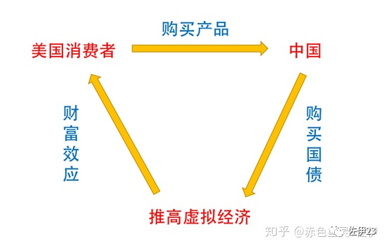

外循环示意图

**（二）内部循环**

内部有两条线，一是投资，一是消费。

**（1）投资**

投资方面，当时的内部循环对应着城镇化和整个房地产市场。

首先，老百姓把钱放在银行里面，形成银行体系的巨额存款。

其次，银行通过三个渠道，把这些存款投放到房地产市场。第一个渠道是土地开发市场。每个地方都有各种各样的土地储备公司或者投融资平台，比如某某市城市土地储备公司。银行将钱贷给这些公司，这些公司就用这些钱征收土地，搞土地开发。第二个渠道是土地买卖市场。地方将土地卖给开发商，开发商买地的钱，大部分也是银行贷款。开发商贷款买地之后，就开始造房子。第三个渠道是房地产买卖市场。开发商建好房子后，卖给老百姓。老百姓买房的钱，大部分也是贷款。

老百姓用自己的存款，支撑了整个中国房地产市场，最终，再自己去贷款，消化不断升值的房屋。这就是当时的内部循环，内部循环的本质是不断通过城镇化和房地产投资来带动经济。

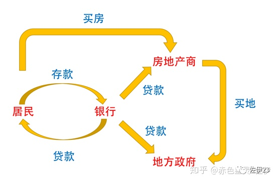

内循环：城镇化（房地产）拉动投资示意图

**（2）消费**

消费方面又有两条线。

首先，外部循环导致出口订单增多，出口轻工业企业必然需要扩大生产，修更多的厂房，买更多的设备，这又导致重工业企业订单增多，重工业企业也会扩大再生产。这两者扩大再生产又会雇佣更多工人，导致对内销型轻工业需求增加（对食品、衣服等需求增加），形成良性互动。

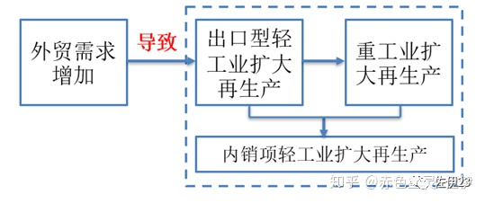

外循环与内循环互动：外贸拉动国内消费示意图

其次，城镇化导致的大兴土木（以房地产为代表），进而导致重工业扩大再生产。重工业扩大再生产，又需要更多劳动力，进一步导致内销项轻工业需求增加（对食品、衣服等需求增加），这两者又形成良性循环。

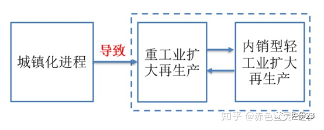

内循环：城镇化拉动国内消费示意图

**从当时的情况看，我国消费是一个被动项，是由于外贸订单增加或者城镇化加速，导致工人数量增多或者工资提高，进而导致的消费增多。如果外贸和投资熄火，是无法靠所谓的消费来拉动经济的，因为此时的消费就是无源之水。**

**四、外部循环的破灭**

这两个循环一个主要对应着城镇化和房地产投资，一个主要对应着外贸出口，这也是我们当时消耗过剩产能的两个主要途径。但是，这两个循环都是不稳定的。

外部循环，要求美国虚拟经济不断膨胀。只有美国虚拟经济不断膨胀，才能持续产生财富效应，刺激美国人消费需求，进而带动中国出口增长。

内部循环，要求中国城镇化不断推进，房地产价格不断上涨。只有土地和房屋不断涨价，地方和开发商才能以此为抵押借到更多的钱，进而通过投资来带动经济。一旦城镇化停滞，就会出现问题。

说白了，要维持两个循环运转，就要求美国的股市和中国的房市一直高涨。但这是做不到的，2008年，外部循环出了问题。

**第二部分、2008年危机和缓解办法**

2008年的时候，次贷危机已经爆发两年了，危机重创了欧美日经济，中国出口企业订单也大规模减少，越来越多的企业因资金链断裂而破产，轻工业产能严重过剩。净出口对GDP的贡献率从前几年的10%左右，迅速下降到2008年的3.5%（修正后的值是2.7%），随后在2009年更是下降为-44.8%（修正之后的值是-42.9%）。轻工业产能过剩，直接导致其扩大再生产的意愿下降，从而波及到了重工业行业。这导致全国性产能过剩，企业开始大规模裁员。2009年，中国出现了20年来最大规模民工返乡潮。如果再不出手，经济问题就可能演化为社会问题。

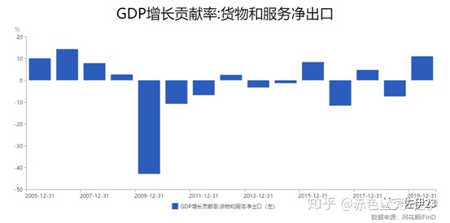

**万分危机之下，我国以凯恩斯主义为指导思想，启动大规模刺激计划，暂时缓解了危机。那么，什么是凯恩斯主义，它是怎么缓解危机的，它与当前中国经济又有什么关系呢？理解了这些，才能更好地理解中国经济为什么必然出现内卷。**

**一、凯恩斯主义**

什么是凯恩斯主义？举个例子。

在某个国家，由于生产过剩，钢铁和水泥大量堆积卖不出去，钢铁厂和水泥厂开始大规模裁员。很多人失业了，经济问题逐步演变成社会问题。国家不希望企业继续裁员，因为大规模裁员会引发更严重的社会问题。为了缓解危机，有人就出了一个主意，建议国家出台一个政策，号召每个城市修一个公园。他说，每个城市修一个公园有两个方面的好处，首先修公园需要钢铁、水泥，这样就可以消耗钢铁水泥的过剩产能，稳住重工业就业；其次修公园还需要雇佣工人，这还能带动一部分失业人口再就业，就业后这些人就有钱买买买了，这会进一步带动轻工业发展。这两者还能形成良性循环，因为重工业发展了会雇佣更多工人，进而消耗更多轻工业产品，轻工业发展了会购买更多设备、修建更多厂房，带动重工业发展。

国家觉得挺有道理，但是还有一个问题，市政府修公园的钱哪里来呢？这个人就说，让银行印钱借给市政府就好了，反正钞票都是可以印出来的嘛。国家一听觉得可行，但是又有一个担忧，市面上的商品数量没变，但是印出来的钱变多了，这会造成全社会通货膨胀，导致老百姓手中货币贬值，这怎么办？这个人说啊，这个没有办法，只能请大家理解国家的难处了。

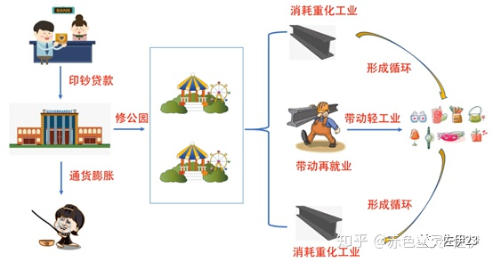

凯恩斯主义/内循环示意图

你以为这只是一个故事？不，这是一段历史。1933年后，罗斯福政府就曾雇佣大量失业青年去修建众多的国家公园。当然，修建公园只是一种方式，它还可以是修建铁路、修建公路、修建机场、修建形象工程，或者修建各种烂尾和不烂尾的楼。

**这就是凯恩斯主义。通过国家印钱，以通货膨胀为代价，政府加大基础设施建设，消耗过剩产能，延缓危机的爆发。**

**二、凯恩斯主义和四万亿计划**

讲完了什么是凯恩斯主义，我们回过头来看看2009年中国的经济情况。这里要讲一个重要的部分，凯恩斯主义和四万亿计划。

在极度危急的形势下，2009年我国决定加大投资力度，鼓励企业贷款，准备实施一系列基建工程。除了灾后重建外，主要有如下方面：第一，加快保障房建设，第二，加快农村基础设施建设，第三，加快铁路公路机场建设。

基建的钱从哪里来呢？从银行来。国家要求加大金融对经济增长的支持力度，取消对商业银行的信贷规模限制，加大对重点工程等项目的贷款支持。

为实施上述工程，国家预计到2010年投资合计四万亿，其中铁路公路机场城乡电网共计1.8万亿，灾后重建1万亿。这就是俗称的四万亿计划。

你对比一下四万亿计划和凯恩斯主义，是不是觉得很像，没错，四万亿计划就是中国版的凯恩斯主义。

在这个中国版凯恩斯主义的主导下，经济从“外贸-投资”双驱动模式，转变成以城镇化为依托的“负债-投资”单驱动模式。从2009年开始，我国经济一方面持续大搞基建，另一方面一遇经济下滑就放宽房地产贷款和购房政策，努力挖掘房地产市场，通过基建投资和房地产投资，带动重化工业需求，进而全面带动制造业，最终盘活中国经济。

但是，通过政府主导、银行放款、企业借钱进而大搞基建的凯恩斯主义，有三个致命的缺点。

**三、凯恩斯主义引发的三个问题**

**（一）这会导致更大规模产能过剩**

任何基建项目都是有周期的。比如修公路，修路的时候，需要买大量的重化工业产品，消耗过剩产能，并催生更大规模的产能。基建周期内，为满足市场需求，重工业领域各行业扩建厂房，扩大生产规模。但是，路修完之后怎么办呢？以前卖给修路单位的钢筋水泥现在又卖给谁呢？如果你是决策者，你会怎么办？你会说，那就再修一条路。这可以继续延缓危机，但是路总有修完的时候。一旦城镇化进程慢下来，各个基建项目周期就会陆续完结，更严重的产能过剩就会凸显出来。2011年底，产能过剩又出现了。这个产能过剩有多严重呢？我们在后面会详细介绍。

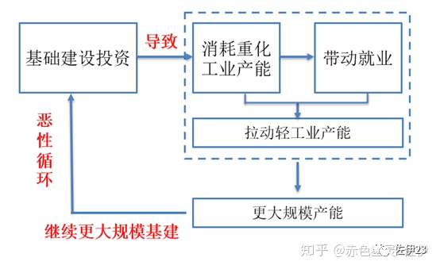

内循环：产能过剩循环示意图

 

**（二）这会造成企业高额负债**

基建资金多是银行贷款，这些钱是要还的，但是很多钱却还不上。为什么呢？因为很多基建项目根本不能创造收益。我举个例子来说。某个四线城市地方政府借钱修了一个机场，这个机场一年都没几架飞机停靠，根本不赚钱，他拿什么还钱？这种现象在全国非常普遍。2015年《每日经济新闻》的丁舟洋就写过一篇文章，名叫《小机场建设热背后：超7成亏损，靠补贴生存》。

不光是机场，地铁、市政、烂尾楼，都是这样。之前闹得沸沸扬扬的独山县烂尾楼事件，你以为只是独山县的特例吗？大家可以去查查自己家乡都欠了多少钱。不光如此，负债还会从地方政府传导到一般的私营企业。地方政府搞基建，必然会向其他企业购买原材料，比如购买钢铁。基建项目周期内，钢铁企业订单就会增多，钢铁企业就要扩大产能。但是钢铁企业一时间没有钱去修厂房，怎么办？他们就会向银行借钱来扩大再生产。但是，基建项目周期完成后，就会再次出现产能过剩，进而导致钢铁价格下跌，赚的钱根本无法偿还银行本息。这些还不上钱的公司不得不继续贷款借新还旧，利息负担越来越重。

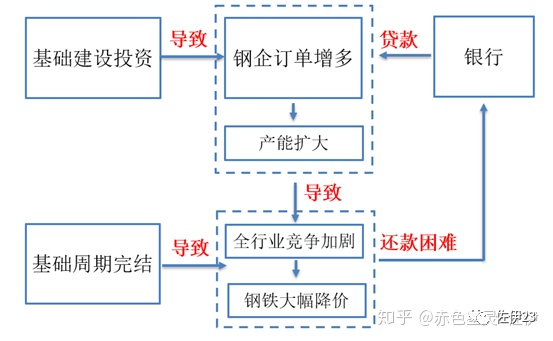

内循环：滚动负债循环示意图

企业债务有多严重呢？**人民大学经济研究所对发债企业做过一项统计， 2015年所有发债企业中， 98%的企业利润根本不足以偿还债务，而必须靠借钱才能偿还之前的债务。也就是说，中国企业的债务负担，使得企业从“借债投资”，变为“借新还旧”。**

**有人提到近几年降杠杆，其实效果并不明显，杠杆仅仅是在几个部门之间倒腾而已，“朝三暮四”这个词的本意，非常适合用来描述降杠杆的效果。**

**（三）这会导致经济脱实就虚**

由于制造业大规模过剩，制造业本身的利润越来越低。与此同时，得益于城镇化的推进，得益于高杠杆购房的优惠政策，中国房地产的价格持续攀升，房地产成了最赚钱的行业之一。怕制造业还不上钱，银行不愿意贷款给制造业，大量资金变着方儿的流向房地产。不光是银行把钱贷给房地产，实体企业自己也搞房地产，制造业的利润不再用于扩大生产，而是用来拿地开发。稍微大一点的实体企业，只要有可能就到处拿地搞开发。央企更是频频成为地王，石油、化工、兵器、烟草，各大垄断集团，谁不拿块地，都不好意思说自己是央企。在这个背景下，民间资金、银行资金甚至制造业自己的利润，大量流向了房地产。

资金不再支持实体经济，而是炒房炒地，这就构成了中国经济另一个重要现象——脱实就虚。到底有多少资金流向了房地产，光看银行报表根本看不出来，因为大量流向房地产的钱都被包装成了理财产品。国务院发展研究中心的夏斌曾经做过一个估算，他认为真正和房地产相关的贷款占比约有70%左右，甚至更高。

前几天爆出一个新闻，哈尔滨银行80%的新增贷款都流向了房地产。很多人看到新闻大吃一惊，怎么会有这么多钱流向房地产。其实这个不是什么新闻，好多年都是这样，而且各个地方都差不多。大量资金流向房地产，导致中国房价在2008年后数次暴涨。到目前，高昂的房价已经成了所有年轻人心中的痛。银行借出去的钱，相当部分是以房屋和土地作为抵押品的，一旦房地产泡沫破裂，银行将出现大量呆坏账，最终爆发系统性风险。

产能过剩、负债高企、脱实就虚，就是中国版凯恩斯主义导致的三大问题。

**第三、当前经济问题**

在产能过剩、负债高企、脱实就虚这三大问题环绕下，我国经济能通过外循环或者内循环来重新启动呢？为了理解这个问题，我们需要详细分析一下当前中国的经济数据。

**一、产能过剩情况**

首先讲讲产能过剩有多严重。对一个经济循环而言，首先要采掘原料，这个就对应着采掘业；其次将原料制作成中间产品，这个就对应着冶金和化工等行业；不论是冶金行业还是采掘行业，都需要相应的机器设备，这个就对应着专用设备和通用设备。这些行业就是主要的重工业行业。

大家看这张表，这里面包括了重工业主要部门。采矿业包含了煤炭、石油、金属、水泥矿等等各种采掘部门。非金属矿物制造业包括了玻璃、水泥、耐火材料等各种产品；黑色金属冶炼和压延指的就是钢铁生产；化学原料和化学制品这一块非常重要，经济中大量使用的化肥、农药、油墨、燃料、各种合成橡胶，等等，都是这个部门生产的，包括妹子用的化妆品原料，以及捡肥皂捡的那块肥皂（的原料），都是这个部门生产的；通用设备更是包罗万象，小到阀门、水泵，大到机床、起重机，都属于通用设备；专用设备是某个行业专门的设备，比如石油行业需要钻井的机器，这就是专用设备。这些部门涵盖了重化工业几乎所有部门，从原料到设备到厂房，大致就对应这些行业。

大家仔细看一下表格中的数据，绿色部分是产能利用率在75%以下的，也就是产能严重过剩的。黄色部分是产能利用率大于75%但是小于80%以下的都标，也就是产能过剩的。白色部分是产能利用率大于80%的，也就是产能不过剩的。

2016年以来，主要重化工业部门中，几乎所有行业，在几乎所有时间中，全部产能过剩，可谓触目惊心。采掘业在所有时间中产能严重过剩。非金属矿物制品业，在所有时间中产能严重过剩。黑色金属冶炼和压延，也就是钢铁行业，只有在2019年第二季度和第四季度，以刚刚压线的成绩达标，没有产能过剩，其余时间全部产能过剩或者严重过剩。化学原料和化学制品部门，全部时间产能过剩或者严重过剩。通用设备部门，除了2018年第一季度压线达标外，其余时间全部产能过剩。专用设备在所有时间全部产能过剩。

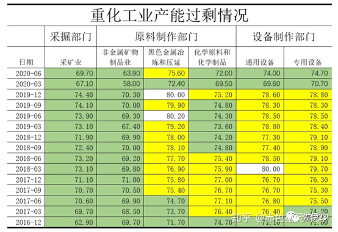

整个经济是联动的，重化工业的过剩会传导到轻工业。这里我们看一下轻工业过剩情况。轻工业中与我们生活相关度最高的两个部门是食品和纺织，逛街的时候买买买，主要就是买吃的、买穿的。2016年以来，和我们日常生活关联度最大的两个轻工业部门，食品部门在所有时间全部产能过剩，且多数时间是产能严重过剩。纺织部门在9个季度中产能过剩，在6个季度中踩线达标。

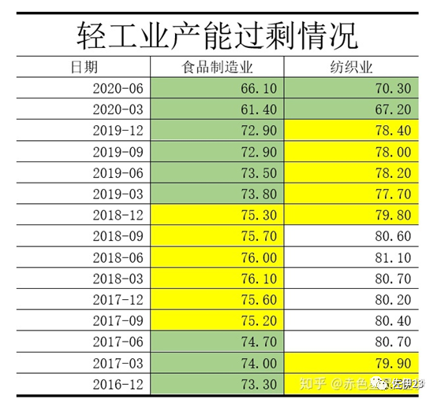

也就是说，在开启以投资为主导的内循环之后，数年之间，整个工业部门就都处于产能过剩之中，重化工业尤为严重。而这些过剩产能在当前的经济环境中难以消化。

之前很多人在说供给侧改革缓解了产能过剩，其实并没有，大家看黄奇帆最近的讲话，明确提出重化工业某些部门再次过剩。

**二、产能过剩能消化掉吗**

一个商品如果卖出去了，最终只可能有三种去向：第一、被国内终端消费者买了，这是消费。第二、被国内企业买了，这是投资。第三、被国外的消费者或企业买了，这是出口。

因此，消化过剩产能也只可能有三种渠道，第一，拉动国内消费，第二，促进国内投资，第三，加强外贸出口。

现在的经济是什么情况呢？外需萎靡，内需不振，投资下滑。

下面我们就这三个方面做一个详细梳理。

**（一）外贸**

金融危机以来，先是欧债爆发债务危机，其后2015年新兴市场爆发金融危机，接着美国退群，整个外部经济环境一直恶化，逆全球化趋势越发明显。在这个大背景下，我国出口增长率持续走低。按美元计价的出口总值，在2009年、2015年、2016年出口增长率都低于零，2019年的出口增长也仅有0.51%。外贸形势非常严峻，短期看无法通过外贸消耗过剩产能。最近因为疫情原因外贸订单回流，这不具有可持续性。再加上中美关系有太多不确定型，外循环难以重建，所以我国只能不断强调内循环。但是，内循环事实上也很难建立。

**（二）投资**

投资是内循环最大的依托，凡是讲内循环的，无不讲到城镇化、5G、投资，等等。的确，2009年之后，投资在中国经济中占有绝对主导的地位，中国经济就是靠投资吊着一口仙气持续至今。但是，投资这个引擎离熄火越来越近了。这里我们详细分析一下。制造业投资、基建投资、房地产投资，是投资中最重要的部分，三者合计超过全社会固定资产投资的七成，三者的增长基本决定了投资的增长。

下面我们详细分析一下这三部分的情况。

制造业方面。由于制造业过剩越来越严重，投资增速从2011年开始持续下滑。2011年，制造业投资增速还有30%左右，到2012年就下滑到不足20%，之后持续下跌，在2015年6月份之后，增速再也没超过10%左右，到了2019年底，增速仅有3.1%，几乎丧失了拉动经济的能力。

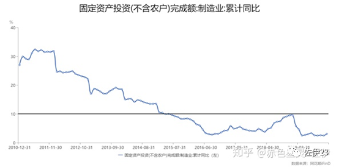

基础设施方面。自从2009年四万亿以来，基建就成了固定资产投资增速的基石。在2018年前，基本保持15%以上的增速。但是，基建投资至少受到三方面的制约。首先，2015年以来，我国城镇化的速度明显减慢，官方数据从2015到2019年城镇化率提高百分点分别为1.33、1.25、1.17、1.06、1.02，呈逐年放缓态势。其次，中国大中型城市的基建已经比较完善，大规模基建的空间在降低。最后，基建的投资主体是地方政府投资平台，这些企业往往债务高企。这一系列原因导致基建投资增速从2017年开始快速下降，2018年5月，增速跌破10%，到2019年底，基建投资增速下滑到3.8%，几乎丧失了拉动经济的能力。

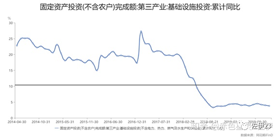

制造业投资和基建投资都几乎丧失了拉动经济的能力，于是，只能靠房地产投资拉动经济了。但是，房地产也有自己的问题。中长期来看，对房地产投资影响最大的是人口的抚养比，也就是非劳动人口（老人和小孩）/劳动力人口的比例。在中国，这一比例从2011年底开始逆转。这使得潜在买房需求的劳动力人口比例越来越小。再加上价格高涨，有消费能力的人群越来越少，房地产相对过剩趋势明显。这些原因导致房地产投资增速下滑。中国房地产投资增速，从2003年以来，除2008年底前后的金融危机异常期外，基本保持在20%以上。到了2013年底，增速都在20%以上。但是从2014年开始，房地产投资增速迅速下降，到2019年底，增速勉力维持在9.1%。

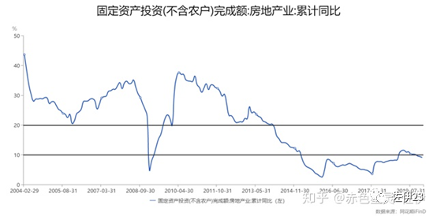

制造业投资、基建投资和房地产投资，从高达20%、甚至30%的增速，逐步下滑到不到10%的增速，制造业投资和基建投资增速更是仅有百分之三点几。它们高速增长时期催生出来的产能，在潮水褪去之后，全都裸露在了沙滩上。

那么，可以靠5G等新的投资增长点吗？新的投资增长点，就算有，体量也远远不如上述三项。更何况，就算体量与之相当，也只是在延缓危机，催生出更大的过剩产能。

外贸和投资都不能消化如此庞大的过剩产能，那么就只有靠促进国内消费来消化过剩产能了。但是这也做不到。

**（三）消费**

现在有人说疫情导致国外消费内移，可以通过消费重启经济。这个其实很难。之前说过，消费是一个被动项。由于外贸订单增加或者城镇化加速，导致企业盈利增加，进而扩大生产，雇佣更多工人并一定程度提高工人工资，这才导致消费增加。但是2012年以来，企业再次出现产能过剩，生产出来的产品卖不出去，利润大幅下滑，亏损企业越来越多。

大家看这个表格。四万亿初期，2010-2011年，企业盈利快速增长，亏损企业亏损总额与盈利企业盈利总额的比值远低于10%。但是从2012年以来，企业亏损快速增长，再次提升到2009年的水平，并且在2015-2016、2018-2019这两个时间段，亏损额和盈利额的比值都明显高于10%。

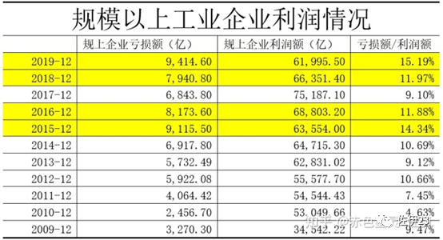

企业盈利下滑，必然导致裁员。离职员工丢失工作，在职员工福利薪酬也势必受到影响。事实上，在这两个时间段，中国人均收入增长率持续放缓。看这个图，蓝色的线是人均实际GDP增长率，橘黄色的线是人均实际可支配收入增长率。2105年底开始，人均实际可支配收入就长时间低于人均实际GDP增长率。

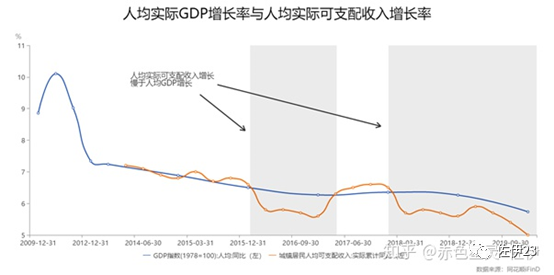

工资降低，失业增多，据此可以得出一个基本判断，可供消费的工资总量，其增速势必在加速下滑。

可供消费的工资总量增速在下滑，而房价和房租却居高不下，这又极大程度挤压了消费。

这三个因素综合作用下，我国消费萎靡不振，难以消耗如此庞大的过剩产能。前段时间，官方号召消费升级，民间却调侃消费降级，就是最好的体现。

**是否可以靠消费信贷强行带动消费呢？这是可以的，但后遗症非常大，所以高层很警惕，刘副总理在2017年写的那本书里面就提到要谨慎对待消费信贷。当然，随着危机加剧，不排除采取消费信贷的方式来促进消费。**

**是否可以通过再分配来促进消费？这也是可能的。在这种情况下消费可能起到更积极的作用。但是再分配意味着将从企业利润中拿出更多部分给到劳动者，这样的改革势必触动利益集团，它的前景是不明朗的。**

讲到消费，必须讲到不同人群的生活，关于不同人群的生活，大家可以看这个帖子：https://zhuanlan.zhihu.com/p/338973792

**三、凯恩斯主义的归宿**

截至目前，中国大规模实施凯恩斯主义已经11年了。从整体来看，外贸、消费和投资领域都不乐观。从目前的经济发动机，即投资领域来看，制造业由于前述原因，出现严重产能过剩和大规模负债，导致制造业投资增速大幅下滑；房地产经过近20年发展，已经出现结构性变化，房屋明显过剩，投资增速大幅降低；基建方面，由于前期发展迅速以及城镇化放缓使得投资空间缩减，也由于城投等公司负债严重，基建投资增速也开始降低。

中国的凯恩斯主义，快要走到头了。

之前我们说过，凯恩斯主义的实质是，“通过国家印钱，以通货膨胀为代价，政府加大基础设施建设，消耗过剩产能，延缓危机的爆发”。也就是说，凯恩斯主义必然会导致通货膨胀。什么是通货膨胀呢？西方经济学有一个通俗的解释，通货膨胀就是更多的钱去追逐数量不变的商品。

凯恩斯主义增发的货币是印出来的，而市场上商品的数量没有变化，因此必然出现“更多的钱去追逐原有的商品”，这就会导致通货膨胀。但是我国反映通胀的CPI指数并不高，这是为什么呢？因为大量资金被房地产领域吸收了。也就是说，我国印出来的钱，没有去追逐一般的商品，而是有相当部分去追逐房地产领域中的房屋和土地这一特殊商品。这就是CPI涨幅并不大，但房价却暴涨的原因。

那么，房地产的价格会一直维持高位吗？做不到。城镇化放缓，人口结构逆转，房价虚高，房企背负高额负债，地方债务恶化，这一切都预示着房地产泡沫终将破灭。房地产泡沫会怎么破灭，我并不知道，但是能够预判，一旦房地产泡沫破灭，中国经济将停滞下来。而我国任何一届政府都不允许在其任期内发生危机，所以必然将以更大规模投放资金拉动基建。此时创造货币的将不再是房地产信贷而是基建贷款，部分货币由于没有房地产吸收蓄水（因为创造贷款的不再是房地产），将直接流入生产市场。基建周期到来后经济必然再次停滞，大量货币增发导致的通货膨胀和停滞将并存，凯恩斯主义最终将迎来自己的归宿——滞胀。

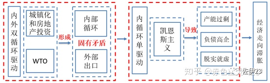

2002至今：中国经济大循环示意图

 

目前，经济面临的外部形势越来越严峻，而内部投资和消费也逐渐熄火。**在这样的局面下，所谓的内卷仅仅是经济缓慢走向危机的另一个说法而已。**

**四、回顾和后记**

这里我们再次做一个整体回顾。在第一部分，我们回顾了1996年的那一次生产过剩，分析了我国怎么靠房地产市场和WTO延缓了危机。并且发现当时的经济形成了内外两个循环，而这两个循环既支撑着中国经济，又为更大规模的危机埋下了种子。其次我们讲了2008年金融危机打破了第一个经济循环，经济再次出现过剩的风险。在第二个部分，我们讲到了我国怎么通过凯恩斯主义的方式，延缓了2008年的危机。接着，我们又分析了凯恩斯主义的内在矛盾，并且发现凯恩斯主义持续数年后，造成了更大规模的产能过剩。在这种情况下，经济下行压力不断加大，企业债务规模持续攀升。从2012年后，实体经济持续萎靡，投资增长快速下滑，大量银行资金流向房地产。而这一切导致了中国经济当前的三大特点：产能过剩、负债高企、脱实就虚。在第三部分，我们详细分析了产能过剩的情况，分析了外贸、投资和消费都难以消化当前的产能过剩，并且大致介绍了货币增发和高房价的关系。最后我们得出结论，凯恩斯主义将会走向滞胀。**也就是说，怎么走出内卷是伪命题，因为在目前的情况下，我们必然走向滞胀，换言之，必然走向内卷。**

以上就是我分析中国经济所采取的一般方法，这是辩证唯物主义的方法，这种方法要求我们从事物发展的内在矛盾出发，去研究每一次矛盾冲突以及解决这个矛盾的手段。

这种研究方法，比我们得出的研究结论更重要。由于我们对经济做了抽象和取舍，比如我们并未讲到互联网为代表的新兴产业对经济的促进，也并未讲述一带一路对消耗过剩产能起到的作用。再比如，房地产跌价后由其创造的货币会部分消失，导致货币减少，经济萧条会导致投资减少，大众商品价格下跌，这也可能导致通缩。那么房价跌价后在什么条件下才会导致通胀，在什么条件下又会出现通缩呢？这些问题，我们都没有详细分析。这些使得我们的个别结论不一定正确。但是这个研究方法，却指引着我们不断接近真像。

我并不保证所有结论都是对的，但我觉得这个分析方法是对的。抛砖引玉，供大家讨论、批评。

最后关于一些常见的问题，我说一下个人看法。

1、GDP的构成。消费、投资和净出口，还是消费、投资、政府部门和净出口。这其实没有本质的区别。金融数据终端，不论是wind还是ifind，统计的都只有消费、投资和净出口，因为他们把政府部门拆解进去了。当然，卖不出去的产品也可以被计入GDP，比如计入库存投资。

2、中国过剩是从1997年开始的。1996年之前中国是短缺经济，没有产能过剩。之前政府对经济的干预，主要是压缩消费，这与凯恩斯主义完全不同。

3、一带一路的体量、新基建的体量。能否消耗过剩，需要具体计算。但从中长期看，这只会导致更大规模的过剩。

4、金融和生产的关系。以前的危机，是从生产领域爆发，进而波及金融；现在的危机，多数是从金融领域爆发，进而影响生产。但是，不论是哪一种，实质归根结底都是生产相对过剩。

5、通缩还是通胀。货币增发是通胀的必要条件，而不是充要条件。我觉得货币增发需要和基建等因素结合才能形成通胀（不同国家可能还有其他影响因素）。

6、这篇文章是我2016年底写的一篇文章的下半部分。2016年的文章我尝试梳理了1978-2016年的经济情况（从经济运行导致的矛盾方面来梳理的），一些网站曾发过此文。这次截取下半部分更新了一些数据来回答这个问题。但是，这次的文章并未对2016年之后的供给侧和去杠杆做详细分析（不过从数据看影响不大），这是不足之处。

7、温铁军的书我并没有看过，本文对经济史的梳理，主要来自《中华人民共和国经济史》，本文的数据，主要来自于金融数据终端ifind。如果其中某些梳理得出和温铁军类似的观点，我想这是由于大家都用了同样的基础材料，以及大家有类似的方法论。

8、本文的分析框架是传统的政治经济学分析框架，也就是说主要从生产而非流通领域来解释危机、滞胀。新凯恩斯主义是从外部来解释滞胀的（输入型），这是典型的外因论，是错误的。西方目前进步学者是从劳资对抗来解释滞胀，这是内因论，是值得参考的。这里也说一下西方进步学者的逻辑。经济发展导致劳工联合，劳工联合导致工资上升，工资上升导致利润下降，利润下降导致资本家提高商品物价，进而在某种条件下产生滞胀。这种观点其实也有值得商榷的部分。工资上涨导致物价上涨的理论，在贵金属作为货币的时期就曾出现。1865年马克思专门做了一个演讲，叫做《工资、价格和利润》来驳斥这种观点。按马克思的观点，工人工资上升，只会导致对生活用品的需求上升，进而导致生活用品供不应求，轻工业部门利润上升。此时重工业部门的资本就会流入利润更高的轻工业部门，导致重工业供给下滑，轻工业供给上升，于是重工业价格略有上升，轻工业产品略有降价，进而形成新的平衡。在这样的平衡下，工人的工资上升导致的更多是资本家内部利润分割的问题，而不是全社会物价普遍上涨。当然，马克思所处时代是贵金属和自由竞争时代，资本在不同行业流通相对顺畅，而现在是垄断时代，资本的流通更多是源于信贷的倾斜，这毕竟有所不同。但我自己的观点更倾向于马克思的观点，我倾向于从生产和货币增发的角度来解释滞胀，这我在前面已经说过。这个观点是否正确，尚待进一步论证。

9、除之前的问题外，这篇文章还有诸多不足。比如对生产领域的研究是不够的，工业是怎么分布的，集中度如何，对产能过剩的内部结构情况；再比如对债务的结构研究也是不足的，企业具体的债务情况，银行抗压能力，等等；再比如，对我国经济区域性差异以及这个差异可能带来的影响也并未谈及。这有可能导致某些结论似是而非。因此，我认为本文更多是框架性和方法性的。