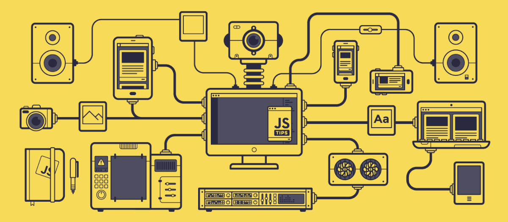
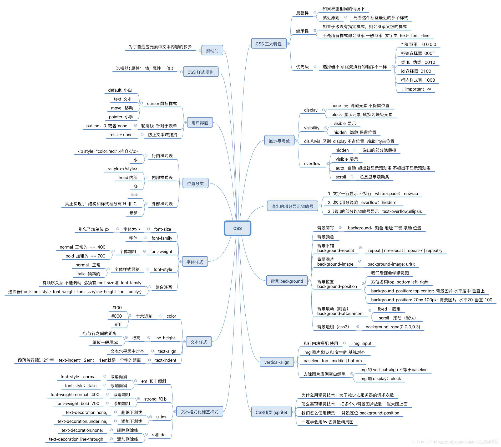
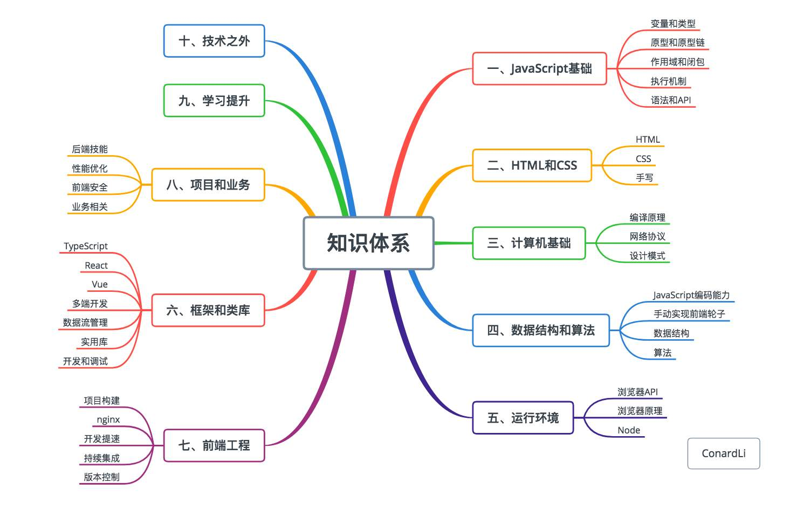

## 前端知识整理(待完善)

<!--more-->

#### 一.常见问题

##### 1.懒加载,函数节流

```javascript
var imgs = document.querySelectorAll('img');
	var lazyload = function(){
		var scrollTop = document.body.scrollTop || document.documentElement.scrollTop;
		var winTop = window.innerHeight;
		for(var i=0;i < imgs.length;i++){
			if(imgs[i].offsetTop < scrollTop + winTop ){
				imgs[i].src = imgs[i].getAttribute('data-src');
			}
		}
	}
	function throttle(method,delay){
		var timer = null;
		return function(){
			var context = this, args=arguments;
			clearTimeout(timer);
			timer=setTimeout(function(){
				method.apply(context,args);
			},delay);
		}
	}
	window.onscroll = throttle(lazyload,200);
```


#####2.前端组件实现:


> ##### 1.HTML(组件)占位:(组件文件引入到index.html):
>
> 写在body中即可:
>
> ```html
> <body>
> 
> {{template "/erp/collegenew/inc/consult/templeteA.html" .}}
> 
> {{template "/erp/collegenew/inc/consult/templeteB.html" .}}
> 
> </body>
> 
> ```
>
>
>
> ##### 2.组件实现:
>
> ```html
> <templete id="A">
> 
> </templete>
> 
> <script>
>     var templeteA = new Vue({
>           el:'#A',
>           data:{
>               first:'vue是什么?'
>           }
>       })
> </script>
> ```
>
>
>
>
> ##### 3.index.html中组件使用:
>
> ```html
> 
> <script>
>     var app = new Vue({
>           el:'#app',
>           data:{
>               first:'vue是什么?'
>           },
>         components: {
>             "tabbarA":templeteA,
>             "tabbarB":templeteB
>         }
>       })
> </script>
> 
> ```
>
>


##### 3.webpage原理:

>

##### 4. CDN 与 DNS

> https://blog.csdn.net/hetoto/article/details/90509328


##### 5.http 与 https

>


#### 二.框架流程图








