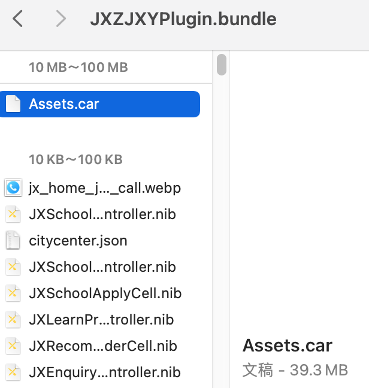
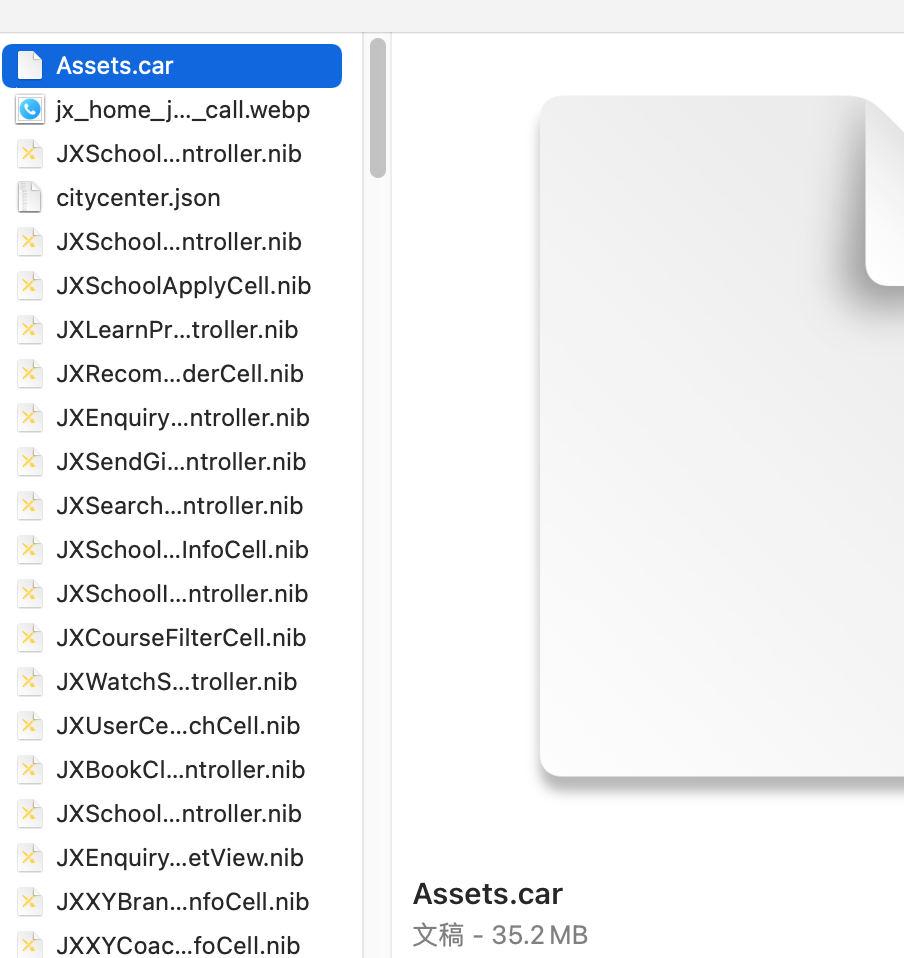
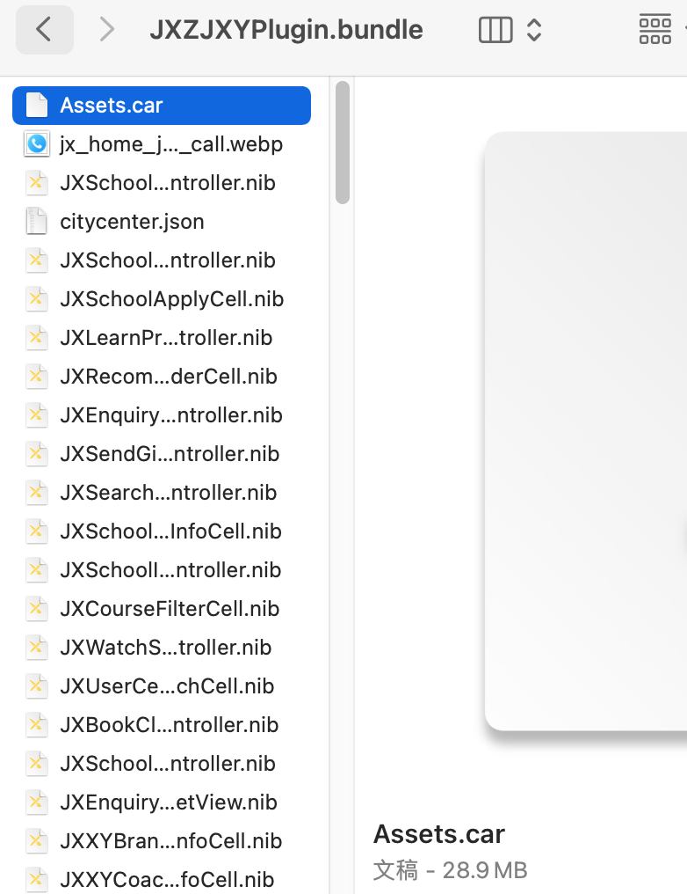

## 学员端包体积优化

<!--more-->

#### 一. 删除代码中未使用的素材和所有@x1图

https://github.com/tinymind/LSUnusedResources

使用工具LSUnusedResources 找出相关素材,进行删除。

#### 

#### 二. 不失真压缩较大图片素材

使用https://tinypng.com/ 统一压缩

#### 三. 移除无用代码文件尤其是xib

暂不统一处理，后续代码尽量减少xib的使用。迭代中遇到无用代码再进行删除。

#### 四. 持续移除无用代码/素材

1. 后续迭代遇到某些重复素材可以移除
2. 无用代码删除后，出现的无用素材可以移除
3. 使用@2x，@3x 素材即可，不适配 iPhone 4 的情况下 @1x 可以弃用。

#### 相关文档

[深入探索 iOS 包体积优化](https://juejin.cn/post/6844904169938092045)