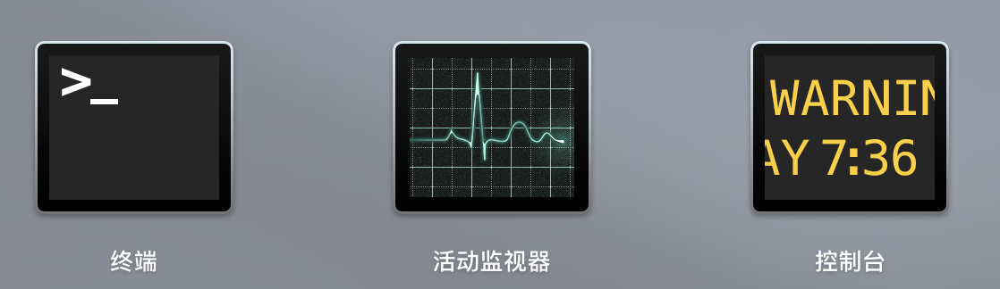
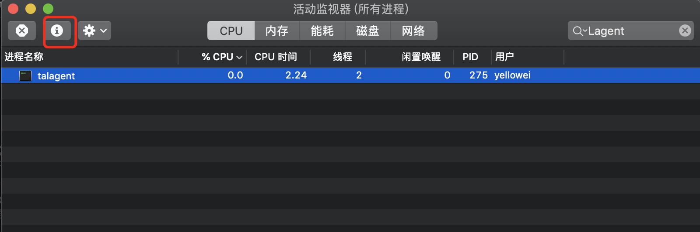
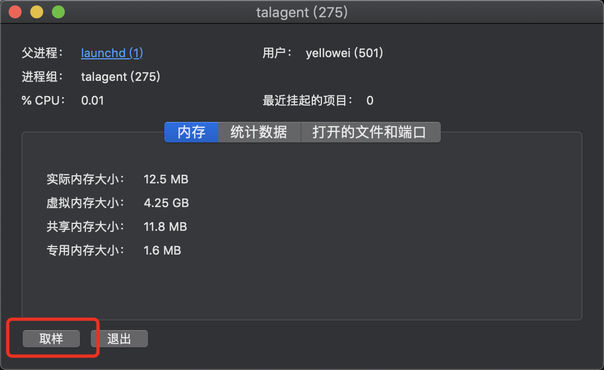
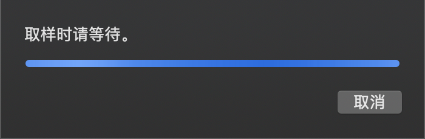
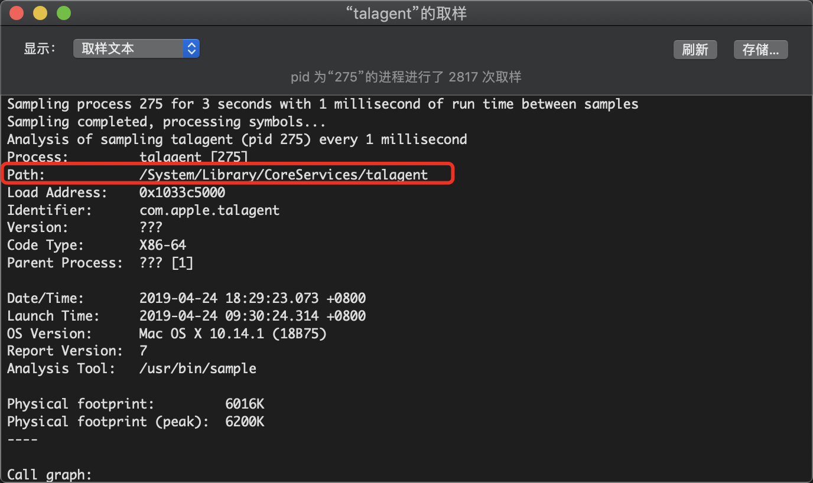

# 强制删除 IP-GUARD 的 MAC 客户端 LAGENT

<!--more-->

强制删除 ip-guard 的 Mac 客户端 LAgent

工具：

1、Mac 下 LAgent 端口占用情况查看时， 要使用 sudo netstat -a | grep 8237

基本上 8237 是服务端的默认端口

2、查找到本地进程的端口号之后， 例如 49155， 使用命令：

lsof -i:49155

查找出 pid， pid 这时对应的命令名称基本上就是 LAgent

3、找出罪魁祸首 LAgent 之后， 我们打开活动监视器

4、搜索 LAgent， 会显示 LAgent 和 LAgentUser 两项进程， 这个老 B 很阴险， LAgent 是 root 下的，LAgentUser 是用户下的，并且进程有保护， 直接关闭又会重新启动自己

5、这时候，选中 LAgent，点击图中按钮（由于已经移除了 LAgent，本文以另一个系统进程为例进行操作说明）

6、在弹出的对话框中点击“取样”

7、等待一会儿

[]

8、找到老 B 的藏身之处

9、打开 finder， 进入 shift+command+G 进入此目录查看，已确认老 B 躲在这里

10、准备重启系统，并记得按住 command+R， 进入恢复模式

11、在恢复模式中， 选则磁盘工具， 对系统盘进行加载， 千万别点击格式化之类的啊！！！

12、加载完成后，就可以退出磁盘工具， 随后打开命令行终端， cd 进入到老 B 所在目录

13、rm -rf xxx
