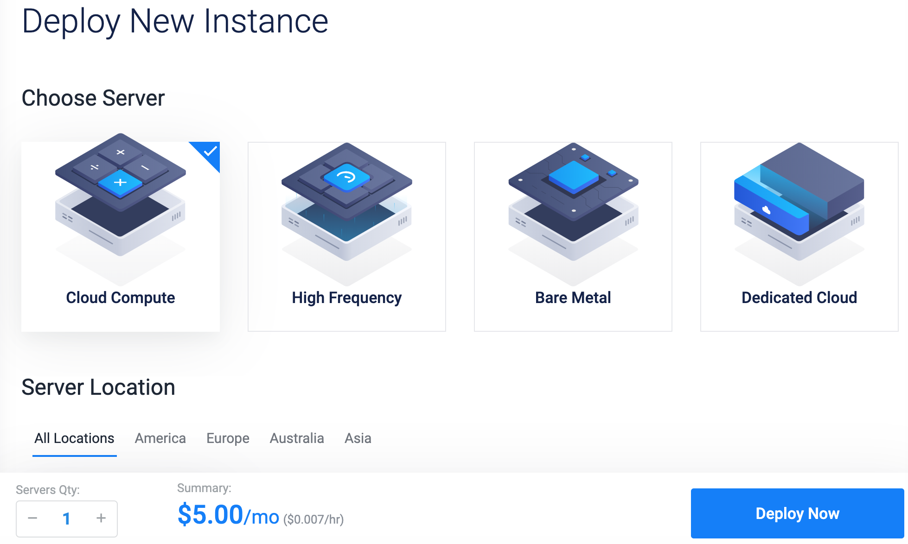
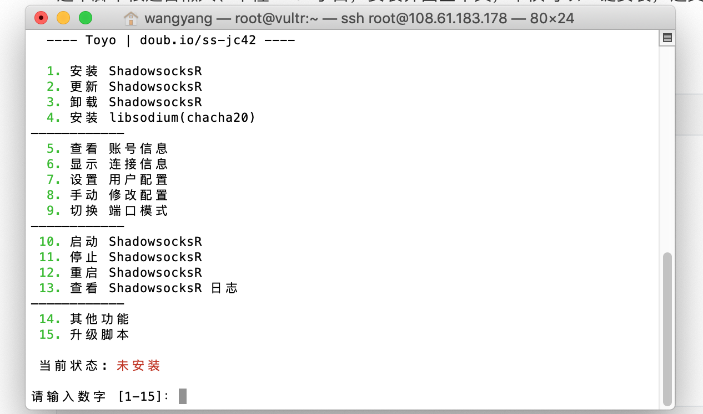
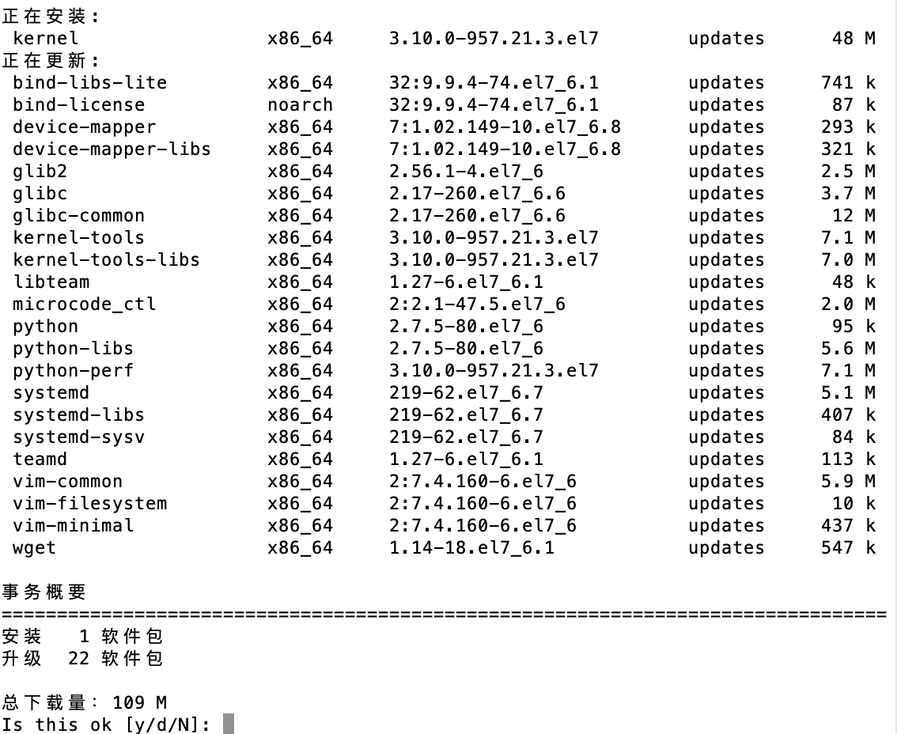
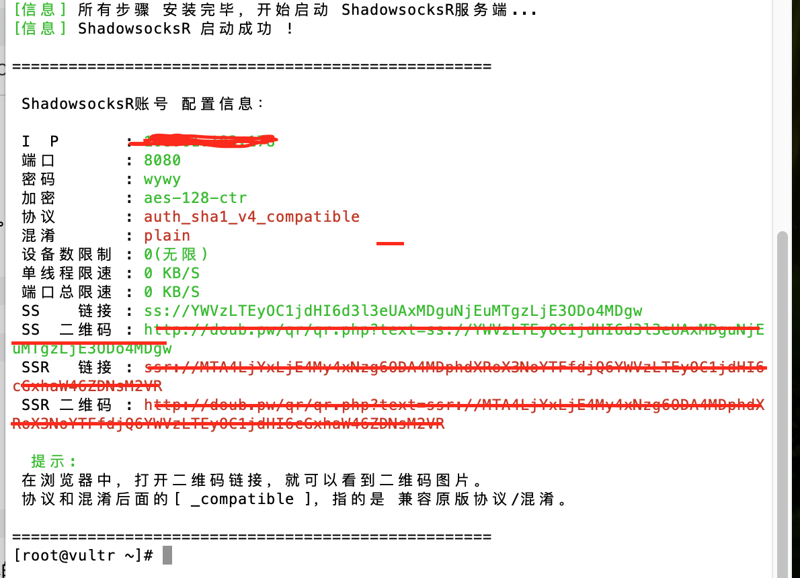
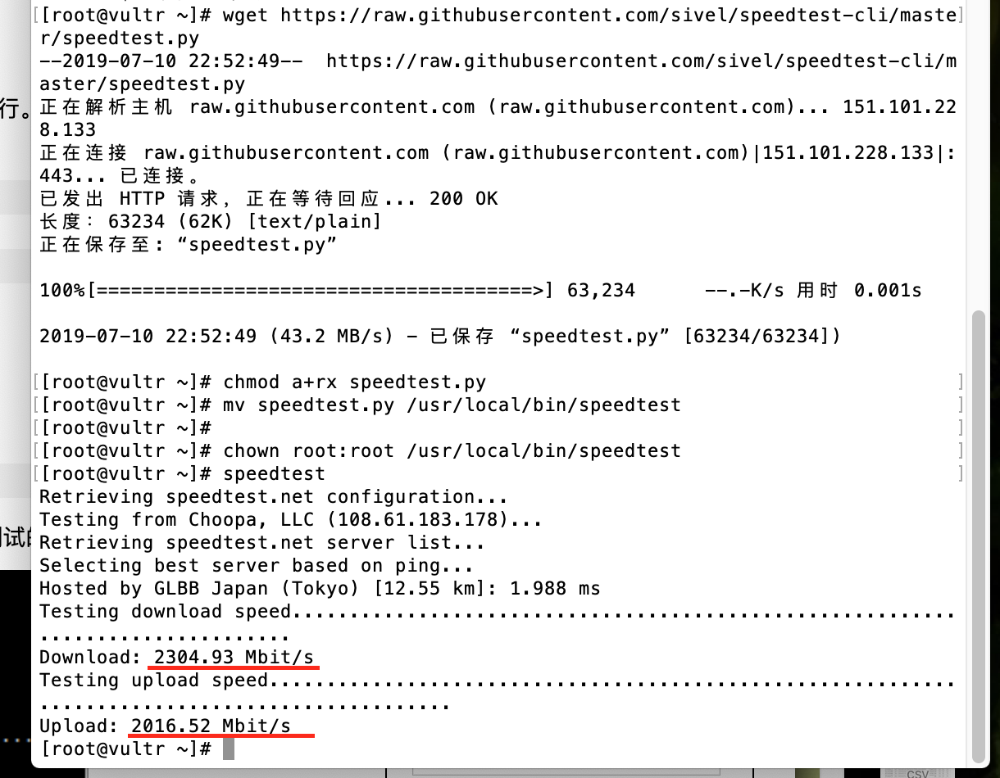

想要看看外面的世界吗?

<!-- more -->


### 搭建代理服务器

#### 一.购买代理服务器:

1.为了性价比选择vultr,进入官网注册充值

> 官网地址: [https://www.vultr.com/?ref=8193606](https://www.vultr.com/?ref=8193606) 
>
> **(注:这是我的邀请地址,您注册使用的同时我会获得奖励金,但您的首单赠送不会受到任何影响)**



#### 二.安装BBR加速:

1.介绍BBR:

Google BBR就是谷歌公司提出的一个开源TCP拥塞控制的算法,ss不经过其它的任何的优化就能轻松的跑满带宽!

2.使用root用户登录:(eg:192.168.1.1)

> ssh root@192.168.1.1
>
> password:123456

3.运行一下命令:

```json
$ wget --no-check-certificate https://github.com/teddysun/across/raw/master/bbr.sh
$ chmod +x bbr.sh
$ ./bbr.sh
```

安装完成后，脚本会提示需要重启 VPS，输入 y 并回车后重启。

4.重启完成后，进入 VPS，验证一下是否成功安装最新内核并开启 TCP BBR，输入以下命令：

```json
uname -r
```

查看内核版本，含有 4.9 就表示 OK 了

5.按顺序执行以下命令验证是否安装成功:

$ sysctl net.ipv4.tcp_available_congestion_control

> 返回值一般为：net.ipv4.tcp_available_congestion_control = bbr cubic reno

```json
sysctl net.ipv4.tcp_congestion_control
```

> 返回值一般为： 
> net.ipv4.tcp_congestion_control = bbr

```l
sysctl net.core.default_qdisc
```

> 返回值一般为： 
> net.core.default_qdisc = fq

```json
lsmod | grep bbr
```

> 返回值有 tcp_bbr 模块即说明bbr已启动。


**原文地址:  <https://www.cnblogs.com/Eason1024/p/8177665.html>**

#### 三.搭建SSR(ShadowsocksR)服务端:

1.一键安装脚本:

```
wget -N --no-check-certificate https://raw.githubusercontent.com/ToyoDAdoubi/doubi/master/ssr.sh 
```

这个脚本很适合懒人、不懂Linux小白，安装界面全中文，不仅可以一键安装，还支持**一键重启，一键安装和一键管理。**

2.执行脚本:

```json
bash ./ssr.sh
```




输入1进行安装,然后选下端口和密码,其他一路点默认即可.





下载相关包.

如下图安装成功:




> ShadowsocksR 默认支持UDP转发，服务端无需任何设置.


#### 四.服务器测速:

1.安装speedtest的Python脚本:

```json
$ wget https://raw.githubusercontent.com/sivel/speedtest-cli/master/speedtest.py
$ chmod a+rx speedtest.py
$ mv speedtest.py /usr/local/bin/speedtest
$ chown root:root /usr/local/bin/speedtest
```

2.执行脚本:

```json
$ speedtest
```


3.测试结果如图:



**原文地址: <https://q.115.com/wap/topic?gid=153332&tid=78657>**


#### 五.SSR再次提速:

原理:选择加密:chacha20,混淆:http_simple,速度更快,但**可能**加大被墙的风险.

> chacha20加密效率更高的同时安全性也没有降低,但需要安装**libsoduim**.

centerOS6安装**libsoduim**:

1.安装GCC(编译环境)

> yum -y groupinstall "Development Tools"

2.下载最新稳定版本:

> wget https://download.libsodium.org/libsodium/releases/LATEST.tar.gz

3.解压:

> tar xf LATEST.tar.gz  
> cd libsodium-stable

4.编译:

> ./configure && make -j2 && make install
> echo /usr/local/lib > /etc/ld.so.conf.d/usr_local_lib.conf
> ldconfig

#### 六.相关文档:

```json
搭建SSR(ShadowsocksR)服务端:https://q.115.com/wap/topic?gid=153332&tid=78657
安装BBR: https://www.cnblogs.com/Eason1024/p/8177665.html
测速:https://www.cnblogs.com/KevinJasmine/p/6700312.html
chacha20加密:https://github.com/shadowsocksrr/shadowsocks-rss/wiki/libsodium
```


