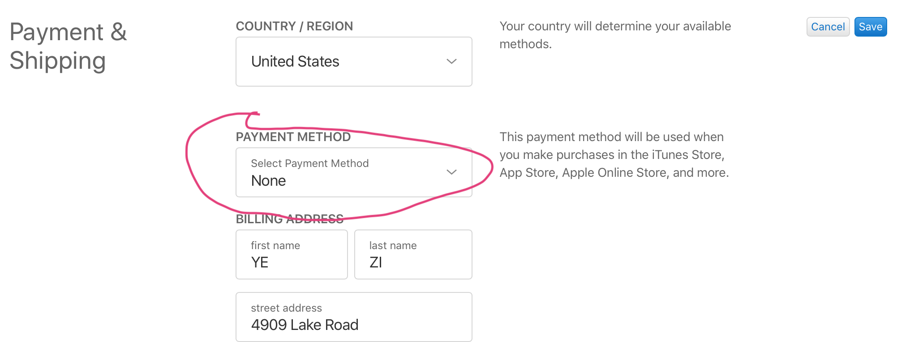

这是一篇获取美国Appid教程(前提是你能翻墙,下面会介绍为啥)

<!-- more -->

### 如何申请一个美国App Store账号

#### 一.登录美国Apple官网申请账号.

#### 二.填写申请信息:

1.填写密保:

2.填写支付&&购物地址:

> **支付方式可以先选 None !!!**

#### 三.电脑翻墙到美国:

原因:苹果现在会验证Appid的地址是否和当前电脑(手机)ip所在地址匹配!!!

#### 四.电脑打开iTunes并登陆刚刚申请的Appid:

**注意:经最新测试,若整个账号的申请流程都在美国ip下操作,可以省去此步骤,直接手机进行登录App Store即可.**

目的:激活新申请的美国账号的App Store 相关功能!!!

> **这里最后一步continue会报错,先不用管操作到此结束.**

#### 五.手机登陆刚刚申请的Appid:

进入手机的设置中登陆

#### 六. 至此结束,美国Appid到手.

#### 七. 写在最后:

> **这里尚不清楚:1.是否手机翻墙到美国直接登陆便可激活账户;2.电脑翻墙后登陆iTunes后,手机即使不翻墙也能登陆(激活App Store)使用.**

